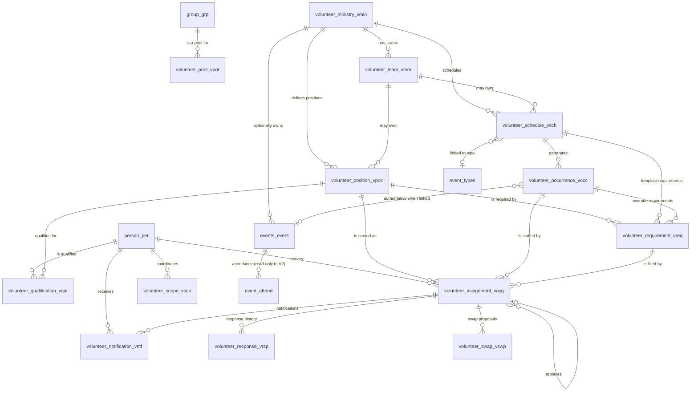

# Volunteer Management v2 — Architecture & Reuse Design

Deliverable of upstream issue [#9703](https://github.com/ChurchCRM/CRM/issues/9703), under epic
[#9701](https://github.com/ChurchCRM/CRM/issues/9701). Migration/retirement of V1 is epic
[#9702](https://github.com/ChurchCRM/CRM/issues/9702) and is **out of scope here**.

---

## 0. Preface

### 0.1 Purpose

This document is the single technical design for Volunteer Management v2. It exists so that an
implementing agent working on **any** child issue of #9701 (#9704–#9715) does not have to
re-derive the product decisions, the domain model, the authorization model, or the reuse
decisions. That is #9703's acceptance criterion:

> Design is detailed enough for subsequent AI coding agents to implement without rediscovering
> product decisions.

### 0.2 How to use this document

1. **Read this file completely before writing code for any #9701 child issue.** Then read #9701,
   then your own issue.
2. Find your issue in [§7 Dependency / implementation sequence](#7-dependency--implementation-sequence).
   That section tells you which sections of this document are normative for your PR and what the
   PR must contain.
3. Copy the "reuse decisions to document in the PR" bullets for your issue into the PR
   description. The epic requires every PR to answer: what existing capability was evaluated, why
   it can be reused as-is or must be extended, and why a new implementation is necessary.
4. Where this document and a skill file disagree, **this document wins for V2 work** and the
   disagreement is recorded in [Appendix E](#appendix-e--prerequisite-hardening-track).
   Several skill files are demonstrably stale; the reliable references are
   `groups-mvc-guidelines.md`, `db-schema-migration.md`, `cypress-testing.md`,
   `timezone-handling.md`, and the source files cited here.
5. **[Appendix E](#appendix-e--prerequisite-hardening-track) is a work list, not a disclaimer.**
   Its items are known upstream defects that affect V2; each is filed as its own upstream issue and
   **fixed before V2 implementation starts** (§7.3 "Wave -1"). A V2 PR must not carry a workaround,
   a defensive comment, or a private copy of core behaviour to route around one of them — if you
   find yourself writing one, the prerequisite has not landed yet and your issue is not ready to
   start. If you discover a *new* defect while implementing, add it to Appendix E and file it
   rather than absorbing it into your PR.
6. Every claim about existing code in this document carries a `path:line` citation against
   upstream `master` at commit `850c70a8c`. If a line number has drifted, the file and symbol name
   are still correct — re-grep rather than assuming the claim is wrong.

### 0.3 The product principle

> **Set it up once, then let the system run the weekly process with minimal coordinator effort.**

Every design decision below is measured against that. A screen that makes a coordinator re-enter
next week what they entered last week is a design failure, not a missing feature.

The core workflow is:

```
Initial Setup → Schedule → Assign → Notify → Accept/Decline → Detect Gaps → Self-Service Signup → Fill → Serve
```

### 0.4 Driving use cases

These five must all be representable **without ministry-specific columns or code**. They come from
the epic (#9701) and from the church driving this work.

| # | Use case | What it forces into the model |
|---|---|---|
| **UC1** | **Coffee Bar.** One ministry/team. 15 volunteers in one existing ChurchCRM Group. Five positions (Setup, Cleanup, Espresso, Milk Station, Expeditor). 2–3 people needed each Sunday. Volunteers hold multiple qualifications. Assignments rotate. Weekly notification; accept/decline; declines create gaps; qualified volunteers self-sign-up. | Group-as-pool; many-to-many qualification; a *count* requirement that is not one-per-position; self-service signup. |
| **UC2** | **Sunday Worship.** "Sunday Morning Worship" is a recurring ChurchCRM calendar event, Sundays 10:30–11:45. A coordinator (**not** a system administrator) fills Song Leader, Communion Leader, Opening Prayer, Closing Prayer and Preacher for each occurrence, weeks ahead, from qualified people. Volunteers confirm, decline, or propose a substitute who has already agreed; the coordinator approves or rejects. | Occurrence must be the **event** row; exactly-one-per-position requirements; substitution/swap as a first-class, coordinator-approved workflow; non-admin coordinator. |
| **UC3** | **Parallel ministries on the same occurrence.** The sound booth needs Audio Engineers during that same service, under a **different** coordinator, in a different team/ministry. | Occurrence↔event is many-to-one: several V2 occurrences (different schedules, different ministries) may point at the same `events_event` row. Authorization is per ministry/team, not per event. |
| **UC4** | **Children's Ministry.** One Ministry, several Teams, five weekly "events" (Elementary Bible Hour Sun 09:30–10:15, Nursery Bible Hour Sun 09:30–10:15, Children's Church Sun 10:30–11:45, Wednesday Night Elementary Wed 19:00–20:00, Wednesday Night Preschool Wed 19:00–20:00). Each team may have its own leader, or one coordinator manages all. For class-type events the coordinator also wants to see **attendance** (existing event check-in) alongside who served. | Teams under a Ministry; per-team leader scope; one schedule per weekly event; read-only reuse of `event_attend`. |
| **UC5** | **Reminder.** A reminder email goes out a configurable, system-level time before the occurrence. | A notification outbox with a due time, drained by whatever passes for a scheduler in ChurchCRM. |

Non-hierarchical by design: **Teams under Ministry is sufficient. There are no nested ministries.**

### 0.5 Fixed decisions (do not relitigate in a PR)

| # | Decision | Source |
|---|---|---|
| D1 | **Groups are the volunteer pool/roster.** V2 stores a reference to `group_grp.grp_ID`; it never copies membership. | #9701 |
| D2 | **Qualifications are NOT Group Roles.** Qualification is a separate many-to-many person↔position relation. | #9701, and structurally forced (§2) |
| D3 | **Occurrences/shifts are separate from assignments.** | #9701 |
| D4 | **When a schedule is linked to a ChurchCRM Event, the event occurrence is authoritative** for date/time and occurrence identity. No second recurrence engine for linked schedules. Unlinked schedules may generate their own occurrences. | #9701, #9708, #9713 |
| D5 | **Authorization is server-side and scope-based.** UI hiding is never treated as security. | #9701, #9706 |
| D6 | **V1/V2 rollout is controlled independently of migration**, by a version/rollout setting, not a boolean. | #9701, #9704, #9702 |
| D7 | **V2 must not read or write V1 tables at runtime** (`volunteeropportunity_vol`, `person2volunteeropp_p2vo`). | #9703 |
| D8 | **Teams under Ministry; no nested ministries.** Children's Ministry = one Ministry, several Teams. | Church product decision |
| D9 | **Ministry coordinators create and own events.** `events_event` gains a nullable ministry id. Events carrying a ministry id are editable and volunteer-assignable by that ministry's coordinator (and by global volunteer managers / administrators). Events with a null ministry id behave exactly as today. Ministries are **not** the parent of events in general — the link is optional. | Church product decision |
| D10 | **Email only for the first release** (assignment, reminder, decline/gap alert, swap proposal/resolution, signup confirmation). SMS and in-app are later; the design must not preclude them and must not build them. | Church product decision |
| D11 | **Reminder lead time is one system-level setting**, adjustable by an administrator, not per volunteer. | Church product decision |
| D12 | **Authorization tiers**: Administrator > Global Volunteer Manager > Ministry Coordinator > Team Leader > Volunteer. | #9701, #9706 |
| D13 | **Substitution/swap is core**, not optional. | Church product decision, #9709 |
| D14 | **Volunteers are ChurchCRM members with logins** — the "Non-Admin Member Access" persona, i.e. an **EditSelf-exclusive** user. Self-service lives on authenticated member-facing pages, authorized per authenticated person. **Tokenized accept/decline links in email for people without logins are a documented future extension, not in scope.** | Resolves audit open question; see §4.7 |
| D15 | **Reminders and scheduling**: there is no scheduler in ChurchCRM. V2 specifies a **notification outbox** table (idempotent enqueue keyed by assignment + type, send log, retry-safe) drained by the existing `POST /api/background/timerjobs` mechanism. Installations wanting punctual reminders configure a real cron or external ping of that endpoint with an API key — **zero code**. Best-effort delivery on page load is the documented fallback. | Resolves audit open question; see §3.6 |
| D16 | **A person may hold multiple qualifications within the same team and the same ministry**, and may be assigned to different positions on different occurrences. **Multi-position on one occurrence is allowed**, with a UI warning and no server-side block — one person can lead singing and serve communion in the same service. The schema already permits all of this unchanged (§2.7, §2.11.2 I7). | Product decision |

#### D14 — rationale and the alternative

*Rationale.* A volunteer needs to see only their own assignments, so the account that carries the
least authority and still logs in is the right one. ChurchCRM already has exactly that persona:
`usr_EditSelf = 1` with every other flag `0`, i.e. `User::isEditSelfExclusive()`
(`src/ChurchCRM/model/ChurchCRM/User.php:119`). Using it means V2 needs **no new account type, no
token lifecycle, no unauthenticated surface, and no IDOR-prone `personId` request parameters** —
the acting person is `AuthenticationManager::getCurrentUser()->getId()`, which *is* the person id
(`User.php:29`, `user_usr.usr_per_ID` is the PK and FKs `person_per.per_ID`, `orm/schema.xml:584`).
It costs one narrowly-scoped change to `AuthMiddleware` (§4.7), which already has a precedent for
exactly that kind of exemption (`AuthMiddleware.php:130-137`, added for #8680).

*Alternative (one line).* Emit `tokens`-table links (`orm/schema.xml:745-754`,
`src/ChurchCRM/model/ChurchCRM/Token.php:21`) into `/external/`, which has no `AuthMiddleware`
(`src/external/index.php:26-27`) and derives its subject from `reference_id` — rejected for the
first release because it doubles the response surface, needs its own expiry/replay policy, and
`tokens.valid_until_date` is a `DATE` column (one-day granularity).

*Second alternative (one line).* Give volunteers a zero-permission, non-EditSelf account — rejected
because the #9003 read-default policy then grants every volunteer read access to the whole people
directory.

#### D15 — rationale and the alternative

*Rationale.* The complete "cron" in ChurchCRM is `src/skin/js/Footer.js:178` →
`src/skin/js/CRMJSOM.js:501-508` → `POST api/background/timerjobs`
(`src/api/routes/background.php:9`) → `SystemService::runTimerJobs()`
(`src/ChurchCRM/Service/SystemService.php:74-87`). There is no OS cron, no queue worker, no
systemd timer. Sending from inside the request that creates an assignment is fine for
assignment/decline/swap mail, but a *reminder* is due at a wall-clock time nobody is guaranteed to
be logged in for. An **outbox** decouples "decide the message is due" from "deliver it": rows are
enqueued idempotently at assignment time with a `ScheduledFor`, and every timer-job run drains
whatever is due. The same route already accepts `x-api-key` authentication
(`AuthMiddleware.php:27-34`), so a church that wants punctual reminders adds
`curl -X POST -H "x-api-key: …" https://…/api/background/timerjobs` to cron — **no ChurchCRM code
change at all**, only documentation.

*Alternative (one line).* Send synchronously from the request and accept that reminders fire only
when someone logs in — rejected because it cannot satisfy #9710's "duplicate notifications are
avoided when operations are retried" without a per-message record anyway, so the outbox is not
extra cost.

### 0.6 Non-goals

Explicitly **not** designed here. Do not build them; do not add speculative columns for them.

- Hours tracking / service-hour reporting. (Where it would attach later: §2.11 note on `event_attend`.)
- Background-check tracking, name tags, onboarding checklists, skills-based assignment suggestions.
  These were in the superseded epic #9131, not in #9701.
- SMS and in-app delivery. The notification model has a channel extension point and nothing else
  (D10, §3.5).
- Per-recipient email localization. See [Appendix D](#appendix-d--open-questions-for-the-maintainer).
- PDF reporting. The mPDF framework (#8136/#8138/#8139, PR #8252) is **not merged** — `grep -rni mpdf`
  over the tree returns nothing. V2 uses DataTables CSV/print and server-side `CsvExporter`.
- Migration of V1 data, V1 retirement, and the legacy Volunteer Opportunities UI. That is #9702.
- A generic RBAC engine. #8758/#8760 propose `role_rol`/`AuthorizationService`; **none of it exists
  in code** (`grep -rn "AuthorizationService" src --include="*.php"` → no matches). V2 must not
  depend on it landing, but must be absorbable by it (§4.9).

**Not a non-goal: fixing the upstream defects V2 depends on.** The known defects in
[Appendix E](#appendix-e--prerequisite-hardening-track) are **not** left alone and are **not**
worked around. Each is filed as its own upstream issue and fixed on its own PR, before V2
implementation begins where it blocks (§7.3 "Wave -1"). What *is* a non-goal is fixing them
**inside a V2 PR**: a V2 branch that also converts a table's charset, rewrites a skill file, or
sweeps 40 notifier call sites is mixing issues and will be sent back. One defect, one issue, one
PR — then V2 builds on the fixed core.

### 0.7 Facts about the current codebase this design relies on

Each of these was verified in the tree at `850c70a8c`. They are load-bearing: if one turns out to
be false, the section that depends on it must be revisited.

**Identity and keys**

| # | Fact | Evidence |
|---|---|---|
| F1 | `person_per.per_ID` is `type="SMALLINT" size="9" sqlType="mediumint(9) unsigned"`, phpName `Id`. | `orm/schema.xml:19-20` |
| F2 | `group_grp.grp_ID` is `type="SMALLINT" size="8" sqlType="mediumint(8) unsigned"`, phpName `Id`. `grp_Name` is only `VARCHAR(50)`. | `orm/schema.xml:252-258` |
| F3 | `events_event.event_id` is a plain `INTEGER` (`int(11)`), phpName `Id`, model phpName `Event`. | `orm/schema.xml:443` |
| F4 | `user_usr` PK is `usr_per_ID` (phpName `PersonId`) — **a User *is* a Person**; `User::getId()` returns the person id. No user↔volunteer mapping table is needed. | `orm/schema.xml:584`; `User.php:29` |
| F5 | `event_types.type_id` is `INTEGER`, phpName `Id`, model `EventType`. | `orm/schema.xml:399` |
| F6 | Existing FK column types are **not** consistent with their parents — `person2group2role_p2g2r.p2g2r_per_ID` is `mediumint(8) unsigned` while `person_per.per_ID` is `mediumint(9) unsigned`; `event_audience.event_id` is `mediumint(8) unsigned` while `events_event.event_id` is `int(11)`. **V2 matches the parent, not these.** | `orm/schema.xml:296-300`, `:821` |

**What does not exist**

| # | Fact | Evidence |
|---|---|---|
| F7 | **There is no event series identifier.** No `series_id`, no `parent_event_id`, no recurrence-rule column. "Repeat" bulk-inserts N independent, unlinked `events_event` rows and the returned id list is discarded. | `orm/schema.xml:442-476`; `src/ChurchCRM/Service/EventService.php:110-142`; `src/event/routes/repeat-editor.php:158-171` |
| F8 | The de-facto series key the core itself trusts is **`event_type` + a date window**, used by `generateRecurringEvents`'s `skipExisting` and by `quickCreateEvent`'s find-or-create. | `src/api/routes/calendar/events.php:1494-1507`, `:790-804` |
| F9 | **There is no scheduler.** `POST /api/background/timerjobs` is fired from every authenticated page load. | `src/skin/js/Footer.js:178`; `src/api/routes/background.php:9`; `SystemService.php:74-87` |
| F10 | **There is no scoped/per-entity authorization primitive.** Every gate is a global boolean on `user_usr` (`orm/schema.xml:590-608`). The only object-level checks are `User::canReadFamily()/canReadPerson()/canEditPerson()/canViewFamily()`, which are family-scoped, and two of them `return true` unconditionally as deliberate ABAC stubs. | `User.php:277`, `:293`, `:306`, `:341` |
| F11 | **There is no "Ministry" entity.** "Ministry" is only group-type list option `list_lst (lst_ID=3, lst_OptionID=1)`; "Team" is `(3,2)`. A "ministry" today is a `group_grp` row with `grp_Type = 1`. | `src/mysql/install/Install.sql:363-364`; `orm/schema.xml:254` |
| F12 | **There is no PHP test suite** — no PHPUnit, no `tests/` directory, no composer `test` script. 100 % of behavioural coverage is Cypress E2E. | `src/composer.json:97-105`; `find . -name "phpunit*"` → nothing |
| F13 | **There is no shared person-selector module, no generic action-menu builder, no shared confirm helper, and no shared DataTables init helper.** | §1 rows P4, U1, U3, U4 |
| F14 | **There is no `EVENT_UPDATED` / `EVENT_DELETED` hook**, and `EventService::createRepeatEvents()` does not fire `EVENT_CREATED` either. | `src/ChurchCRM/Plugin/Hooks.php:20-133`; `EventService.php:110-142` |
| F15 | **There is no `PERSON_VIEW_TABS` filter.** The person-view tab strip is hard-coded in `src/people/views/person-view.php:580-584`. | `grep -rn "PERSON_VIEW_TABS" src/` → nothing |
| F16 | **There is no queue, outbox, send log, or delivery-status storage anywhere.** The only idempotency marker in the whole messaging stack is one global `config_cfg` string, `sLastBirthdayEmailRunDate`, guarded by a check-then-set race. | `orm/schema.xml` (47 tables, none matching); `BirthdayEmailService.php:30-36` |
| F17 | **There is no DI container.** Services are instantiated with `new XService()`. `service-layer.md`'s `$container->get(...)` example is stale. | `grep -rn "ContainerBuilder\|setContainer" src/` → nothing |
| F18 | **There is no server-side DataTables pagination anywhere** (`serverSide: true` has zero hits). APIs return whole, hard-capped result sets. | `grep -rn "serverSide" src webpack` → nothing |

**Structural constraints**

| # | Fact | Evidence |
|---|---|---|
| F19 | `person2group2role_p2g2r` has PK `(p2g2r_per_ID, p2g2r_grp_ID)` — **one role per person per group**. Multi-position qualification on Group Roles is structurally impossible. | `orm/schema.xml:296-301` |
| F20 | `GroupService::deleteGroupRole()` **renumbers** the `lst_OptionID` of every surviving higher role. Any FK a V2 table kept to a role id would silently re-point. | `GroupService.php:262-269` |
| F21 | `Group::preSave/preInsert/preUpdate/preDelete` and the four equivalents on `Person2group2roleP2g2r` call `AuthService::requireUserGroupMembership('bManageGroups')`, which reads `$_SESSION` flags that `APITokenAuthentication` never sets. A non-admin coordinator cannot save a Group through the ORM, and an API-key caller falls back to `isAdmin()`. | `Group.php:34-60`; `Person2group2roleP2g2r.php:22-46`; `AuthService.php:23-48`; `LocalAuthentication.php:98-99` |
| F22 | `GroupQuery::preSelect()` unconditionally injects a LEFT JOIN, `COUNT()`, `GROUP BY Group.Id` and a second LEFT JOIN into **every** query built from `GroupQuery`. | `src/ChurchCRM/model/ChurchCRM/GroupQuery.php:23-36` |
| F23 | `Event::preDelete()` hard-deletes child rows (`calendar_events`, `event_audience`, `event_attend`, `eventcounts_evtcnt`, `kioskassginment_kasm`) because Propel does not cascade event FKs. | `src/ChurchCRM/model/ChurchCRM/Event.php:51-62` |
| F24 | All event DATETIMEs store **naive wall-clock in `sTimeZone`**. Never UTC. PHP's default timezone is set to `sTimeZone` at bootstrap. The frontend keeps wall-clock strings, never JS `Date`. | `.agents/skills/churchcrm/timezone-handling.md`; `Bootstrapper.php:284`; `src/Include/Header.php:177` |
| F25 | `AbstractEntityMiddleware::postEntityLoad()` exists and is documented as the place for "an extra permission check after the entity exists". Only `FamilyMiddleware.php:43-50` overrides it today. | `src/ChurchCRM/Slim/Middleware/Api/AbstractEntityMiddleware.php:37-40` |
| F26 | `MvcAppFactory::create()` accepts **exactly three** options (`dashboardUrl`, `dashboardText`, `roleMiddleware`) and always passes `addErrorMiddleware(true, true, true)` — full error detail, in production, with no way to turn it off. | `src/ChurchCRM/Slim/MvcAppFactory.php:35-62` |
| F27 | `SystemConfig` defaults live in PHP, not the DB. `config_cfg` is created empty and `ConfigItem::setValue()` deletes the row when the value equals the default. **Adding a setting needs no SQL on install or upgrade.** | `Install.sql:20-24`; `ConfigItem.php:67-87` |
| F28 | `event_audience` is documented as "a prospective audience for the purpose of advertising / outreach" — it is **not** an ownership relation. | `orm/schema.xml:820` |
| F29 | The DB version in development is **7.7.0**, whose `current` block in `src/mysql/upgrade.json` already holds two scripts. A V2 migration is appended to that array; `dbVersion` stays `7.7.0`. | `src/mysql/upgrade.json` (tail) |
| F30 | `orm/schema.xml:460-462` contains a real bug: the `PrimaryContact` foreign key maps `local="event_type"` → `person_per.per_ID`. **Do not copy that FK block as a template.** | `orm/schema.xml:460-462` |
| F31 | `i18next.t()` inside a `.php` view is **never extracted** — the JS extractor scans only `src/skin/js/**` and `webpack/**`. At least 14 core files have this bug today. | `locale/scripts/i18next.config.ts:6-10` |
| F32 | Only `cypress/e2e/api/**`, `cypress/e2e/ui/**` and `cypress/e2e/ui-admin/**` are matched by a Cypress `specPattern`. `cypress/e2e/finance/` exists and **has never run**. | `cypress/configs/{base,docker,docker-ui,docker-admin}.config.ts` |
| F33 | `src/finance/`, `src/v2/` and `src/admin/` `.htaccess` files do **not** block direct access to their view templates; `src/event/`, `src/groups/` and `src/people/` do. | `src/event/.htaccess` (8 lines) vs the other three |

---

## 1. Reuse matrix

This consolidates the three code audits into one authoritative table. **Every major V2 capability
named in #9701 appears here.** Row ids are stable and are referenced from later sections and from
the per-issue checklists in §7.

Legend for **Decision**:

- **Reuse** — use the existing code unchanged. No V2-owned copy is permitted.
- **Extend** — the existing code is the right home; add to it. The addition must be generic where
  the capability is generic (epic rule: "prefer a reusable/core implementation rather than a
  Volunteer-only copy").
- **Extract → reuse** — nothing shared exists, but the capability is duplicated in core. Extract a
  shared helper, **migrate at least one existing caller onto it in the same PR**, then use it from
  V2. These are marked **core-reusable work** and are listed again in §7.1.
- **New** — genuinely new. Justified individually in [§8](#8-explicit-list-of-new-tables-services-and-components).
- **Do not use** — available but wrong; the row records why so nobody re-proposes it.

### 1.1 Roster, pool and person data

| Id | Capability | Existing code location | Decision | Notes |
|---|---|---|---|---|
| G1 | Volunteer pool / roster (who belongs) | `orm/schema.xml:251-275` (`group_grp`), `:295-318` (`person2group2role_p2g2r`); `src/ChurchCRM/Service/GroupService.php` | **Reuse** | V2 stores a `grp_ID` reference on `volunteer_pool_vpol` (§2.5). V2 **never** copies membership rows. Group membership remains the source of truth for who is in the pool. |
| G2 | Group member list | `src/api/routes/people/people-groups.php:227` `GET /groups/{id}/members` | **Reuse** | Returns `Person2group2roleP2g2rs[]` with the family address merged in. The V2 pool screen calls this directly; it does not re-implement a member list. |
| G3 | Add/remove pool member | `people-groups.php:923` `POST /groups/{id}/addperson/{userID}`, `:887` `DELETE /groups/{id}/removeperson/{userID}` | **Reuse** | Already fires `Hooks::GROUP_MEMBER_ADDED/REMOVED` and writes a person timeline Note. **Trap:** the whole write block is gated on `ManageGroups` (`:1195`) and the ORM hooks require it too (F21) — see §4.6 for what a coordinator without `ManageGroups` can and cannot do. |
| G4 | Group + role picker modal | `src/skin/js/CRMJSOM.js:165` `window.CRM.groups.promptSelection()` | **Reuse** | Handles the Bootstrap modal lifecycle, TomSelect teardown and i18n already. Used to pick the pool Group in the setup flow. |
| G5 | Group Roles as **team leadership** marker | `list_lst` via `grp_RoleListID`; `people-groups.php:279`, `:1076` | **Do not use** | Tempting, but rejected: role ids renumber on delete (F20), role lists are per-group with free-text names, `Install.sql:352-390` seeds no "Leader" role anywhere, and `SundaySchoolService::getClassByRole()` (`:210-232`) shows the existing resolution is by literal name string. Team Leader is a `volunteer_scope_vscp` row instead (§4.4). |
| G6 | Group Roles as **qualification** model | `person2group2role_p2g2r` PK `(PersonId, GroupId)` | **Do not use** | Structurally impossible: one role per person per group (F19). This is also the epic's explicit ruling. |
| G7 | Group **record** properties (pool metadata) | `property_pro` `pro_Class='g'` + `record2property_r2p`; `src/api/routes/people/groups-properties.php` | **Reuse** (optional) | Fine for free-form coordinator metadata on a pool group. Not a V2 domain key: values are `LONGVARCHAR`, `record2property_r2p` has no class discriminator column (must filter on `pro_Class`, cf. `src/groups/routes/view.php:76-80`), and it is not queryable. |
| G8 | Group-specific **member** properties (`groupprop_<id>`) | `GroupService.php:353-388`; `src/groups/routes/properties-form.php:213` | **Do not use** | Runtime `CREATE/ALTER/DROP TABLE` per group, `c1..cN` column names in `VARCHAR(5)`, `groupprop_master` has no primary key, all access is string-concatenated raw SQL, and disabling drops the table and all data. Never build qualifications on this. |
| G9 | Pool membership change notification | `src/ChurchCRM/Plugin/Hooks.php:109`, `:115` (`GROUP_MEMBER_ADDED/REMOVED`) | **Reuse** | V2 may subscribe to invalidate cached eligibility when a coordinator edits the pool group directly. Not required for the first release. |
| G10 | `GroupService` | `src/ChurchCRM/Service/GroupService.php` (442 lines) | **Reuse, do not extend** | V2 calls `getGroupMembers()` (`:393`, Propel-based) and the group APIs. Do **not** add V2 methods here: ~60 % of the file is string-concatenated raw SQL, in violation of `service-layer.md:20`, and `addUserToGroup()` swallows `\Throwable` into a warning and still returns success (`:107-115`). V2 logic lives in V2 services (§3.4). |

### 1.2 Person selection and search

| Id | Capability | Existing code location | Decision | Notes |
|---|---|---|---|---|
| P1 | Person typeahead API | `src/api/routes/people/people-persons.php:100` `GET /persons/search/{q}` | **Reuse** | Returns `[{id, objid, text, uri}]`, applies `filterByLiving()`. **Gotcha:** `limit(15)` is hardcoded (`:110`) with no "more results" affordance. V2 person pickers are always *additionally* constrained by qualification, so the V2 screens prefer P3 over raw typeahead. |
| P2 | Global search | `src/api/routes/search.php:34`; `src/ChurchCRM/Search/BaseSearchResultProvider.php:16` | **Extend** | Add `VolunteerSearchResultProvider extends BaseSearchResultProvider` plus one line in the `$resultsProviders` array (`search.php:39-47`). Two files. Cleanest extension point in the codebase. Scope results to `getManagedMinistryIds()` (§4.5) or the provider leaks other ministries' data into search. |
| P3 | "Eligible people for this position" picker | — (V2-specific query, no core equivalent) | **New endpoint, reused UI** | `GET /api/volunteer/occurrences/{id}/eligible?positionId=` (§3.3). Renders through the shared person-select helper (P4). The *query* is new because qualification is new; the *widget* is not. |
| P4 | Person picker UI (TomSelect) | Duplicated 4× with **two different class conventions**: `src/skin/js/GroupView.js:488-519` (`.personSearch`), `webpack/event-checkin.js:24-71` and `:583-620` (`.person-search`), `webpack/people/person-group-manager.js:114-160` | **Extract → reuse** (core-reusable) | **No shared module exists.** Create `webpack/common/person-select.ts` exporting `initPersonSelect(el, opts)` honouring both class conventions and accepting a custom `endpoint` (so V2 passes the eligible-people endpoint). Migrate `event-checkin.js` onto it in the same PR. Then V2 uses it. See §7.1-CR1. |
| P5 | Bulk person selection (Cart) | `src/ChurchCRM/dto/Cart.php`; `src/api/routes/cart.php`; `src/skin/js/cart.js` | **Reuse** | The declarative DOM contract (`data-cart-id` + `data-cart-type` + class `AddToCart`/`RemoveFromCart`, wired at `cart.js:483-521`, `:638-683`) means a V2 DataTable row action needs **zero new JS** — just the right markup, exactly as `GroupList.js:131-132` does. Do not build a second bulk-selection mechanism. |
| P6 | Cart **sink** for V2 | precedents: `Cart::emptyToGroup()` `Cart.php:180`, `Cart::emptyToFamily()` `:206`, `src/event/routes/event.php:65` cart-to-event | **Extend** | Add one V2 sink: `POST /api/volunteer/cart/assign` (§3.3). Put the loop in `VolunteerAssignmentService`, not in `Cart` — the route calls `Cart::getCartPeople()` (`:243`) and then the service. **Gotcha:** the cart dropdown menu HTML (`cart.js:606-636`) is hardcoded with no extension point; adding a V2 entry there means editing that function. |
| P7 | Cart as a durable store | `$_SESSION['aPeopleCart']` | **Do not use** | Session-scoped, cleared on logout, person-ids only, shared across tabs, no size cap. It cannot be a draft-assignment store or a volunteer's self-service basket. |
| P8 | Person profile / photo | `src/ChurchCRM/Utils/...`, `window.CRM.avatarLoader` (`webpack/avatar-loader.ts`) | **Reuse** | V2 rosters render `` and call `window.CRM.avatarLoader.refresh()` — the `GroupView.js:783-799`, `:899` pattern. V2 never duplicates person data. |

### 1.3 Shared UI

| Id | Capability | Existing code location | Decision | Notes |
|---|---|---|---|---|
| U1 | Action menus | Three entity-specific HTML-string renderers: `window.CRM.render{Person,Family,Event}ActionMenu` at `src/skin/js/CRMJSOM.js:593`, `:677`, `:746`. **No generic builder exists.** 82 hand-built `btn-ghost-secondary` dropdowns across 43 files. | **Extract → reuse** (core-reusable) | Factor the ~95 %-duplicated trio into one `buildActionMenu(items, opts)` in `CRMJSOM.js`, re-express the three existing renderers as thin wrappers (no behaviour change, no new files to load), then add `renderVolunteerActionMenu` beside them. Trigger markup is byte-identical today (`:609-611`, `:692-694`, `:767-769`) so the extraction is mechanical. Every dropdown trigger needs `data-bs-display="static"` or it is clipped inside a scrolling table. See §7.1-CR2. |
| U2 | DataTables | `window.CRM.plugin.dataTable`, emitted as PHP-generated inline JS at `src/Include/Header.php:196-229` | **Reuse** | Canonical idiom, 29+ call sites: build the local config first, then `$.extend(dataTableConfig, window.CRM.plugin.dataTable)` **last**, then `.DataTable(...)`. Gives CSV + print export for free. Mark the Actions column `className: 'text-end w-1 no-export'`. |
| U3 | Confirmation dialogs | **bootbox 6**, a global from `src/Include/Footer.php:100`. 99 duplicated `bootbox.confirm({...})` literals in 40 files. No shared wrapper. Canonical shape at `CRMJSOM.js:820-844`. | **Extract → reuse** (core-reusable, optional) | Add `window.CRM.confirmAction({title, message, confirmLabel, confirmClass, icon})` in `CRMJSOM.js` and migrate the three delegated handlers already in that file (`:812-955`) onto it. V2 then has one call per destructive action. If the maintainer prefers not to touch 99 sites, V2 may use the raw literal — but it must use the canonical shape and re-escape values read via jQuery `.data()` (`:826-829`). See §7.1-CR3. |
| U4 | DataTables init helper | — (none; only the `window.CRM.plugin.dataTable` object) | **Reuse U2 as-is** | Do **not** invent a `initDataTable()` for V2 only. Nothing in the codebase uses server-side processing (F18); V2 lists are client-side over a capped, date-ranged API response. |
| U5 | Toasts / inline notifications | `src/skin/js/notifier.js:32` `window.CRM.notify`, backed by Notyf | **Reuse** | **Use `"danger"`, never `"error"`.** `"error"` is not a branch (`notifier.js:53-88`) and renders **blue info**. 40 existing call sites get this wrong; `frontend-development.md:196-207` documents it wrongly. Default delay is 3000, not 5000. |
| U6 | Loading / empty / error / success states | `src/people/views/partials/attendance-tab.php:40-133` + `webpack/people/attendance-history.ts:363-412`; widget-level Tabler `.empty` block via `src/skin/js/MainDashboard.js:44-55` | **Reuse (copy the template)** | This is the best reference in the tree: `d-none` toggling, spinner re-shown at the start of each attempt, `loaded = false` in `catch` to enable retry, `finally` always hides the spinner, `data-i18n` JSON blob instead of an inline `<script>` (CSP-friendly). V2 screens copy this structure verbatim. |
| U7 | Email composer (ad-hoc coordinator mail) | `webpack/common/email-composer.ts:685`, `:817`; declarative `data-email-composer` / `data-email-endpoint` / `data-email-title` (`:8-13`, `wireDataAttributes()` `:791`) | **Reuse** | A V2 roster gets an "Email these volunteers" button for the cost of one `<button>` plus one endpoint returning `{emails: []}` (§3.3). **This is `mailto:` handoff, capped at 50 recipients (`:37`) — it cannot be used for automated assignment mail.** |
| U8 | Settings panel | `webpack/system-settings-panel.js`, `window.CRM.settingsPanel`; reference usage `src/groups/views/dashboard.php:158-180` | **Reuse** | Renders the `sVolunteerVersion` choice and `iVolunteerReminderLeadHours` number on the V2 dashboard, wrapped in `if ($isAdmin)`. Backing API is `GET\|POST /admin/api/system/config/{configName}` (`src/admin/routes/api/system/system-config.php:10`, admin-gated at `:15`). |
| U9 | API fetch / escaping helpers | `webpack/api-utils.ts` (`fetchAPIJSON<T>` `:109`); `webpack/utils/escape-html.ts` (`escapeHtml` `:6`, `escapeAttribute` `:23`); jQuery-era twins at `CRMJSOM.js:16`, `:32`, `:39` | **Reuse** | Read `window.CRM.root` **lazily** — bundles execute before `Header.php` populates `window.CRM` (`api-utils.ts:10-14`). |
| U10 | `window.CRM` TypeScript surface | `webpack/types/window.d.ts` (80 lines) | **Extend** | ~25 real members (`plugin`, `permissions`, `currency`, `cartManager`, `groups`, `render*ActionMenu`, `localesLoaded`, …) resolve only through the `[key: string]: unknown` catch-all at `:63`. Add the members V2 touches so V2's TypeScript is actually checked. Cheap, reusable. |
| U11 | Page chrome | `ChurchCRM\view\PageHeader::breadcrumbs()` (`src/ChurchCRM/view/PageHeader.php:20`) and `::buttons()` (`:72`); `sPageTitle`/`sPageSubtitle`/`aBreadcrumbs` args | **Reuse** | Mandatory per `code-standards.md` → "Unified Page Header Standard". Never emit a second `<h2>`/`.page-header` in page content. |

### 1.4 Events, calendar, occurrences and attendance

| Id | Capability | Existing code location | Decision | Notes |
|---|---|---|---|---|
| E1 | Occurrence identity when linked | `events_event.event_id` (`orm/schema.xml:442-476`) | **Reuse** | A nullable FK from `volunteer_occurrence_vocc`. It is the only identity an event has (F7). |
| E2 | "The same weekly service" (series) | — **nothing exists** (F7) | **New, V2-owned** | V2 owns the series as `volunteer_schedule_vsch`. The binding to core is **schedule → `event_type` (+ optional title filter) + date window**, resolved to concrete `events_event` rows per generation window — the same key `skipExisting` already trusts (F8). **Do not try to reverse-engineer a series out of `events_event`.** |
| E3 | Recurrence date math (unlinked schedules only) | `EventService::generateOccurrenceDates()` `src/ChurchCRM/Service/EventService.php:157-300`, **duplicated** at `src/api/routes/calendar/events.php:1411-1467` | **Extract → reuse** (core-reusable) | Extract weekly/monthly/yearly date generation into an event-free `ChurchCRM\Service\RecurrenceDateGenerator`, migrate `EventService` onto it in the same PR, then call it from V2. This *retires* an existing duplication instead of adding a third copy. See §7.1-CR4. |
| E4 | Bulk event creation | `EventService::createRepeatEvents()` `:52-143`; `generateRecurringEvents()` `events.php:1373` | **Do not use** | Both create `events_event` rows. #9713 forbids V2 creating duplicate events. V2 *links to* events; it does not manufacture them. (A coordinator who needs new events uses the existing event editor — with `event_ministry_id` set, §2.16.) |
| E5 | Idempotent generation | `skipExisting` scan at `events.php:1494-1507` | **Extend / re-express** | Express idempotency as database `UNIQUE` keys on the occurrence table (§2.8), not an application-level scan. `UNIQUE(vocc_vsch_ID, vocc_event_id)` and `UNIQUE(vocc_vsch_ID, vocc_StartDateTime)` make double generation a no-op at the storage layer. |
| E6 | Event ⇄ group link | `event_audience` (`orm/schema.xml:820-834`) | **Reuse, read-only** | Semantics are explicitly "prospective audience for advertising / outreach" (F28), and every UI writes at most one row (`findOne()` at `events.php:196`). V2 may *read* it to pre-suggest a pool group. **V2 never writes it and never uses it as the ministry link.** |
| E7 | Event-type → default group | `event_types.type_grpid` (`orm/schema.xml:410-413`) | **Reuse, read-only** | A useful default pool suggestion when a coordinator links a schedule to an event type. |
| E8 | Ministry ownership of an event | — **nothing exists** | **New column on core** | Nullable `events_event.event_ministry_id` → `volunteer_ministry_vmin.vmin_ID`, `ON DELETE SET NULL`. Full change list in §2.16. |
| E9 | Roster-against-an-occurrence query shape | `getEventRoster` `events.php:968-1067` | **Extend (copy the shape, not the endpoint)** | It already does exactly what V2's staffing view needs structurally: group members ⟕ `event_attend` for this event → per-person `checked_in` / `checked_out` / `not_checked_in` + `stats`. V2 adds its own endpoint using the same join idiom. **Do not fork or modify `getEventRoster`.** |
| E10 | "Did the volunteer actually serve?" | `event_attend` (`orm/schema.xml:376-397`, `UNIQUE(event_id, person_id)`); `Event::checkInPerson()` `Event.php:85`, `checkOutPerson()` `:113`; `Hooks::EVENT_CHECKIN/CHECKOUT` (`Hooks.php:93`, `:99`) | **Reuse, read-only** | For a linked occurrence, join assignment → `event_attend(event_id, person_id)` to show attendance beside who served (UC4). **V2 never writes `event_attend` except through `Event::checkInPerson()`.** Hours tracking is a non-goal (§0.6); when it arrives, this join is where it attaches. |
| E11 | Reacting to event date/time changes | — **no `EVENT_UPDATED`/`EVENT_DELETED` hook** (F14) | **Avoid the problem** | Read `events_event.event_start/event_end` **lazily at render time** for linked occurrences. There is then nothing to synchronise, which *is* "the event occurrence is the source of truth" (#9713 AC). Adding the two hooks is the rejected alternative: more core surface, and it still leaves a window where the denormalised copy is wrong. |
| E12 | Event deletion vs volunteer history | `Event::preDelete()` `Event.php:51-62` (F23) | **Extend (one line)** | Add `VolunteerOccurrenceQuery::create()->filterByEventId($eventId)->update(['EventId' => null], $con);` — **null the link, keep the row**. #9708 requires historical occurrences to be preserved. The DB-level `ON DELETE SET NULL` is the belt; this is the braces, because Propel does not cascade and `preDelete()` is the established place. |
| E13 | Staffing status on the existing calendar | `FullCalendarEvent::$extendedProps` `src/ChurchCRM/dto/FullCalendarEvent.php:22-23`, `:52-75` | **Reuse** | Surface `volunteerGapCount` / `volunteerStaffed` on events the caller may see, with no new feed and no new calendar. Gate on the rollout flag and on scope. |
| E14 | "My Volunteer Assignments" calendar | `SystemCalendar` interface (`src/ChurchCRM/SystemCalendars/SystemCalendar.php:8-25`) + `Hooks::SYSTEM_CALENDARS_REGISTER` (`Hooks.php:87`); reference impl `src/plugins/core/holidays/src/HolidaysPlugin.php:36-41` | **Reuse** (post-v1.0) | ~60 lines implementing 7 methods, with a `getId()` not colliding with 0–3. **Deferred**: `/systemcalendars/*` carries no role middleware (`src/api/routes/calendar/calendar.php:37-42`), so exposing per-person assignments there needs an authorization decision first. Not in the first release. |
| E15 | Timezone / datetime handling | `src/ChurchCRM/Utils/DateTimeUtils.php`; `.agents/skills/churchcrm/timezone-handling.md`; `window.CRM.timeZone` (`src/Include/Header.php:177`) | **Reuse — mandatory** | All V2 datetimes are **naive wall-clock in `sTimeZone`** (F24). Never `new \DateTime($string)` — use `DateTimeUtils::createDateTime()`. Frontend keeps wall-clock strings, never JS `Date`. |

### 1.5 Authorization

| Id | Capability | Existing code location | Decision | Notes |
|---|---|---|---|---|
| A1 | Actor identity | `AuthenticationManager::getCurrentUser(): User` (`src/ChurchCRM/Authentication/AuthenticationManager.php:42`); `User::getId()` (`User.php:29`) | **Reuse** | Returns the **person** id (F4). No mapping table. |
| A2 | Admin bypass + feature-flag gate + EditSelf short-circuit | `User::isFinanceEnabled()` `User.php:181-187` and siblings | **Reuse (the shape, verbatim)** | Every new V2 predicate uses the same three-line shape. §4.2. |
| A3 | Global "Volunteer Manager" role | `user_usr` boolean column + `User::isXxxEnabled()` + a `BaseAuthRoleMiddleware` subclass; direct precedent `usr_ManageFundraisers` added by `src/mysql/upgrade/7.4.3-manage-fundraisers.sql` | **Extend** | New `usr_VolunteerManager` column. Full checklist §4.3. Rejected alternative in one line: a `userconfig_ucfg` row (`bManageVolunteers`, read via `isEnabledSecurity()`), which needs no migration but is the storage tier the codebase is migrating away from (`User.php:72-77`). |
| A4 | Ministry-coordinator / team-leader **scope** | — **nothing exists** (F10) | **New table** | `volunteer_scope_vscp` (§2.15). No table in `orm/schema.xml` persists a user→object scope; Group Roles cannot carry it (G5); the RBAC epic does not exist in code (§0.6). |
| A5 | Coarse role gate on a route group | `BaseAuthRoleMiddleware` (`src/ChurchCRM/Slim/Middleware/Request/Auth/BaseAuthRoleMiddleware.php:18`); 11 subclasses; usage `src/v2/routes/email.php:19` | **Extend (two subclasses)** | `VolunteerManagerRoleAuthMiddleware`, `VolunteerCoordinatorRoleAuthMiddleware`. ~20 lines each. **Never** used for ministry/team scope — the middleware runs before route args become domain objects. |
| A6 | Per-record scope check | `AbstractEntityMiddleware::postEntityLoad()` (F25); live example `FamilyMiddleware.php:43-50` | **Reuse** | One entity middleware per V2 entity; the scope decision lives in `postEntityLoad()`, returning `SlimUtils::renderErrorJSON(new Response(), gettext('Not authorized for this ministry'), [], 403)`. |
| A7 | "Self or authorized" check | `src/api/routes/people/people-attendance.php:75` | **Reuse (the shape)** | `if ($personId !== (int) $currentUser->getId() && !$authz->canManageAssignment(...)) { 403 }`. This is exactly #9712's requirement. |
| A8 | Per-record visibility predicate on a model | `Note::isVisibleTo(User $user): bool` `src/ChurchCRM/model/ChurchCRM/Note.php:80-96` | **Reuse (the pattern)** | `VolunteerAssignment::isVisibleTo(User): bool`. |
| A9 | Read-open / write-gated API split | `src/api/routes/people/people-groups.php:68` (ungated read block) vs `:765`…`:1195` (write block gated) | **Reuse** | V2 uses the same two-block idiom inside `/api/volunteer`. |
| A10 | Denial UX | `/v2/access-denied?role=…`; allow-list at `src/v2/routes/root.php:24-35`; `RedirectUtils::securityRedirect()` (`src/ChurchCRM/Utils/RedirectUtils.php:34-38`) | **Extend** | Add `'VolunteerManager'` and `'VolunteerCoordinator'` to the allow-list array, **or the denial page renders no reason at all**. |
| A11 | Menu visibility | `src/ChurchCRM/Config/Menu/Menu.php:38-49` (top-level registry), `MenuItem::__construct($name, $uri, $hasPermission = true, $icon = '')` (`MenuItem.php:18`) | **Reuse** | Permission is a plain boolean 3rd argument — **no closures**. `isVisible()` hides a parent whose children are all hidden (`MenuItem.php:109-116`). Menu visibility must mirror the route middleware exactly. |
| A12 | Model-layer (ORM lifecycle) authorization | `AuthService::requireUserGroupMembership()` (`AuthService.php:23`) called from `Group`/`Person2group2roleP2g2r` `pre*` hooks | **Do not use** | It reads `$_SESSION` flags that `APITokenAuthentication` never sets (F21), so it silently degrades to admin-only for API-key callers. V2 puts **no** authorization in Propel lifecycle hooks. |
| A13 | CSRF on API POSTs | `CSRFMiddleware` is applied on exactly **one** route in the app (`src/admin/routes/system.php:78`), and skips validation when `X-API-Key` is present (`CSRFMiddleware.php:40-44`) | **Reuse the status quo** | `/api` is not CSRF-protected anywhere. Adding CSRF to V2 alone would be inconsistent and would break the Cypress API helpers. Deliberately **not** an [Appendix E](#appendix-e--prerequisite-hardening-track) prerequisite: it is a project-wide decision about the whole `/api` surface, nothing in V2 depends on it, and V2 introduces no new exposure by matching the status quo. Raise it on its own if the maintainer wants it. |
| A14 | Input sanitization | `InputSanitizationMiddleware` (`src/ChurchCRM/Slim/Middleware/InputSanitizationMiddleware.php:37`), types `text` / `html` / `int` | **Extend** | V2 needs `date`, `datetime` and `enum:a,b,c`. Add those types to the **shared** middleware (epic rule: prefer a reusable implementation), with tests. Until it lands, validate in the handler with `in_array($v, [...], true)`. |

### 1.6 Notifications and messaging

| Id | Capability | Existing code location | Decision | Notes |
|---|---|---|---|---|
| N1 | Email transport, branding, template | `src/ChurchCRM/Emails/BaseEmail.php:13-128`; the single Twig template `src/templates/email/BaseEmail.html.twig` | **Reuse verbatim** | One `BaseEmail` subclass per V2 message type (Appendix C). `getCommonTokens()` (`:84-113`) supplies church name/address/logo/`sDear`/signature; the CTA button appears only when `getFullURL()` is non-empty (`:103-110`). |
| N2 | Email kill switch | `SystemConfig::isEmailEnabled()` `SystemConfig.php:570-573` (= `bEnabledEmail` **and** `hasValidMailServerSettings()`) | **Reuse — and call it first** | `BaseEmail::send()` returns `false` identically for "email disabled" and "SMTP failed" (`:52-58`). V2 must check `isEmailEnabled()` *before* attempting so the outbox can distinguish `skipped` from `failed`; otherwise #9710's "failed delivery does not corrupt assignment state" is unimplementable because you cannot tell whether to retry. |
| N3 | Do-not-email opt-out | `SystemConfig` `iDoNotEmailPropertyId` (`:253`); `PersonService::buildDoNotEmailSet()` (`PersonService.php:173`); `_getExcludedPersonIdSet()` (`people-groups.php:41-52`) | **Reuse — mandatory** | V2 must apply it at enqueue time or it will mail people who opted out. Outbox rows for opted-out recipients are written with status `skipped`, so the audit trail still shows the decision. |
| N4 | Multi-channel fan-out | `ChurchCRM\dto\Notification::send()` `src/ChurchCRM/dto/Notification.php:98-157` | **Reuse the *pattern*, not the class** | Copy the per-channel gate + per-channel `try/catch` + structured error log. The class itself is unusable: `setSMSText()` and `setEmailText()` are **empty no-ops** (`:22`, `:26`), the body is hard-coded to the kiosk pickup message, and `sendSMS()` always returns `true` (`:81`). |
| N5 | SMS | Vonage core plugin: `src/plugins/core/vonage/src/VonagePlugin.php:322` `sendSMS()`, `:382` `sendBulkSMS()`; reached via `PluginManager::getPlugin('vonage')` + `isConfigured()` | **Deferred (extension point only)** | D10: email only for the first release. `VolunteerNotificationService` takes a channel enum whose only value is `email`; adding `sms` later means one new branch and one new outbox `Channel` value, no schema change. There is no SMS-provider interface — `'vonage'` is hard-coded in 5 places — so V2 must not pretend one exists. |
| N6 | Scheduled "send due" job | `SystemService::runTimerJobs()` `SystemService.php:74-87`; precedent `BirthdayEmailService::run()` `BirthdayEmailService.php:20-67` | **Extend** | Add `VolunteerNotificationService::drainOutbox();` next to `BirthdayEmailService::run()`. **Do not copy `BirthdayEmailService`'s guard** — one global date string in `config_cfg` with a check-then-set race (`:30`, `:36`). |
| N7 | Notification idempotency | — **nothing reusable** (F16) | **New table** | `volunteer_notification_vntf` with a `UNIQUE` dedupe key (§2.14). Modelled on `event_attend`'s `UNIQUE(event_id, person_id)` + `findOneOrCreate()` (`Event.php:87-90`), which is how check-in already gets idempotency for free. |
| N8 | "Notify a configured set of people" | `NewPersonOrFamilyEmail.php:47-61` (explode a config CSV of person ids → `PersonQuery` → emails) | **Reuse the pattern, not the config** | V2's coordinator recipients come from `volunteer_scope_vscp`, not from a global `SystemConfig` list. |
| N9 | In-app banner notifications | `NotificationService` (`src/ChurchCRM/Service/NotificationService.php:31`) + `UiNotification` (`src/ChurchCRM/dto/Notification/UiNotification.php:17`) | **Do not use (first release)** | It is a per-request static registry seeded from `$_SESSION` at login, with no table; dismissals live in `user_settings` keyed `notification.dismissed.{id}` and `user_settings.setting_name` is `VARCHAR(50)`. The V2 coordinator dashboard's "what needs my attention" panel (§5.2) serves the same purpose with live data. |
| N10 | Reply-To on volunteer mail | `src/ChurchCRM/Emails/BaseEmail.php:21-31` (constructor), `:24` (the single `setFrom`), `:33-50` (`setConnection()`, which builds the one `PHPMailer` at `:35`), `:52-59` (`send()`); PHPMailer `^7.0.2` (`src/composer.json:49`) | **Extend (core-reusable)** | `BaseEmail` wraps **PHPMailer** (`use PHPMailer\PHPMailer\PHPMailer;` `BaseEmail.php:11`, `new PHPMailer()` `:35`). It sets exactly one `From` — the church address — at `:24` and never calls `addReplyTo()`, so a volunteer replying to an assignment email reaches the church office rather than their coordinator. **Minimal backward-compatible extension:** add `public function setReplyTo(string $email, string $name = ''): void` storing a nullable pair on the object, applied at the top of `send()` (`:52-59`) as `$this->mail->addReplyTo($email, $name)` before `$this->mail->send()` — PHPMailer's signature is `addReplyTo($address, $name = '')` and it returns `false` on a rejected address, so `send()` logs and continues rather than aborting the message. Nothing changes for existing mail: all nine subclasses call `parent::__construct($toAddresses)` and set no Reply-To, and PHPMailer's own default (replies go to `From`) is preserved. Prerequisite **CR6** (§7.1), consumed by #9710. Routing rule in §3.6 and Appendix C. |

### 1.7 Module, API, settings, data and platform

| Id | Capability | Existing code location | Decision | Notes |
|---|---|---|---|---|
| M1 | MVC module scaffold | `MvcAppFactory::create()` `src/ChurchCRM/Slim/MvcAppFactory.php:35`; models `src/event/index.php`, `src/groups/index.php` | **Reuse** | `src/volunteer/index.php` — 25 lines. Only three options exist (F26). Route paths are **module-relative**; `setBasePath()` supplies the prefix. |
| M2 | Module `.htaccess` | `src/event/.htaccess` (8 lines) | **Reuse (copy exactly)** | Copy the event/groups/people variant, **not** finance/v2/admin — those three omit the `RewriteRule ^views/.*\.php$ - [F,L]` line and expose their templates directly (F33). |
| M3 | Extra module-wide middleware the factory does not expose | `src/fundraiser/index.php:27-35` (wrapper `$app->group('', …)->add(...)`) | **Reuse** | How the rollout gate wraps the whole `/volunteer` module while individual route groups keep their own role gates (§3.1). |
| M4 | API entry point / route registration | `src/api/index.php` (75 lines; 36 `require` lines at `:38-73`) | **Reuse** | Add `src/api/routes/volunteer/*.php` plus `require` lines. Route files act on the ambient `$app`. |
| M5 | JSON rendering / error shape | `SlimUtils::renderJSON` (`:397`), `renderSuccessJSON` (`:26`), `renderErrorJSON` (`:35`) | **Reuse** | **Trap:** `renderErrorJSON()` redacts any message matching `/(password\|credential\|secret\|api[_-]?key\|token\|user\|host\|localhost\|…)/i` (`SlimUtils.php:41-43`). `gettext('User is not in this team')` would be replaced by the generic string. Phrase V2 messages to avoid the words *user* and *token* — e.g. "Not authorized for this team". |
| M6 | Entity load + 404 | `AbstractEntityMiddleware` (`:42-63`); model subclass `EventsMiddleware.php` | **Reuse (subclass)** | One ~25-line subclass per V2 entity. |
| M7 | OpenAPI | swagger-php 6 `@OA\*` DocBlocks; `src/composer.json:103-104`; global tag list `docs/openapi/openapi-private-info.php:43-57` | **Extend** | **There is no `Volunteer` tag — add one** before annotating routes. Then `cd src && composer run openapi:private` and commit `docs/openapi/generated/private-api.yaml`. |
| M8 | Service layer | 29 instance services in `src/ChurchCRM/Service/`, instantiated with `new` | **Reuse** | Instance classes, Propel only (no raw SQL), `LoggerUtils` for business logic, `\RuntimeException(gettext('…'))` for validation failures caught by the route. **No DI container exists** (F17) — design V2 services to be `new`-able. |
| M9 | Pagination | — none (F18) | **New, minimally** | Do not invent a pagination protocol for one module. Coordinator lists take a mandatory `from`/`to` date range plus a hard `->limit()` cap, mirroring `events.php:1578`. |
| S1 | V1/V2 rollout state | `ConfigItem` type `choice` (`src/ChurchCRM/dto/ConfigItem.php:21-30`); working four-state precedent `sTelemetryLevel` (`SystemConfig.php:119-129`, registered `:282`) | **Reuse** | `sVolunteerVersion` ∈ {`v1`,`v2`,`both`}, default `v1`. **No SQL needed on install or upgrade** (F27). Appendix B. |
| S2 | Rollout enforcement middleware | `BaseAuthSettingMiddleware` (`src/ChurchCRM/Slim/Middleware/Request/Setting/BaseAuthSettingMiddleware.php:12-23`) | **Extend (new sibling, not a subclass)** | The base class only understands `getBooleanValue()` (`:16`) and returns an **empty body** with the reason in the HTTP reason-phrase (`:17-19`). A choice-valued gate needs its own small middleware that returns proper JSON. §3.1. |
| S3 | Reminder lead time | `ConfigItem` type `number`; `SystemConfig::getIntValue()` (`:488`) | **Reuse** | `iVolunteerReminderLeadHours`, default `48`. Appendix B. |
| S4 | Admin settings surface | `window.CRM.settingsPanel` (U8) vs `src/SystemSettings.php` + `buildCategories()` | **Reuse the panel** | `bEnabledEvents`/`bEnabledSundaySchool` are not in any category today, so the panel-only approach is the established newer pattern. V2 exposes both settings on the volunteer dashboard behind `if ($isAdmin)`. |
| B1 | New tables / migration | `orm/schema.xml` + `src/mysql/upgrade/X.Y.Z-*.sql` + `src/mysql/upgrade.json` + `src/mysql/install/Install.sql` (+ `cypress/data/seed.sql`); worked example `src/mysql/upgrade/7.6.4-pledge-denominations.sql` | **Reuse the conventions** | Append to the **existing `current` block** (`versions:["7.6.4"]`, `dbVersion:"7.7.0"`) — do not create a new block. `CREATE TABLE IF NOT EXISTS`, InnoDB, `utf8mb4_unicode_ci`, index names `_idx` / `_uidx`, a leading comment naming the issue. Full checklist Appendix A. |
| B2 | Model generation | `cd src && composer run orm-gen` (`src/composer.json:98`) | **Reuse** | **`npm run build:orm` is broken** — `package.json:33` points at `--config-dir=propel` relative to `src/`, and `src/propel` does not exist. Also `orm/propel.php` must be copied from `orm/propel.php.dist` first. Appendix A. |
| L1 | Localization (PHP) | `gettext()` / `ngettext()`; bootstrapped at `Bootstrapper.php:289-334` | **Reuse** | 5,724 `gettext()` call sites; `_()` is used zero times — do not introduce it. Colons go **outside** the call. Never run `npm run locale:build`; never commit `locale/messages.po`. |
| L2 | Localization (JS) | `i18next` UMD global; `webpack/locale-loader.js:116-232`; `window.CRM.onLocalesReady` | **Reuse, with one hard rule** | **Every `i18next.t()` call must live in a file under `webpack/`.** Calls inside `.php` views are silently never extracted (F31). Defer init behind `window.CRM.onLocalesReady(init)` or `t()` returns `undefined` on non-`en_US` locales (`email-composer.ts:820-829`, upstream #9609). |
| R1 | Coordinator lists + CSV/print export | `window.CRM.plugin.dataTable` (U2) | **Reuse, unchanged** | CSV + print buttons free; `no-export` class excludes the action column. This is V2's default reporting answer. |
| R2 | Server-side CSV export | `CsvExporter` + `getContent()` (`src/ChurchCRM/Utils/CsvExporter.php:176`); route pattern `src/api/routes/finance/finance-deposits.php:204-232` | **Reuse** | **Never call `CsvExporter::create()` or `output()` from a Slim route — both `exit`** (`:199-200`, `:211`). Use `getContent()` and write to the PSR-7 body. |
| R3 | PDF reporting | FPDF only; mPDF framework not merged (§0.6) | **Avoid** | If a printable roster is genuinely needed, the DataTables print button covers it. Do not couple V2 to #8136. |
| R4 | Legacy query runner (`query_qry`) | `src/QueryList.php:16-20`, `src/QueryView.php:18-21` | **Do not use** | Deprecated and admin-gated under GHSA-6rgg-mrx3-92w7. Adding V2 seeded queries would add raw-SQL surface to a deprecated subsystem. |
| T1 | Tests | Cypress only (F12); `cypress/e2e/api/private/standard/private.admin.volunteer-opportunities.spec.js` is the closest in-repo template | **Reuse the conventions** | §6. **Do not create `cypress/e2e/volunteer/`** — it would never run (F32). |
| V1x | V1 volunteer tables / models / editor / API | `volunteeropportunity_vol`, `person2volunteeropp_p2vo`, `src/VolunteerOpportunityEditor.php`, `src/api/routes/system/volunteer-opportunities.php`, `PersonService::addVolunteerOpportunity()` | **Do not touch, do not read** | D7. The only permitted edits are the seven V1/V2 switch surfaces in §3.8, and even those are "decide whether to render", never "change behaviour". |

---

## 2. V2 domain model and relationships

### 2.0 Conventions used by every V2 table

Derived from `db-schema-migration.md` and from the newest real table in the tree
(`src/mysql/upgrade/7.6.4-pledge-denominations.sql`).

| Rule | Value |
|---|---|
| Table name | `volunteer_<entity>_<abbr>` — the legacy `name_abbr` convention, so that the column prefix has an obvious source and the whole family sorts together in `SHOW TABLES`. |
| Column prefix | the table's abbreviation, e.g. `vmin_`, `vasg_`. FK columns keep the **parent's** column name after the prefix where that aids grepping (`vasg_per_ID`, `vocc_event_id`). |
| PK | `<prefix>_ID`, `INTEGER`, `autoIncrement`, `phpName="Id"`. |
| Engine / charset | `ENGINE=InnoDB DEFAULT CHARSET=utf8mb4 COLLATE=utf8mb4_unicode_ci` in SQL; `<vendor type="mysql"><parameter name="Engine" value="InnoDB"/></vendor>` in `schema.xml`. |
| FK column types | **match the parent exactly** (F1/F2/F3/F5), *not* the inconsistent widths used by `person2group2role_p2g2r` / `event_audience` (F6): `per_ID` → `type="SMALLINT" size="9" sqlType="mediumint(9) unsigned"`; `grp_ID` → `type="SMALLINT" size="8" sqlType="mediumint(8) unsigned"`; `event_id` → `type="INTEGER"`; `type_id` → `type="INTEGER"`. |
| Index names | `<prefix>_<what>_idx` / `<prefix>_<what>_uidx`. |
| Enums | `type="CHAR" sqlType="enum('a','b')"` in `schema.xml`, mirrored by a PHP class constant list on the model. **Never** copy V1's `enum('true','false')` string-boolean (`vol_Active`); use `BOOLEAN` + `tinyint(1) unsigned`. |
| Timestamps | `TIMESTAMP` / `DATETIME` storing **naive wall-clock in `sTimeZone`** (F24). |
| FK constraints | V2 tables **do** declare real `FOREIGN KEY` constraints in both `schema.xml` and the migration SQL, except where the reference is polymorphic (`volunteer_scope_vscp.vscp_ScopeId`, `volunteer_pool_vpol.vpol_OwnerId`) — same limitation `record2property_r2p` lives with (`orm/schema.xml:756-768`), enforced in the service instead. |
| Redundant `UNIQUE(pk)` | **never** — several legacy tables carry one (`volunteeropportunity_vol` `:677-679`); do not copy. |
| `description` attribute | required on every table and on any column whose purpose is not obvious. The newest tables do this. |

### 2.1 Entity overview

| Entity | Table | Owns | #9701 concept |
|---|---|---|---|
| Ministry | `volunteer_ministry_vmin` | organizational area (Coffee Bar, Worship, Children's Ministry) | Ministry |
| Team | `volunteer_team_vtem` | operational team inside a ministry | Team |
| Position | `volunteer_position_vpos` | a role a volunteer can serve in | Position |
| Volunteer Pool | `volunteer_pool_vpol` | link ministry/team → existing `group_grp` | Volunteer Pool |
| Qualification | `volunteer_qualification_vqal` | person ↔ position eligibility | Qualification |
| Schedule | `volunteer_schedule_vsch` | the recurring series V2 owns | (implied by #9708) |
| Occurrence | `volunteer_occurrence_vocc` | one concrete opportunity to serve | Shift/Occurrence |
| Staffing Requirement | `volunteer_requirement_vreq` | how many of which position an occurrence needs | Staffing Requirement |
| Assignment | `volunteer_assignment_vasg` | person + position + occurrence | Assignment |
| Assignment Response | `volunteer_response_vrsp` | append-only response history | Assignment Response |
| Open Gap | **derived, no table** | requirement minus live assignments | Open Gap |
| Substitution / Swap | `volunteer_swap_vswp` | proposed replacement + coordinator decision | (D13) |
| Notification outbox | `volunteer_notification_vntf` | idempotent enqueue + send log | (#9710, D15) |
| Scope | `volunteer_scope_vscp` | user → ministry/team authority | (#9706) |

Plus **one nullable column on a core table**: `events_event.event_ministry_id` (§2.16).

### 2.2 ER diagram



### 2.3 Ministry — `volunteer_ministry_vmin`

**Purpose.** The organizational area that owns teams, positions, schedules and scope. It is the
root of the authorization tree (D12) and the target of `events_event.event_ministry_id` (D9).

**Decision: Ministry is a new V2 table, not a `group_grp` row.** *Recommended.*

*Why.* (a) "Ministry" today is only a **group-type list option** (F11) — there is no entity to
reference. (b) V2 needs stable FKs from five tables plus a core column; pointing them at
`group_grp.grp_ID` would mean an ordinary user deleting a group silently deletes a ministry's
identity, and `Group::preDelete()` requires `bManageGroups` (F21). (c) Conflating ministry with
group collapses two different relations the epic keeps apart: *who belongs to the pool* (Group) vs
*who owns and administers the programme* (Ministry). UC3 is the proof — Worship and Sound Booth
are two ministries staffing **one** event, and their pools may be one group or three. (d) Practical
limits: `grp_Name` is `VARCHAR(50)` (F2) and `GroupQuery::preSelect()` injects a join, a `COUNT()`
and a `GROUP BY` into every query built from `GroupQuery` (F22), which a ministry list query would
inherit and could not override.

*Alternative (one line).* Make Ministry and Team `group_grp` rows of types 1 and 2 — zero new
tables and free membership UI, but no stable ownership FK, `bManageGroups` required for every
write, and every ministry query inherits `preSelect()`.

| Column | phpName | Type | Notes |
|---|---|---|---|
| `vmin_ID` | `Id` | `INTEGER` PK autoinc | |
| `vmin_Name` | `Name` | `VARCHAR(100)` required | `UNIQUE`. 100, not 50 — V1's `VARCHAR(30)` is far too small. |
| `vmin_Description` | `Description` | `VARCHAR(255)` null | |
| `vmin_Active` | `Active` | `BOOLEAN` `tinyint(1) unsigned` required default `1` | Deactivate, never delete, once occurrences exist. |
| `vmin_CreatedDate` | `CreatedDate` | `DATETIME` required | wall-clock in `sTimeZone` |
| `vmin_CreatedBy_per_ID` | `CreatedByPersonId` | `mediumint(9) unsigned` null | FK → `person_per.per_ID`, `ON DELETE SET NULL` |

Indexes: `vmin_name_uidx UNIQUE (vmin_Name)`, `vmin_active_idx (vmin_Active)`.

### 2.4 Team — `volunteer_team_vtem`

**Purpose.** An operational team inside a ministry (D8: exactly one level, no nesting). Team is the
finest authorization scope (Team Leader) and the usual owner of a pool and a schedule.

| Column | phpName | Type | Notes |
|---|---|---|---|
| `vtem_ID` | `Id` | `INTEGER` PK autoinc | |
| `vtem_vmin_ID` | `MinistryId` | `INTEGER` required | FK → `volunteer_ministry_vmin.vmin_ID`, `ON DELETE CASCADE` |
| `vtem_Name` | `Name` | `VARCHAR(100)` required | |
| `vtem_Description` | `Description` | `VARCHAR(255)` null | |
| `vtem_Active` | `Active` | `BOOLEAN` required default `1` | |

Indexes: `vtem_ministry_name_uidx UNIQUE (vtem_vmin_ID, vtem_Name)`, `vtem_ministry_idx (vtem_vmin_ID)`.

A ministry with no teams is legal (UC1: Coffee Bar is one ministry, one team — the coordinator may
skip the team step and the setup wizard creates a single default team named after the ministry, so
that scope and pool always have a team to hang on; see §5.3).

### 2.5 Volunteer Pool — `volunteer_pool_vpol` (the Group link)

**Purpose.** D1: a Group *is* the roster. This table is the link, nothing more. It stores **no
people**.

| Column | phpName | Type | Notes |
|---|---|---|---|
| `vpol_ID` | `Id` | `INTEGER` PK autoinc | |
| `vpol_OwnerType` | `OwnerType` | `enum('ministry','team')` required | polymorphic, like `record2property_r2p` |
| `vpol_OwnerId` | `OwnerId` | `INTEGER` required | `vmin_ID` or `vtem_ID`; **no DB FK possible** — enforced in `VolunteerSetupService` |
| `vpol_grp_ID` | `GroupId` | `mediumint(8) unsigned` required | FK → `group_grp.grp_ID`, `ON DELETE CASCADE` |
| `vpol_Label` | `Label` | `VARCHAR(100)` null | optional coordinator label, e.g. "Sunday A team" |

Indexes: `vpol_owner_group_uidx UNIQUE (vpol_OwnerType, vpol_OwnerId, vpol_grp_ID)`,
`vpol_group_idx (vpol_grp_ID)`.

*Why a link table rather than a nullable `vtem_grp_ID` column (the one-line alternative):* UC3 and
UC4 both want more than one pool feeding one team (Worship draws on "Worship Team" and
"Musicians"), and the epic names Volunteer Pool as its own concept. `ON DELETE CASCADE` on the
group FK means deleting a group unlinks the pool without touching assignments or history.

**Pool ≠ eligibility.** Being in the pool group does not make someone assignable; a
**Qualification** does (§2.7). The pool is the *candidate set* the coordinator picks from and the
audience for gap-filling invitations.

### 2.6 Position — `volunteer_position_vpos`

**Purpose.** A role a volunteer can serve in — Espresso, Song Leader, Audio Engineer, Nursery
Teacher. Owned by a ministry; optionally narrowed to a team.

| Column | phpName | Type | Notes |
|---|---|---|---|
| `vpos_ID` | `Id` | `INTEGER` PK autoinc | |
| `vpos_vmin_ID` | `MinistryId` | `INTEGER` required | FK → `volunteer_ministry_vmin.vmin_ID`, `ON DELETE CASCADE` |
| `vpos_vtem_ID` | `TeamId` | `INTEGER` null | FK → `volunteer_team_vtem.vtem_ID`, `ON DELETE SET NULL`. `NULL` = ministry-wide position. |
| `vpos_Name` | `Name` | `VARCHAR(100)` required | |
| `vpos_Description` | `Description` | `VARCHAR(255)` null | "operational requirements" per #9715 live here as prose. |
| `vpos_Active` | `Active` | `BOOLEAN` required default `1` | #9715: deactivation must not destroy history — so **deactivate, never delete**, once assignments exist. |
| `vpos_Order` | `Order` | `INTEGER` required default `0` | display order within the ministry |

Indexes: `vpos_ministry_team_name_uidx UNIQUE (vpos_vmin_ID, vpos_vtem_ID, vpos_Name)`,
`vpos_ministry_active_idx (vpos_vmin_ID, vpos_Active)`.

> **MySQL trap, documented deliberately.** In a `UNIQUE` index MySQL treats `NULL`s as distinct, so
> the unique above does **not** prevent two ministry-wide positions with the same name
> (`vpos_vtem_ID IS NULL` twice). `VolunteerSetupService::createPosition()` therefore performs an
> explicit case-insensitive duplicate check within the ministry, and the API returns `409`. The
> index still buys idempotency for team-scoped positions. Do not "fix" this by giving
> `vpos_vtem_ID` a `NOT NULL DEFAULT 0` sentinel — that is the `event_types.type_grpid` anti-pattern
> and it breaks the FK.

**Deleting a position** is allowed only when it has no qualifications, requirements or assignments;
otherwise the API returns `409` with a count, mirroring `DELETE /api/volunteer-opportunities/{id}`
(`src/api/routes/system/volunteer-opportunities.php:232-264`, which deliberately diverges from V1's
cascading editor). Coordinators deactivate instead.

### 2.7 Qualification — `volunteer_qualification_vqal`

**Purpose.** Person ↔ Position eligibility, many-to-many. D2: **not** Group Roles (structurally
impossible, F19/G6). Coordinator-controlled: only a ministry coordinator or above may create or
remove one (product decision 4 in §0.4 — a volunteer recording skills or interests never makes them
assignable by itself; the first release has no self-declared-skills surface at all).

| Column | phpName | Type | Notes |
|---|---|---|---|
| `vqal_ID` | `Id` | `INTEGER` PK autoinc | |
| `vqal_per_ID` | `PersonId` | `mediumint(9) unsigned` required | FK → `person_per.per_ID`, `ON DELETE CASCADE` |
| `vqal_vpos_ID` | `PositionId` | `INTEGER` required | FK → `volunteer_position_vpos.vpos_ID`, `ON DELETE CASCADE` |
| `vqal_Active` | `Active` | `BOOLEAN` required default `1` | |
| `vqal_GrantedDate` | `GrantedDate` | `DATETIME` required | |
| `vqal_GrantedBy_per_ID` | `GrantedByPersonId` | `mediumint(9) unsigned` null | FK → `person_per.per_ID`, `ON DELETE SET NULL` |
| `vqal_Notes` | `Notes` | `VARCHAR(255)` null | |

Indexes: `vqal_person_position_uidx UNIQUE (vqal_per_ID, vqal_vpos_ID)`,
`vqal_position_active_idx (vqal_vpos_ID, vqal_Active)`, `vqal_person_idx (vqal_per_ID)`.

**Multiple positions per person.** One person may hold **as many qualifications as the coordinator
grants**, with no cap and no restriction on where those positions live: several positions in the
same team, several positions in the same ministry, and positions across different ministries are
all ordinary rows. The schema already says exactly this and needs no change — the unique key is
`UNIQUE (vqal_per_ID, vqal_vpos_ID)`, i.e. *one qualification row per person per position*, not one
per person per team and not one per person per ministry. That is the whole reason qualification is
its own table rather than a Group Role: `person2group2role_p2g2r` has PK `(PersonId, GroupId)` and
permits exactly **one** role per person per group (F19/G6), which would have made multi-position
qualification structurally impossible. Concretely: Tony may be qualified for Setup, Espresso **and**
Expeditor in the Coffee Bar team (§2.17 UC1), and Rachel may be qualified for both Song Leader and
Communion Leader in the Worship team (§2.17 UC2). Assigning such a person is unconstrained across
occurrences — different positions on different weeks is the normal rotation case — and is also
permitted on a *single* occurrence; see I7 in §2.11.2 for that rule and D16 in §0.5 for the product
decision behind it.

**Revocation is deactivation** (`vqal_Active = 0`), not deletion. #9707 requires that qualification
changes affect *future* eligibility without rewriting historical assignments. Because
`volunteer_assignment_vasg` carries **no FK to the qualification** — only to person and position —
past assignments stay valid and readable no matter what happens to the qualification row. That is
the whole reason the assignment does not reference a qualification.

### 2.8 Schedule — `volunteer_schedule_vsch`

**Purpose.** The recurring series V2 owns. This is where D4 is implemented: a schedule is either
**linked** to a ChurchCRM event type (the event occurrences are authoritative) or **standalone**
(V2 generates its own dates).

**How a schedule links to an "event series" given there is no series id (F7).** The binding is
`event_type` **+ an optional title filter** + a **date window** — the same de-facto key the core
itself already trusts for `skipExisting` and find-or-create (F8). Generation resolves that key to
concrete `events_event` rows inside the window and creates one occurrence row per event found. The
coordinator may then detach an individual occurrence (`vocc_Status = 'cancelled'`) without
affecting the schedule. **Hand-picking individual events is not the primary binding** because it
violates the product principle ("set it up once"); it is available as a per-occurrence action.

| Column | phpName | Type | Notes |
|---|---|---|---|
| `vsch_ID` | `Id` | `INTEGER` PK autoinc | |
| `vsch_vmin_ID` | `MinistryId` | `INTEGER` required | FK → ministry, `ON DELETE CASCADE` |
| `vsch_vtem_ID` | `TeamId` | `INTEGER` null | FK → team, `ON DELETE SET NULL` |
| `vsch_Name` | `Name` | `VARCHAR(100)` required | e.g. "Sunday Morning Worship", "Coffee Bar — Sunday" |
| `vsch_LinkMode` | `LinkMode` | `enum('event_type','standalone')` required | |
| `vsch_event_type_id` | `EventTypeId` | `INTEGER` null | FK → `event_types.type_id`, `ON DELETE SET NULL`. Required when `LinkMode = 'event_type'`. |
| `vsch_TitleFilter` | `TitleFilter` | `VARCHAR(255)` null | optional `LIKE` narrowing when one event type carries several distinct services (UC4: Elementary vs Nursery Bible Hour). |
| `vsch_RecurType` | `RecurType` | `enum('none','weekly','monthly','yearly')` required default `'none'` | standalone only |
| `vsch_RecurDOW` | `RecurDow` | `enum('Sunday',…,'Saturday')` null | standalone weekly; same value domain as `event_types.type_defrecurDOW` |
| `vsch_RecurDOM` | `RecurDom` | `TINYINT` null | standalone monthly |
| `vsch_StartTime` | `StartTime` | `TIME` null | standalone only |
| `vsch_EndTime` | `EndTime` | `TIME` null | standalone only |
| `vsch_WindowStart` | `WindowStart` | `DATE` required | no occurrence is ever generated before this |
| `vsch_WindowEnd` | `WindowEnd` | `DATE` null | `NULL` = open-ended |
| `vsch_GenerateAheadDays` | `GenerateAheadDays` | `INTEGER` required default `56` | how far ahead a generation run materialises occurrences (8 weeks) |
| `vsch_Active` | `Active` | `BOOLEAN` required default `1` | |

Indexes: `vsch_ministry_idx (vsch_vmin_ID)`, `vsch_type_idx (vsch_event_type_id)`,
`vsch_active_window_idx (vsch_Active, vsch_WindowStart)`.

**Invariants (service-enforced — MySQL cannot express conditional `NOT NULL`):**

- `LinkMode = 'event_type'` ⇒ `vsch_event_type_id IS NOT NULL` **and** `RecurType = 'none'` and
  the four standalone recurrence/time columns are `NULL`. *A linked schedule never carries its own
  recurrence — that is the "no competing recurrence engines" rule (D4).*
- `LinkMode = 'standalone'` ⇒ `vsch_event_type_id IS NULL`, `RecurType != 'none'`,
  `vsch_StartTime IS NOT NULL`.

### 2.9 Occurrence — `volunteer_occurrence_vocc`

**Purpose.** One concrete opportunity to serve. This is the row assignments hang off.

**How date/time is stored.**

- **Linked** (`vocc_event_id IS NOT NULL`): `vocc_StartDateTime` / `vocc_EndDateTime` are **NULL**
  and the occurrence's real start/end are read **lazily from the event row at render time**
  (`events_event.event_start` / `event_end`). There is deliberately no denormalised copy, so there
  is no synchronisation problem to solve and no `EVENT_UPDATED` hook to add (E11). This *is* what
  "the event occurrence is the source of truth" means operationally.
- **Standalone** (`vocc_event_id IS NULL`): `vocc_StartDateTime` / `vocc_EndDateTime` are
  authoritative, stored as naive wall-clock in `sTimeZone` (F24).
- **Always**: `vocc_OccurrenceDate` (`DATE`) is populated for both modes. It is explicitly
  **non-authoritative** for a linked occurrence — it exists only as a cheap sort/filter key for
  range queries and, after an event is deleted (E12), as the historical anchor that keeps a past
  occurrence meaningful.

| Column | phpName | Type | Notes |
|---|---|---|---|
| `vocc_ID` | `Id` | `INTEGER` PK autoinc | |
| `vocc_vsch_ID` | `ScheduleId` | `INTEGER` required | FK → schedule, `ON DELETE CASCADE` |
| `vocc_event_id` | `EventId` | `INTEGER` null | FK → `events_event.event_id`, **`ON DELETE SET NULL`** |
| `vocc_OccurrenceDate` | `OccurrenceDate` | `DATE` required | non-authoritative when linked; see above |
| `vocc_StartDateTime` | `StartDateTime` | `DATETIME` null | standalone only |
| `vocc_EndDateTime` | `EndDateTime` | `DATETIME` null | standalone only |
| `vocc_Status` | `Status` | `enum('scheduled','cancelled')` required default `'scheduled'` | a coordinator may cancel one occurrence without touching the schedule |
| `vocc_Notes` | `Notes` | `VARCHAR(255)` null | |
| `vocc_GeneratedDate` | `GeneratedDate` | `DATETIME` required | |

Indexes:

- `vocc_schedule_event_uidx UNIQUE (vocc_vsch_ID, vocc_event_id)` — idempotent **linked**
  generation. MySQL permits multiple `NULL`s in a unique index, so standalone rows never collide here.
- `vocc_schedule_start_uidx UNIQUE (vocc_vsch_ID, vocc_StartDateTime)` — idempotent **standalone**
  generation. Linked rows have `NULL` here, so they never collide either.
- `vocc_date_idx (vocc_OccurrenceDate)`, `vocc_event_idx (vocc_event_id)`.

**Invariants:**

- Exactly one of (`vocc_event_id`, `vocc_StartDateTime`) is non-NULL — except for a formerly-linked
  occurrence whose event was deleted, which has both NULL and survives on `vocc_OccurrenceDate`
  alone. Service-enforced; the API rejects a write that violates it.
- **Generation is idempotent by construction.** Running generation twice over the same window
  inserts nothing new: the two unique keys reject the duplicates. Implementation uses
  `findOneOrCreate()` in a transaction, the same idiom `Event::checkInPerson()` uses
  (`Event.php:87-90`).
- **Historical occurrences are immutable.** Generation never touches an occurrence whose effective
  date is in the past, never deletes occurrences, and never changes `vocc_event_id` on an existing
  row. Changing a schedule's window or recurrence affects only future materialisation.
- Several occurrences from **different schedules** may point at the **same** `events_event` row
  (UC3). The unique key is per schedule, so this is allowed by design.

### 2.10 Staffing Requirement — `volunteer_requirement_vreq`

**Purpose.** What an occurrence needs: how many people, in which position. Requirements live at
**two levels**: a *template* on the schedule (the normal case — "set it up once") and an optional
*override* on a single occurrence ("this week we need four, not two").

| Column | phpName | Type | Notes |
|---|---|---|---|
| `vreq_ID` | `Id` | `INTEGER` PK autoinc | |
| `vreq_vsch_ID` | `ScheduleId` | `INTEGER` null | FK → schedule, `ON DELETE CASCADE` — template level |
| `vreq_vocc_ID` | `OccurrenceId` | `INTEGER` null | FK → occurrence, `ON DELETE CASCADE` — override level |
| `vreq_vpos_ID` | `PositionId` | `INTEGER` required | FK → position, `ON DELETE CASCADE` |
| `vreq_MinCount` | `MinCount` | `INTEGER` required default `1` | the number below which a **gap** exists |
| `vreq_MaxCount` | `MaxCount` | `INTEGER` null | `NULL` = same as `MinCount`. Capacity ceiling for self-signup. |
| `vreq_Notes` | `Notes` | `VARCHAR(255)` null | |

Indexes: `vreq_schedule_position_uidx UNIQUE (vreq_vsch_ID, vreq_vpos_ID)`,
`vreq_occurrence_position_uidx UNIQUE (vreq_vocc_ID, vreq_vpos_ID)`,
`vreq_position_idx (vreq_vpos_ID)`.

**Invariants:**

- Exactly one of (`vreq_vsch_ID`, `vreq_vocc_ID`) is non-NULL. Service-enforced (§2.0 note on
  polymorphic references).
- `vreq_MaxCount IS NULL OR vreq_MaxCount >= vreq_MinCount`.
- **Effective requirements for an occurrence** = the occurrence's own rows, unioned with the
  schedule's rows for positions the occurrence does not override. One function,
  `VolunteerScheduleService::getEffectiveRequirements(int $occurrenceId): array`, is the single
  place that resolves this; nothing else may re-implement the merge.

This is how UC1 and UC2 are both expressed with no special-case column: Coffee Bar is **one**
requirement with `MinCount = 2, MaxCount = 3` against a generic "Coffee Bar Volunteer" position (or
five requirements of `Min 0/Max 1` if the coordinator wants named stations); Worship is **five**
requirements of `MinCount = 1, MaxCount = 1`, one per named position.

### 2.11 Assignment — `volunteer_assignment_vasg`

**Purpose.** Person + position + occurrence, with an explicit lifecycle.

| Column | phpName | Type | Notes |
|---|---|---|---|
| `vasg_ID` | `Id` | `INTEGER` PK autoinc | |
| `vasg_vocc_ID` | `OccurrenceId` | `INTEGER` required | FK → occurrence, `ON DELETE CASCADE` |
| `vasg_vpos_ID` | `PositionId` | `INTEGER` required | FK → position, `ON DELETE RESTRICT` (a position with assignments cannot be deleted — §2.6) |
| `vasg_per_ID` | `PersonId` | `mediumint(9) unsigned` required | FK → `person_per.per_ID`, `ON DELETE CASCADE` |
| `vasg_vreq_ID` | `RequirementId` | `INTEGER` null | FK → requirement, `ON DELETE SET NULL`. Which requirement this fills; nullable so an assignment survives a requirement being restructured. |
| `vasg_Status` | `Status` | `enum('pending','accepted','declined','cancelled','substituted','completed')` required default `'pending'` | §2.11.1 |
| `vasg_Source` | `Source` | `enum('coordinator','self_signup','substitute')` required default `'coordinator'` | |
| `vasg_AssignedDate` | `AssignedDate` | `DATETIME` required | |
| `vasg_AssignedBy_per_ID` | `AssignedByPersonId` | `mediumint(9) unsigned` null | FK → `person_per.per_ID`, `ON DELETE SET NULL`. NULL for self-signup. |
| `vasg_RespondedDate` | `RespondedDate` | `DATETIME` null | denormalised from the latest response |
| `vasg_Replaces_vasg_ID` | `ReplacesAssignmentId` | `INTEGER` null | self-FK, `ON DELETE SET NULL` — links a substitute back to the assignment it replaced |
| `vasg_Notes` | `Notes` | `VARCHAR(255)` null | |

Indexes:

- `vasg_occ_pos_per_uidx UNIQUE (vasg_vocc_ID, vasg_vpos_ID, vasg_per_ID)` — **one assignment per
  person per position per occurrence**. Note what this deliberately does *not* say: it is not
  `UNIQUE (vasg_vocc_ID, vasg_per_ID)`, so the same person may hold rows for two **different**
  positions on the same occurrence (I7, D16). Do not "tighten" this index.
- `vasg_occurrence_idx (vasg_vocc_ID, vasg_Status)` — the gap query.
- `vasg_person_status_idx (vasg_per_ID, vasg_Status)` — the volunteer's own list.

#### 2.11.1 Assignment lifecycle

```
                 coordinator assigns / volunteer self-signs-up
                                    │
                                    ▼
                                pending ───────────────┐
                                 │   │                 │ coordinator cancels
                   volunteer     │   │  volunteer      ▼
                   accepts       │   │  declines    cancelled  (terminal)
                                 ▼   ▼
                          accepted   declined  (terminal for this person;
                                 │              reopens the gap)
        coordinator approves a   │
        swap on this assignment  │
                                 ▼
                           substituted  (terminal; the replacement row's
                                 │       vasg_Replaces_vasg_ID points here)
        occurrence passes and    │
        the person checked in    ▼
                            completed  (terminal)
```

Legal transitions, and nothing else:

| From | To | Who | Notes |
|---|---|---|---|
| `pending` | `accepted` | the assigned person | idempotent: accepting twice is a 200 with no second state change and no second response row |
| `pending` | `declined` | the assigned person | reopens the gap |
| `accepted` | `declined` | the assigned person | allowed — plans change; reopens the gap |
| `pending` / `accepted` | `cancelled` | coordinator+ | reopens the gap |
| `accepted` | `substituted` | coordinator+, only via swap approval | creates the replacement assignment in the same transaction |
| `accepted` | `completed` | system | set when the occurrence's end has passed; if linked and the person has an `event_attend` check-in, `completed` is recorded with attendance, otherwise it is recorded without. Never blocks on attendance. |
| anything | anything else | — | rejected with `409` and the current status in the body |

#### 2.11.2 Invariants

| # | Invariant | Enforced by |
|---|---|---|
| I1 | One assignment per person per position per occurrence | `vasg_occ_pos_per_uidx` |
| I2 | **No assignment without an active qualification** for that position at assign time | `VolunteerAssignmentService::assign()`; `403` from the API. Re-assignment after the qualification is revoked is blocked; the *existing* row is untouched. |
| I3 | The person must be in at least one pool group of the owning ministry **or** team — *or* the coordinator explicitly overrides with `allowOutsidePool: true` (logged) | service; `409` without the flag |
| I4 | The position must belong to the occurrence's schedule's ministry (and team, if the position is team-scoped) | service; `400` |
| I5 | Assigning to an occurrence with `vocc_Status = 'cancelled'` or an end time in the past is rejected | service; `409` |
| I6 | Historical rows are immutable: once an occurrence's end has passed, only the `pending/accepted → completed` transition may write to its assignments | service |
| I7 | A person may hold assignments for **two or more different positions** on the same occurrence. **This is allowed, not merely tolerated** (D16): one person may lead singing *and* serve communion in the same service, and a coordinator who wants that must not be blocked. The UI **warns** — an inline caution on the staffing view (§5.5) naming the other position the person already holds on that occurrence — and lets the coordinator proceed; the API allows it unconditionally and returns no error. Across *different* occurrences there is nothing to warn about at all. | by design: I1 is keyed per **position**, so `vasg_occ_pos_per_uidx` never fires for a second position. Warning is UI-only; there is no server-side block, no override flag, and no setting |
| I8 | Re-assigning a person who previously declined the same position+occurrence **reuses the existing row**, resetting it to `pending` and appending a response row — it never inserts a second row (I1 would reject it) | service |

#### 2.11.3 Open Gap — derived, deliberately not a table

For each effective requirement `R` of occurrence `O`:

```
live(R)  = count(assignments A where A.occurrence = O
                                 and A.position   = R.position
                                 and A.status in ('pending','accepted'))
gap(R)   = max(0, R.MinCount - live(R))
open(R)  = (R.MaxCount ?? R.MinCount) - live(R)     -- remaining self-signup capacity
```

**No gap table exists.** #9705 requires gaps to be derivable "without duplicating assignment
truth", and a persisted gap is a cache that will disagree with the assignments the first time a
decline is processed outside the happy path. `declined` and `cancelled` rows deliberately do not
count as live, which is exactly how "a decline creates a gap" falls out with no extra code.
`VolunteerAssignmentService::getGaps(...)` is the single implementation; the dashboard, the
occurrence view, the self-service opportunities list and the coordinator gap alert all call it.

### 2.12 Assignment Response — `volunteer_response_vrsp`

**Purpose.** Append-only history of every response. `vasg_Status` is the denormalised *current*
state; this table is the audit trail #9709 requires ("historical assignment/response state is
preserved", "substitution/swap history must not destroy the audit of the original assignment").

| Column | phpName | Type | Notes |
|---|---|---|---|
| `vrsp_ID` | `Id` | `INTEGER` PK autoinc | |
| `vrsp_vasg_ID` | `AssignmentId` | `INTEGER` required | FK → assignment, `ON DELETE CASCADE` |
| `vrsp_per_ID` | `PersonId` | `mediumint(9) unsigned` required | who responded (the volunteer, or a coordinator acting on their behalf). FK → `person_per.per_ID`, `ON DELETE CASCADE` |
| `vrsp_Response` | `Response` | `enum('accepted','declined','cancelled','substitute_proposed','substitute_approved','substitute_rejected')` required | |
| `vrsp_ResponseDate` | `ResponseDate` | `DATETIME` required | |
| `vrsp_Channel` | `Channel` | `enum('web','coordinator')` required default `'web'` | `'email_token'` is reserved for the future tokenized-link extension (D14) and is **not** implemented |
| `vrsp_Comment` | `Comment` | `VARCHAR(255)` null | |

Indexes: `vrsp_assignment_idx (vrsp_vasg_ID, vrsp_ResponseDate)`, `vrsp_person_idx (vrsp_per_ID)`.

**Idempotency (#9709, #9712):** `respond()` first compares the requested response with the
assignment's current status. If they already agree, it returns `200` with the unchanged assignment
and writes **no** new row. Only a real state change appends. Rows are never updated or deleted.

### 2.13 Substitution / Swap — `volunteer_swap_vswp`

**Purpose.** D13 and UC2: the volunteer proposes a named substitute who has already agreed; the
coordinator approves or rejects.

| Column | phpName | Type | Notes |
|---|---|---|---|
| `vswp_ID` | `Id` | `INTEGER` PK autoinc | |
| `vswp_vasg_ID` | `AssignmentId` | `INTEGER` required | the **original** assignment. FK → assignment, `ON DELETE CASCADE` |
| `vswp_ProposedBy_per_ID` | `ProposedByPersonId` | `mediumint(9) unsigned` required | FK → `person_per.per_ID`, `ON DELETE CASCADE` |
| `vswp_Proposed_per_ID` | `ProposedPersonId` | `mediumint(9) unsigned` required | the substitute. FK → `person_per.per_ID`, `ON DELETE CASCADE` |
| `vswp_Status` | `Status` | `enum('proposed','approved','rejected','withdrawn')` required default `'proposed'` | |
| `vswp_ProposedDate` | `ProposedDate` | `DATETIME` required | |
| `vswp_DecidedDate` | `DecidedDate` | `DATETIME` null | |
| `vswp_DecidedBy_per_ID` | `DecidedByPersonId` | `mediumint(9) unsigned` null | FK → `person_per.per_ID`, `ON DELETE SET NULL` |
| `vswp_Comment` | `Comment` | `VARCHAR(255)` null | |

Indexes: `vswp_assignment_status_idx (vswp_vasg_ID, vswp_Status)`,
`vswp_proposed_person_idx (vswp_Proposed_per_ID)`.

**Lifecycle:** `proposed → approved | rejected | withdrawn` (all terminal).

**Invariants:**

- At most one `proposed` swap per assignment at a time. MySQL has no partial unique index, so this
  is service-enforced; a second proposal returns `409`.
- The proposed substitute must hold an **active qualification** for the assignment's position
  (I2 applies to the replacement too) and must not already be assigned to that position for that
  occurrence (I1).
- **Approval is one transaction**: the original assignment goes `accepted → substituted`, a **new**
  assignment row is inserted for the substitute with `Source = 'substitute'`,
  `Status = 'accepted'` (the substitute has already agreed — that is what "propose a substitute who
  has already agreed" means), and `vasg_Replaces_vasg_ID` pointing at the original. A response row
  is appended to **both**. The original row is never edited beyond its status, so the audit trail
  survives (#9709).
- **Rejection** leaves the original assignment `accepted` and notifies the proposer; the coordinator
  may then cancel the original and assign someone else, which is the ordinary gap loop.

### 2.14 Notification outbox — `volunteer_notification_vntf`

**Purpose.** D15. Idempotent enqueue, due-time scheduling, retry-safe send log.

| Column | phpName | Type | Notes |
|---|---|---|---|
| `vntf_ID` | `Id` | `INTEGER` PK autoinc | |
| `vntf_Type` | `Type` | `enum('assignment','reminder','decline_alert','gap_alert','signup_confirm','swap_proposed','swap_resolved')` required | matches Appendix C |
| `vntf_Channel` | `Channel` | `enum('email')` required default `'email'` | D10/N5 — the extension point. Adding `'sms'` later is one enum value and one branch. |
| `vntf_per_ID` | `PersonId` | `mediumint(9) unsigned` required | recipient. FK → `person_per.per_ID`, `ON DELETE CASCADE` |
| `vntf_vasg_ID` | `AssignmentId` | `INTEGER` null | FK → assignment, `ON DELETE CASCADE` |
| `vntf_vocc_ID` | `OccurrenceId` | `INTEGER` null | FK → occurrence, `ON DELETE CASCADE` — used by `gap_alert`, which is not assignment-scoped |
| `vntf_DedupeKey` | `DedupeKey` | `VARCHAR(190)` required | **`UNIQUE`.** 190, not 255, to stay inside the InnoDB index-prefix limit for `utf8mb4`. |
| `vntf_ScheduledFor` | `ScheduledFor` | `DATETIME` required | wall-clock in `sTimeZone`; `now()` for immediate messages |
| `vntf_Status` | `Status` | `enum('pending','sent','failed','skipped')` required default `'pending'` | |
| `vntf_Attempts` | `Attempts` | `INTEGER` required default `0` | |
| `vntf_LastAttemptDate` | `LastAttemptDate` | `DATETIME` null | |
| `vntf_SentDate` | `SentDate` | `DATETIME` null | |
| `vntf_LastError` | `LastError` | `VARCHAR(255)` null | from `BaseEmail::getError()` |

Indexes: `vntf_dedupe_uidx UNIQUE (vntf_DedupeKey)`,
`vntf_due_idx (vntf_Status, vntf_ScheduledFor)`, `vntf_assignment_idx (vntf_vasg_ID)`.

**Dedupe key format** (stable, documented, never parsed — only compared):

```
assignment:{assignmentId}:{personId}
reminder:{assignmentId}:{personId}
decline_alert:{assignmentId}:{coordinatorPersonId}
gap_alert:{occurrenceId}:{coordinatorPersonId}:{yyyy-mm-dd}     ← one per coordinator per occurrence per day
signup_confirm:{assignmentId}:{personId}
swap_proposed:{swapId}:{coordinatorPersonId}
swap_resolved:{swapId}:{personId}
```

**Invariants:**

- Enqueue is `findOneOrCreate()` on `vntf_DedupeKey` inside the same transaction as the state change
  that caused it. A retried operation therefore produces no second message (#9710). This is the
  `event_attend` `UNIQUE(event_id, person_id)` + `findOneOrCreate()` idiom (`Event.php:87-90`).
- **Delivery failure never rolls back the assignment.** The state change commits; the outbox row
  moves to `failed` with `Attempts + 1` and `LastError`, and is retried by the next drain until
  `Attempts >= 5`, after which it stays `failed` and is surfaced on the admin dashboard.
- `skipped` is written (not `sent`, not `failed`) when the recipient is in the do-not-email set
  (N3) or when `SystemConfig::isEmailEnabled()` is false (N2) — so "we chose not to send" is
  distinguishable from "we tried and could not".
- Rows for a past occurrence are never re-sent: the drain skips `reminder` rows whose occurrence has
  already ended.

### 2.15 Scope — `volunteer_scope_vscp`

**Purpose.** #9706. Persists "this person coordinates that ministry" / "this person leads that
team". See §4.4 for the authorization semantics.

| Column | phpName | Type | Notes |
|---|---|---|---|
| `vscp_ID` | `Id` | `INTEGER` PK autoinc | |
| `vscp_per_ID` | `PersonId` | `mediumint(9) unsigned` required | FK → `person_per.per_ID`, `ON DELETE CASCADE`. Keyed on the **person**, not the user, so a scope may be granted before the person has a login — and `User::getId()` already returns the person id (F4), so lookups need no join. |
| `vscp_ScopeType` | `ScopeType` | `enum('ministry','team')` required | |
| `vscp_ScopeId` | `ScopeId` | `INTEGER` required | `vmin_ID` or `vtem_ID`. Polymorphic ⇒ **no DB FK**; referential integrity is enforced in `VolunteerAuthorizationService` and by `ON DELETE` cleanup in `VolunteerSetupService::deleteMinistry()/deleteTeam()`. |
| `vscp_GrantedDate` | `GrantedDate` | `DATETIME` required | |
| `vscp_GrantedBy_per_ID` | `GrantedByPersonId` | `mediumint(9) unsigned` null | FK → `person_per.per_ID`, `ON DELETE SET NULL` |

Indexes: `vscp_person_scope_uidx UNIQUE (vscp_per_ID, vscp_ScopeType, vscp_ScopeId)`,
`vscp_person_idx (vscp_per_ID)`, `vscp_scope_idx (vscp_ScopeType, vscp_ScopeId)`.

The unique key makes granting idempotent (`findOneOrCreate()` works), matching `event_attend`.

### 2.16 The core column — `events_event.event_ministry_id`

**Purpose.** D9: a ministry coordinator can create and edit events for their ministry, and assign
volunteers to them, without being a global event administrator.

```xml
<!-- orm/schema.xml, inside <table name="events_event"> (442-476), after secondary_contact_person_id -->
<column name="event_ministry_id" phpName="MinistryId" type="INTEGER" required="false"
        description="Optional owning volunteer ministry (volunteer_ministry_vmin.vmin_ID). NULL = no ministry owner; the event behaves exactly as before."/>
...
<foreign-key foreignTable="volunteer_ministry_vmin" name="EventMinistry" refPhpName="Ministry" onDelete="setnull">
    <reference local="event_ministry_id" foreign="vmin_ID"/>
</foreign-key>
```

Naming follows the `events_event` column style — bare, prefixed with the table's own word
(`location_id`, `primary_contact_person_id`), **not** the legacy `evt_` style. Type is `INTEGER` to
match `vmin_ID`. `ON DELETE SET NULL` so deleting a ministry never deletes church events.

> **Do not copy the `PrimaryContact` foreign-key block as a template** — it maps
> `local="event_type"` → `person_per.per_ID` and is wrong (F30).

**Exactly what adding this column touches:**

| # | File | Change |
|---|---|---|
| 1 | `orm/schema.xml` | the column + the FK above, inside `<table name="events_event">` |
| 2 | `src/mysql/install/Install.sql` | the same column in the `events_event` `CREATE TABLE` (line ~118). **Required**, not optional — nothing validates Install.sql against schema.xml. |
| 3 | `src/mysql/upgrade/7.7.0-volunteer-v2-event-ministry.sql` | `ALTER TABLE events_event ADD COLUMN event_ministry_id int(11) DEFAULT NULL AFTER secondary_contact_person_id;` + `ADD KEY` + `ADD CONSTRAINT … ON DELETE SET NULL`. Plain `ALTER` — **not** `ADD COLUMN IF NOT EXISTS` (see the comment in `src/mysql/upgrade/7.4.3-manage-fundraisers.sql:5-8`). Must run **after** the table-creation migration. |
| 4 | `src/mysql/upgrade.json` | append the script to the **existing `current` block**; `dbVersion` stays `7.7.0` (F29) |
| 5 | `cypress/data/seed.sql` | the same column in its `events_event` `CREATE TABLE` — **ask the user before editing `seed.sql`** (`db-schema-migration.md`) |
| 6 | Propel regen | `cd src && composer run orm-gen` (copy `orm/propel.php.dist` → `orm/propel.php` first), then `npm run build:php:validate:orm`. `Base/` and `Map/` are gitignored — nothing is committed from the regen. |
| 7 | Event API — write | `applyEventExtendedFields()` (`src/api/routes/calendar/events.php:234-282`) gains explicit `MinistryId` handling next to `LinkedGroupId`. **This is mandatory, not stylistic:** `updateEvent` (`:567`) uses `$Event->fromArray($input)`, so a `MinistryId` key would otherwise flow straight through with no authorization check at all. |
| 8 | Event API — read | add `MinistryId` to `getEvent`'s payload (`events.php:181-227`) and to the OpenAPI annotations (`:383-392`, `:550-560`) |
| 9 | Event API — validation | the caller must be admin, a global volunteer manager, or a coordinator of the target ministry; setting a ministry the caller does not manage is `403`. Clearing it (→ NULL) requires the same right over the **current** value. |
| 10 | Event editor UI | `webpack/event-form.js` — a TomSelect beside `#linkedGroupSelect` (`:271-272`), included in the save payload (`saveEvent()` `:782-807`). The same renderer powers both `/event/editor` and the calendar modal, so both get it for free. Options come from `GET /api/volunteer/ministries?manageable=1`; the control is hidden when the rollout flag is off or the list is empty. |
| 11 | Per-row event authorization | `AddEventsRoleAuthMiddleware` is a global boolean; there is no per-row event authorization anywhere today. A coordinator editing *their* ministry's event needs a handler-level check in `updateEvent`/`setEventTime`/`setEventStatus`/`deleteEvent`. §4.6. |
| 12 | Tests | `cypress/e2e/ui-admin/event-editor.spec.js`, `cypress/e2e/api/private/standard/private.calendar.*.spec.js` |
| 13 | Docs | `CLAUDE.md` → a user-visible field change **requires a sibling documentation issue** linked from the PR |

### 2.17 Worked examples — the three use cases as concrete rows

Ids are illustrative. `→` means "FK to".

#### UC1 — Coffee Bar (15-person group, 5 positions, 2–3 needed, rotating)

```
volunteer_ministry_vmin   (1, 'Coffee Bar', active)
volunteer_team_vtem       (1, min=1, 'Coffee Bar Team', active)
volunteer_pool_vpol       (1, owner=('team',1), grp_ID=31 → group_grp "Coffee Bar Volunteers" (15 members))

volunteer_position_vpos   (1, min=1, team=1, 'Setup',        active, order 1)
                          (2, min=1, team=1, 'Cleanup',      active, order 2)
                          (3, min=1, team=1, 'Espresso',     active, order 3)
                          (4, min=1, team=1, 'Milk Station', active, order 4)
                          (5, min=1, team=1, 'Expeditor',    active, order 5)

-- MULTI-POSITION QUALIFICATION (§2.7, D16): person 3 holds THREE qualification rows in the SAME
-- team and the SAME ministry — Setup, Espresso and Expeditor. Person 7 holds two. Nothing caps
-- this: UNIQUE(vqal_per_ID, vqal_vpos_ID) is per position, so each row is a distinct key.
volunteer_qualification_vqal (…, per=3, pos=1, active)  (…, per=3, pos=3, active)  (…, per=3, pos=5, active)
                             (…, per=7, pos=3, active)  (…, per=7, pos=4, active)   … ×15 people

volunteer_schedule_vsch   (1, min=1, team=1, 'Coffee Bar — Sunday',
                           LinkMode='event_type', event_type_id=1 (Church Service),
                           WindowStart=2026-09-13, GenerateAheadDays=56, active)

-- "2–3 volunteers required each week", not one per station:
volunteer_requirement_vreq (1, sch=1, pos=3 'Espresso',     Min=1, Max=1)
                           (2, sch=1, pos=4 'Milk Station', Min=1, Max=1)
                           (3, sch=1, pos=5 'Expeditor',    Min=0, Max=1)   ← optional third person

-- generation resolves event_type 1 inside the window to concrete events:
volunteer_occurrence_vocc (11, sch=1, event_id=501, date=2026-09-13, start=NULL, 'scheduled')
                          (12, sch=1, event_id=508, date=2026-09-20, start=NULL, 'scheduled')

volunteer_assignment_vasg (101, occ=11, pos=3, per=3,  req=1, 'pending',  source='coordinator')
                          (102, occ=11, pos=4, per=7,  req=2, 'accepted', source='coordinator')
-- person 3 declines →
volunteer_response_vrsp   (…, asg=101, per=3, 'declined', channel='web')
-- assignment 101 → 'declined'; gap(req 1) = 1 - 0 = 1  → occurrence 11 shows one open Espresso slot
-- qualified volunteer 9 self-signs-up:
volunteer_assignment_vasg (103, occ=11, pos=3, per=9, req=1, 'accepted', source='self_signup', assignedBy=NULL)
-- gap(req 1) = 0 again
```

The **rotation** the epic asks for is a consequence, not a feature: the coordinator's "eligible
people" list (§3.3) is ordered by *last served date ascending*, so the person who served least
recently is offered first. No rotation table, no rotation algorithm.

#### UC2 — Sunday Worship (5 named positions, weekly, substitutions)

```
volunteer_ministry_vmin   (2, 'Worship', active)
volunteer_team_vtem       (2, min=2, 'Worship Team', active)
volunteer_pool_vpol       (2, owner=('team',2), grp_ID=10 → group_grp "Worship Service" (type 1))

volunteer_position_vpos   (10, min=2, team=2, 'Song Leader')      (11, … 'Communion Leader')
                          (12, … 'Opening Prayer')                (13, … 'Closing Prayer')
                          (14, … 'Preacher')

volunteer_schedule_vsch   (2, min=2, team=2, 'Sunday Morning Worship',
                           LinkMode='event_type', event_type_id=1, TitleFilter=NULL,
                           WindowStart=2026-09-13, active)

volunteer_requirement_vreq (10..14, sch=2, pos=10..14, Min=1, Max=1)     -- exactly one each

-- MULTI-POSITION QUALIFICATION, same team, same ministry: person 42 is qualified for Song Leader
-- only; person 55 for Song Leader and Opening Prayer; person 70 for Communion Leader AND Closing
-- Prayer. Three rows, two rows, one row — all ordinary rows under UNIQUE(per_ID, vpos_ID):
volunteer_qualification_vqal (…, per=42, pos=10, active)
                             (…, per=55, pos=10, active)  (…, per=55, pos=12, active)
                             (…, per=70, pos=11, active)  (…, per=70, pos=13, active)

volunteer_occurrence_vocc (21, sch=2, event_id=501, date=2026-09-13)     -- SAME event row as occurrence 11
volunteer_assignment_vasg (201, occ=21, pos=10, per=42, req=10, 'accepted')

-- MULTI-POSITION ASSIGNMENT ON ONE OCCURRENCE (I7, D16): person 70 takes BOTH of their positions
-- on occurrence 21 — leads communion and closes in prayer at the same service. Two rows, two
-- distinct (vocc_ID, vpos_ID, per_ID) keys, so vasg_occ_pos_per_uidx never fires:
volunteer_assignment_vasg (210, occ=21, pos=11, per=70, req=11, 'accepted')
                          (211, occ=21, pos=13, per=70, req=13, 'accepted')
-- the staffing view warns the coordinator that person 70 is already on this occurrence; it does
-- not block, and the API returns 200 for both. A third row (…, occ=21, pos=11, per=70, …) WOULD be
-- rejected — that is I1, and it is the only thing the unique key forbids.
-- On the following week's occurrence the coordinator may give person 70 neither, either or both
-- positions again: nothing in the schema ties a person's position to an earlier occurrence.

-- person 42 proposes a substitute who has already agreed:
volunteer_swap_vswp       (1, asg=201, proposedBy=42, proposed=55, 'proposed')
volunteer_response_vrsp   (…, asg=201, per=42, 'substitute_proposed')
-- coordinator approves, in one transaction:
volunteer_assignment_vasg (201 → 'substituted')
                          (202, occ=21, pos=10, per=55, req=10, 'accepted',
                                source='substitute', replaces=201)
volunteer_swap_vswp       (1 → 'approved', decidedBy=<coordinator>)
volunteer_response_vrsp   (…, asg=201, per=<coord>, 'substitute_approved')
                          (…, asg=202, per=<coord>, 'accepted', channel='coordinator')
-- assignment 201 is never edited beyond its status; the audit trail is intact.
```

Note that occurrence 11 (Coffee Bar) and occurrence 21 (Worship) both point at `event_id = 501`.
That is **UC3**: two ministries, two coordinators, one calendar event. The sound booth adds a third
ministry with its own schedule against the same event type. Authorization is per ministry (§4), so
the Worship coordinator cannot touch Coffee Bar's assignments on the shared occurrence.

#### UC4 — Children's Ministry (one ministry, several teams, per-team leaders, attendance visible)

```
volunteer_ministry_vmin (3, "Children's Ministry", active)
volunteer_team_vtem     (3, min=3, 'Elementary')  (4, min=3, 'Nursery')  (5, min=3, 'Preschool')

volunteer_pool_vpol     (3, ('team',3), grp_ID=40)  (4, ('team',4), grp_ID=41)  (5, ('team',5), grp_ID=42)

volunteer_scope_vscp    (…, per=61, 'ministry', 3)   -- one coordinator over everything
                        (…, per=62, 'team',     4)   -- Nursery has its own leader
                        (…, per=63, 'team',     5)   -- Preschool has its own leader

volunteer_position_vpos (20, min=3, team=3, 'Elementary Teacher')   (21, min=3, team=3, 'Elementary Helper')
                        (22, min=3, team=4, 'Nursery Teacher')      (23, min=3, team=5, 'Preschool Teacher')

-- five weekly "events", five schedules, one per event type (or one type + a title filter):
volunteer_schedule_vsch (3, min=3, team=3, 'Elementary Bible Hour',      LinkMode='event_type', type=2)
                        (4, min=3, team=4, 'Nursery Bible Hour',         LinkMode='event_type', type=2,
                                                                          TitleFilter='Nursery')
                        (5, min=3, team=3, "Children's Church",          LinkMode='event_type', type=3)
                        (6, min=3, team=3, 'Wednesday Night Elementary', LinkMode='event_type', type=4)
                        (7, min=3, team=5, 'Wednesday Night Preschool',  LinkMode='event_type', type=5)
```

Two schedules (3 and 4) share event type 2 and are separated by `vsch_TitleFilter` — that is what
the filter column is for. If the church instead creates distinct event types, the filter stays NULL
and nothing else changes.

**Attendance beside who served (UC4)**: the occurrence view joins
`volunteer_assignment_vasg → event_attend(event_id = vocc_event_id, person_id = vasg_per_ID)`
read-only (E10) and renders `checked_in` / `checked_out` / `not_checked_in`, using the same query
shape as `getEventRoster` (`events.php:968-1067`). V2 writes nothing to `event_attend`.

---

## 3. API / module boundaries

### 3.1 The `/volunteer` MVC module

```
src/volunteer/
  .htaccess                     ← byte-copy of src/event/.htaccess (M2)
  index.php                     ← ~30 lines
  routes/{dashboard,setup,ministry,occurrence,member}.php
  views/{dashboard,setup,ministry-view,occurrence-view,my-schedule,opportunities}.php
  views/partials/{staffing-table,gap-card,assignment-row}.php
```

```php
// src/volunteer/index.php
require_once __DIR__ . '/../Include/LoadConfigs.php';

use ChurchCRM\Slim\Middleware\Request\Setting\VolunteerV2EnabledMiddleware;
use ChurchCRM\Slim\MvcAppFactory;
use Slim\Routing\RouteCollectorProxy;

// NO module-level roleMiddleware: the coordinator area and the member area have
// different gates and must live in the same module (see §3.2).
$app = MvcAppFactory::create('/volunteer', [
    'dashboardUrl'  => '/volunteer/dashboard',
    'dashboardText' => gettext('Back to Volunteer Dashboard'),
]);

// Rollout gate for the whole module, using the wrapper-group idiom from
// src/fundraiser/index.php:27-35 (the factory exposes no hook for this).
$app->group('', function (RouteCollectorProxy $group): void {
    $app = $group;                                  // alias so route files see $app
    require __DIR__ . '/routes/dashboard.php';
    require __DIR__ . '/routes/setup.php';
    require __DIR__ . '/routes/ministry.php';
    require __DIR__ . '/routes/occurrence.php';
    require __DIR__ . '/routes/member.php';
})->add(new VolunteerV2EnabledMiddleware());

$app->run();
```

Notes an implementer must not get wrong:

- Route paths inside route files are **module-relative** (`$app->get('/dashboard', …)`), because
  `setBasePath()` already carries `/volunteer`. Writing `/volunteer/dashboard` yields
  `/volunteer/volunteer/dashboard`.
- Route files act on the ambient `$app`; there are **no controller classes** anywhere in this
  codebase and no `return function ($app)` convention. `routing-architecture.md` and
  `slim-mvc-skill.md` claim otherwise and are wrong — follow `src/event/` and
  `groups-mvc-guidelines.md`.
- Helper functions inside a route file must be **closures**, not file-scope functions, or a
  double-`require` fatals with "Cannot redeclare" (rationale at
  `src/finance/routes/api/funds-api.php:21-27`).
- `new PhpRenderer(__DIR__ . '/../views/')` per handler. There is no layout (`setLayout` has zero
  hits); the **view** requires `Include/Header.php` first and `Include/Footer.php` last.
- Page args: `sRootPath`, `sPageTitle`, `sPageSubtitle`, `aBreadcrumbs` via
  `PageHeader::breadcrumbs()`, optionally `sPageHeaderButtons` and `sSettingsCollapseId` (U11).
- No queries in views (`groups-mvc-guidelines.md:48`). `src/groups/views/dashboard.php:11-14`
  violates this; do not copy it.

**`VolunteerV2EnabledMiddleware`** — a new middleware next to
`src/ChurchCRM/Slim/Middleware/Request/Setting/`. It cannot extend `BaseAuthSettingMiddleware`,
which only reads `getBooleanValue()` and returns an **empty body** with the reason in the HTTP
reason phrase (S2). It reads `sVolunteerVersion`, allows `v2` and `both`, and otherwise returns
`403` JSON for API requests / a `302` to `/v2/access-denied?role=VolunteerManager` for browser
requests, using `BrowserRequestTrait` exactly as `BaseAuthRoleMiddleware` does
(`BaseAuthRoleMiddleware.php:57-64`, `:73-78`).

### 3.2 Route groups and their gates

| Area | Path prefix | Gate |
|---|---|---|
| Coordinator MVC | `/volunteer/dashboard`, `/volunteer/setup`, `/volunteer/ministries/{id}`, `/volunteer/occurrences/{id}` | `VolunteerCoordinatorRoleAuthMiddleware` on the group |
| Member MVC | `/volunteer/my-schedule`, `/volunteer/opportunities` | **no role gate** — per-record authorization only, by authenticated person (D14) |
| Coordinator API | `/api/volunteer/...` | `VolunteerCoordinatorRoleAuthMiddleware` + `VolunteerV2EnabledMiddleware` on the group; per-entity middleware per route |
| Member API | `/api/volunteer/me/...` | `VolunteerV2EnabledMiddleware` only — every authenticated person is potentially a volunteer |
| Global-manager-only API | `POST /api/volunteer/ministries`, `DELETE /api/volunteer/ministries/{id}`, all of `/api/volunteer/scopes` | `VolunteerManagerRoleAuthMiddleware` on those routes |

This mirrors `/v2`, which has no app-level role middleware and gates individual groups instead
(`src/v2/routes/email.php:13-19`, `text.php:13-17`). Middleware `->add()` order is **LIFO** — the
last `->add()` runs first.

### 3.3 API endpoints

Naming follows the surveyed conventions (`api-development.md` plus the real routes): **plural** for
collections, **kebab-case** for multi-word, `{id:[0-9]+}` regex constraints on numeric ids.
Registered by adding three `require` lines to `src/api/index.php` next to the existing 36:

```php
require __DIR__ . '/routes/volunteer/volunteer-setup.php';
require __DIR__ . '/routes/volunteer/volunteer-schedule.php';
require __DIR__ . '/routes/volunteer/volunteer-me.php';
```

All responses are `SlimUtils::renderJSON()` envelopes; all errors are
`SlimUtils::renderErrorJSON($response, gettext('…'), [], <status>, $e, $request)`. Remember M5: the
redaction regex swallows the words *user* and *token*.

#### 3.3.1 Setup surface — `volunteer-setup.php`

| Method | Path | Purpose | Auth | Request → Response |
|---|---|---|---|---|
| GET | `/api/volunteer/ministries` | list ministries **scoped** to the caller | Coordinator | `?manageable=1&active=1` → `{ministries:[{id,name,description,active,teamCount,openGapCount}]}` |
| POST | `/api/volunteer/ministries` | create | **Manager** | `{name,description}` → `201 {ministry:{…}}`; `409` on duplicate name |
| GET | `/api/volunteer/ministries/{ministryId}` | detail incl. teams, pools, positions | Coordinator of it | `MinistryMiddleware` → `{ministry, teams[], pools[], positions[]}` |
| POST | `/api/volunteer/ministries/{ministryId}` | update | Coordinator of it | `{name?,description?,active?}` → `{ministry}` |
| DELETE | `/api/volunteer/ministries/{ministryId}` | delete | **Manager** | `409` when occurrences or assignments exist; message names the count |
| GET | `/api/volunteer/ministries/{ministryId}/teams` | list | Coordinator of it | `{teams:[…]}` |
| POST | `/api/volunteer/ministries/{ministryId}/teams` | create | Coordinator of it | `{name,description}` → `201 {team}` |
| GET/POST/DELETE | `/api/volunteer/teams/{teamId}` | read / update / delete | Coordinator of the parent ministry (delete: coordinator+) | `TeamMiddleware` |
| GET | `/api/volunteer/teams/{teamId}/pools` | list pool links | Coordinator / Team Leader | `{pools:[{id,groupId,groupName,memberCount,label}]}` |
| POST | `/api/volunteer/teams/{teamId}/pools` | link an existing Group | Coordinator / Team Leader | `{groupId,label?}` → `201 {pool}`; `409` if already linked |
| DELETE | `/api/volunteer/pools/{poolId}` | unlink (never deletes the Group) | Coordinator / Team Leader | `200` |
| GET | `/api/volunteer/teams/{teamId}/members` | **thin projection** over the pool groups | Coordinator / Team Leader | `{members:[{personId,displayName,groupIds[],qualifications:[positionId]}]}` — reads `GroupService::getGroupMembers()` (G10); does not re-implement a roster |
| GET | `/api/volunteer/ministries/{ministryId}/positions` | list | Coordinator / Team Leader | `?active=1&teamId=` → `{positions:[…]}` |
| POST | `/api/volunteer/ministries/{ministryId}/positions` | create | Coordinator of it | `{name,description,teamId?,order?}` → `201`; `409` duplicate |
| GET/POST/DELETE | `/api/volunteer/positions/{positionId}` | read / update / deactivate-or-delete | Coordinator of the ministry | `DELETE` → `409` when referenced (§2.6) |
| GET | `/api/volunteer/positions/{positionId}/qualifications` | who is qualified | Coordinator / Team Leader | `{qualifications:[{id,personId,displayName,active,grantedDate}]}` |
| POST | `/api/volunteer/positions/{positionId}/qualifications` | grant | Coordinator / Team Leader **of that position** | `{personId,notes?}` → `201`; idempotent — re-granting a deactivated row reactivates it |
| DELETE | `/api/volunteer/qualifications/{qualificationId}` | revoke (**deactivates**) | Coordinator / Team Leader | `200 {qualification}` with `active:false` |
| GET | `/api/volunteer/people/{personId}/qualifications` | one person's qualifications | Coordinator+, or self | scoped to the caller's ministries |
| GET | `/api/volunteer/scopes` | list scope grants | **Manager**, or coordinator of the named ministry | `?ministryId=&teamId=&personId=` |
| POST | `/api/volunteer/scopes` | grant coordinator / team-leader authority | **Manager** (ministry scope) or coordinator of the ministry (team scope) | `{personId,scopeType,scopeId}` → `201`; idempotent |
| DELETE | `/api/volunteer/scopes/{scopeId}` | revoke | same as grant | `200` |

#### 3.3.2 Schedule, occurrence and assignment surface — `volunteer-schedule.php`

| Method | Path | Purpose | Auth | Request → Response |
|---|---|---|---|---|
| GET | `/api/volunteer/ministries/{ministryId}/schedules` | list | Coordinator / Team Leader | `{schedules:[…]}` |
| POST | `/api/volunteer/ministries/{ministryId}/schedules` | create | Coordinator of it | `{name,linkMode,eventTypeId?,titleFilter?,recurType?,recurDow?,recurDom?,startTime?,endTime?,windowStart,windowEnd?,teamId?}` → `201`; `400` when the §2.8 invariants fail |
| GET/POST/DELETE | `/api/volunteer/schedules/{scheduleId}` | read / update / delete | Coordinator | `DELETE` cascades occurrences **only when none has an assignment**, else `409` |
| POST | `/api/volunteer/schedules/{scheduleId}/generate` | materialise occurrences | Coordinator | `{through?: 'YYYY-MM-DD'}` → `{created:int, existing:int, through:'…'}`. **Idempotent** (§2.9). Defaults to `today + vsch_GenerateAheadDays`. |
| GET | `/api/volunteer/schedules/{scheduleId}/requirements` | template requirements | Coordinator / Team Leader | `{requirements:[…]}` |
| POST | `/api/volunteer/schedules/{scheduleId}/requirements` | upsert a template requirement | Coordinator | `{positionId,minCount,maxCount?,notes?}` → `200/201`; upsert on the unique key |
| DELETE | `/api/volunteer/requirements/{requirementId}` | remove | Coordinator | `200` |
| POST | `/api/volunteer/occurrences/{occurrenceId}/requirements` | upsert a **per-occurrence override** | Coordinator / Team Leader | `{positionId,minCount,maxCount?}` |
| GET | `/api/volunteer/occurrences` | coordinator occurrence list | Coordinator / Team Leader | **`from` and `to` are required** (M9); `?ministryId=&teamId=&hasGaps=1`; hard cap 500 → `{occurrences:[{id,scheduleId,scheduleName,ministryId,teamId,eventId,start,end,status,requiredCount,liveCount,gapCount,pendingCount}]}` |
| GET | `/api/volunteer/occurrences/{occurrenceId}` | detail | scope | `OccurrenceMiddleware` |
| GET | `/api/volunteer/occurrences/{occurrenceId}/staffing` | **the workhorse** | scope | `{occurrence, requirements:[{positionId,positionName,minCount,maxCount,liveCount,gapCount,assignments:[{id,personId,displayName,status,source,respondedDate,attendance}]}]}` — `attendance` is present only for linked occurrences (E10) |
| GET | `/api/volunteer/occurrences/{occurrenceId}/eligible` | who may be assigned | scope | `?positionId=&q=` → `{people:[{personId,displayName,inPool,lastServedDate,conflictPositionId}]}`, ordered by `lastServedDate ASC NULLS FIRST` (the rotation, §2.17) |
| POST | `/api/volunteer/occurrences/{occurrenceId}/assignments` | assign | scope | `{positionId,personId,requirementId?,allowOutsidePool?}` → `201 {assignment}`; `403` I2, `409` I1/I3/I5 |
| GET | `/api/volunteer/occurrences/{occurrenceId}/emails` | addresses for the email composer (U7) | scope | `{emails:[…]}` — do-not-email applied (N3) |
| GET | `/api/volunteer/occurrences/{occurrenceId}/roster/csv` | server-side CSV (R2) | scope | `text/csv` via `CsvExporter::getContent()` |
| POST | `/api/volunteer/assignments/{assignmentId}/status` | coordinator status change | scope | `{status:'cancelled'\|'accepted'\|'declined', comment?}` → `{assignment}`; `409` on an illegal transition |
| DELETE | `/api/volunteer/assignments/{assignmentId}` | cancel (never hard-deletes once responded) | scope | sets `cancelled`; hard-deletes only a `pending`, never-notified row |
| POST | `/api/volunteer/assignments/{assignmentId}/notify` | re-enqueue the assignment mail | scope | `{}` → `{notification:{status}}`; idempotent via the dedupe key unless `?force=1` |
| GET | `/api/volunteer/swaps` | swap queue | scope | `?status=proposed&ministryId=` → `{swaps:[…]}` |
| POST | `/api/volunteer/swaps/{swapId}/approve` | approve | scope | `{comment?}` → `{swap, originalAssignment, replacementAssignment}` — one transaction (§2.13) |
| POST | `/api/volunteer/swaps/{swapId}/reject` | reject | scope | `{comment?}` → `{swap}` |
| GET | `/api/volunteer/dashboard` | "what needs my attention" | Coordinator / Team Leader | `?days=28` → `{upcoming:[…], gaps:[…], pendingResponses:[…], proposedSwaps:[…], failedNotifications:int}` |
| GET | `/api/volunteer/gaps` | gaps across the caller's scope | Coordinator / Team Leader | `from`,`to` required → `{gaps:[{occurrenceId,start,positionId,positionName,gapCount}]}` |
| POST | `/api/volunteer/cart/assign` | **cart sink** (P6) | scope | `{occurrenceId,positionId,emptyCart?:true}` → `{assigned:int, skipped:[{personId,reason}]}`; uses `Cart::getCartPeople()` and honours I2/I3 per person |

#### 3.3.3 Member surface — `volunteer-me.php`

Every route derives the acting person from `AuthenticationManager::getCurrentUser()->getId()`.
**No endpoint on this surface accepts a `personId` parameter** — that is how #9712's "unauthorized
person IDs cannot be substituted into requests" is satisfied structurally rather than by a check
that can be forgotten.

| Method | Path | Purpose | Request → Response |
|---|---|---|---|
| GET | `/api/volunteer/me/assignments` | my upcoming (and optionally past) commitments | `?from=&to=&includePast=0` → `{assignments:[{id,occurrenceId,start,end,ministryName,teamName,positionName,status,canRespond,canProposeSubstitute}]}` |
| POST | `/api/volunteer/me/assignments/{assignmentId}/respond` | accept / decline | `{response:'accepted'\|'declined', comment?}` → `{assignment}`. **Idempotent** (§2.12). `403` if the assignment is not mine (never `404` — the record exists). |
| POST | `/api/volunteer/me/assignments/{assignmentId}/propose-substitute` | propose a named substitute | `{personId, comment?}` → `201 {swap}`. `personId` here is the *substitute*, not the actor; eligibility is checked server-side. `409` if a proposal is already pending. |
| GET | `/api/volunteer/me/opportunities` | open gaps I am qualified for | `?from=&to=` → `{opportunities:[{occurrenceId,start,ministryName,positionId,positionName,openCount}]}` — server-side eligibility, never trusting the client |
| POST | `/api/volunteer/me/signup` | self-sign-up | `{occurrenceId, positionId}` → `201 {assignment}` with `status='accepted'`, `source='self_signup'`. Re-validates qualification **and** capacity server-side at signup time; `403` unqualified, `409` full. |
| GET | `/api/volunteer/me/qualifications` | what I am qualified for | `{qualifications:[{positionId,positionName,ministryName,teamName}]}` — read-only; volunteers cannot grant themselves anything |

#### 3.3.4 OpenAPI

Add a `Volunteer` tag to `docs/openapi/openapi-private-info.php:43-57` (there is none today),
annotate every route with `@OA\*` DocBlocks above the named function or above the
`$group->get(...)` call, then `cd src && composer run openapi:private` and commit
`docs/openapi/generated/private-api.yaml`. Security annotations follow `api-development.md`:
`AuthMiddleware` ⇒ `security={{"ApiKeyAuth":{}}}` + `401`; a role middleware ⇒ also `403`.

### 3.4 Service classes

All in `src/ChurchCRM/Service/`, all **instance** classes instantiated with `new` (F17), Propel
only, `LoggerUtils::getAppLogger()` for business events, `\RuntimeException(gettext('…'))` for
validation failures that the route converts with `renderErrorJSON()`.

```php
final class VolunteerAuthorizationService
{
    public const SCOPE_MINISTRY = 'ministry';
    public const SCOPE_TEAM     = 'team';

    public function isGlobalManager(User $user): bool;
    public function hasAnyScope(User $user): bool;                       // gates the coordinator area
    public function canManageMinistry(User $user, int $ministryId): bool;
    public function canManageTeam(User $user, int $teamId): bool;
    public function canManagePosition(User $user, int $positionId): bool;
    public function canManageOccurrence(User $user, VolunteerOccurrence $o): bool;
    public function canManageAssignment(User $user, VolunteerAssignment $a): bool;
    public function canRespondToAssignment(User $user, VolunteerAssignment $a): bool;  // self only
    public function canManageMinistryLinkedEvent(User $user, Event $event): bool;      // §4.6

    /** Ministry ids this user may administer; [] for a plain volunteer. Scopes LIST queries. */
    public function getManagedMinistryIds(User $user): array;
    /** Team ids: own team scopes + every team under a managed ministry. */
    public function getManagedTeamIds(User $user): array;
    /** Coordinators/leaders who should be alerted about this ministry/team. */
    public function getCoordinatorPersonIds(int $ministryId, ?int $teamId = null): array;
    /** The single coordinator volunteer mail replies to: team leader, else ministry coordinator, else null. §3.6 */
    public function getReplyToPersonId(int $ministryId, ?int $teamId = null): ?int;

    public function grantScope(int $personId, string $scopeType, int $scopeId, int $grantedBy): VolunteerScope;
    public function revokeScope(int $scopeId): void;

    private array $scopeCache = [];   // per-request memoisation, keyed by person id
}
```

```php
final class VolunteerSetupService
{
    public function createMinistry(string $name, string $description, User $actor): VolunteerMinistry;
    public function updateMinistry(VolunteerMinistry $m, array $fields, User $actor): VolunteerMinistry;
    public function deleteMinistry(VolunteerMinistry $m, User $actor): void;   // refuses when referenced
    public function createTeam(VolunteerMinistry $m, string $name, string $description, User $actor): VolunteerTeam;
    public function linkPool(string $ownerType, int $ownerId, int $groupId, ?string $label): VolunteerPool;
    public function unlinkPool(VolunteerPool $p): void;
    public function getPoolPersonIds(int $ministryId, ?int $teamId = null): array;   // union of group memberships
    public function createPosition(VolunteerMinistry $m, ?VolunteerTeam $t, string $name, string $description, int $order): VolunteerPosition;
    public function setPositionActive(VolunteerPosition $p, bool $active): VolunteerPosition;
    public function grantQualification(int $personId, VolunteerPosition $p, User $actor, ?string $notes): VolunteerQualification;
    public function revokeQualification(VolunteerQualification $q, User $actor): VolunteerQualification;  // deactivates
    public function getQualifiedPersonIds(int $positionId): array;
}
```

```php
final class VolunteerScheduleService
{
    public function createSchedule(VolunteerMinistry $m, array $fields, User $actor): VolunteerSchedule;
    /** Idempotent. Returns ['created'=>int,'existing'=>int,'through'=>string]. */
    public function generateOccurrences(VolunteerSchedule $s, ?\DateTimeInterface $through = null): array;
    /** Occurrence start/end, resolved from the event row when linked. Single source of truth. */
    public function resolveOccurrenceWindow(VolunteerOccurrence $o): array;   // ['start'=>?DateTime,'end'=>?DateTime]
    /** Occurrence-level overrides unioned with schedule templates. Nothing else may re-implement this. */
    public function getEffectiveRequirements(int $occurrenceId): array;
    public function upsertRequirement(?VolunteerSchedule $s, ?VolunteerOccurrence $o, VolunteerPosition $p, int $min, ?int $max): VolunteerRequirement;
    public function cancelOccurrence(VolunteerOccurrence $o, User $actor): VolunteerOccurrence;
}
```

```php
final class VolunteerAssignmentService
{
    public function assign(VolunteerOccurrence $o, VolunteerPosition $p, int $personId, User $actor, array $opts = []): VolunteerAssignment;
    public function respond(VolunteerAssignment $a, string $response, User $actor, ?string $comment = null): VolunteerAssignment;
    public function cancel(VolunteerAssignment $a, User $actor, ?string $comment = null): VolunteerAssignment;
    public function selfSignup(VolunteerOccurrence $o, VolunteerPosition $p, User $actor): VolunteerAssignment;
    public function proposeSubstitute(VolunteerAssignment $a, int $substitutePersonId, User $actor, ?string $comment): VolunteerSwap;
    public function approveSwap(VolunteerSwap $s, User $actor, ?string $comment): array;   // one transaction
    public function rejectSwap(VolunteerSwap $s, User $actor, ?string $comment): VolunteerSwap;
    /** The single gap implementation. Everything that shows a gap calls this. */
    public function getGaps(array $occurrenceIds): array;
    public function getEligiblePeople(VolunteerOccurrence $o, VolunteerPosition $p, ?string $query = null): array;
    public function markCompleted(\DateTimeInterface $upTo): int;   // called from the timer job
}
```

```php
final class VolunteerNotificationService
{
    public const TYPE_ASSIGNMENT     = 'assignment';
    public const TYPE_REMINDER       = 'reminder';
    public const TYPE_DECLINE_ALERT  = 'decline_alert';
    public const TYPE_GAP_ALERT      = 'gap_alert';
    public const TYPE_SIGNUP_CONFIRM = 'signup_confirm';
    public const TYPE_SWAP_PROPOSED  = 'swap_proposed';
    public const TYPE_SWAP_RESOLVED  = 'swap_resolved';

    /** Idempotent: findOneOrCreate on the dedupe key. Call inside the caller's transaction. */
    public function enqueue(string $type, int $recipientPersonId, ?int $assignmentId, ?int $occurrenceId, ?\DateTimeInterface $scheduledFor = null): VolunteerNotification;
    /** Enqueue the reminder for an assignment at (occurrence start − iVolunteerReminderLeadHours). */
    public function enqueueReminder(VolunteerAssignment $a): ?VolunteerNotification;
    /** Cancel pending outbox rows for an assignment that is no longer live. */
    public function cancelPendingFor(int $assignmentId): int;
    /** Drained by SystemService::runTimerJobs(). Returns ['sent'=>,'failed'=>,'skipped'=>]. */
    public static function drainOutbox(int $batchSize = 50): array;
}
```

Naming note: `drainOutbox()` is `static` to match the `BirthdayEmailService::run()` call shape at
`SystemService.php:78`; everything else is an instance method, matching `GroupService`,
`UserService` and `PersonService`.

### 3.5 Where V2 plugs into existing surfaces

| Surface | File | Change |
|---|---|---|
| Sidebar menu | `src/ChurchCRM/Config/Menu/Menu.php:38-49` (registry) | Add `'Volunteer' => self::getVolunteerMenu($isVolunteerCoordinator, $isVolunteerManager, $isVolunteerV2)` and a `getVolunteerMenu()` modelled on `getEventsMenu()` (`:266-280`): parent carries the view permission, children carry the write permissions. Visibility booleans are computed once in `buildMenuItems()` like the others. **Menu visibility must mirror the route middleware exactly.** |
| Member menu entry | same | "My Volunteer Schedule" → `volunteer/my-schedule`, visible to every authenticated user when the rollout flag is on. `MenuItem::isVisible()` hides a parent whose children are all hidden, so a volunteer with no assignments still sees the entry (that is intended — it is where they find open opportunities). |
| Person view tab | `src/people/views/person-view.php:580-584` (nav) and `:680-761` (pane); route args `src/people/routes/view.php:246-248` | **Direct edit** — there is no `PERSON_VIEW_TABS` filter (F15). The route passes the rollout state; the view renders the V1 pane, the V2 pane, or both (§3.8). The V2 pane lists the person's qualifications and upcoming assignments, read-only, linking into `/volunteer`. Adding a real `Hooks::PERSON_VIEW_TABS` filter is a worthwhile core extraction, but it is **not a prerequisite** — editing the view directly is the established pattern (F15), not a workaround for a defect. Tracked as open question D-8, not in [Appendix E](#appendix-e--prerequisite-hardening-track). |
| Event editor | `webpack/event-form.js` beside `#linkedGroupSelect` (`:271-272`) | the ministry select (§2.16 item 10) |
| Event API | `src/api/routes/calendar/events.php` `applyEventExtendedFields()` `:234-282`, `getEvent` `:181-227` | §2.16 items 7–9 |
| Event roster / staffing | `src/event/views/view.php` | a "Volunteers" card on the event view showing V2 staffing for occurrences linked to this event, gated on the rollout flag **and** on scope. Read-only; the edit affordance links to `/volunteer/occurrences/{id}`. |
| Calendar | `src/ChurchCRM/dto/FullCalendarEvent.php:52-75` | add `extendedProps.volunteerGapCount` / `volunteerStaffed` for events the caller may see (E13) |
| Global search | `src/api/routes/search.php:39-47` + a new `VolunteerSearchResultProvider` | E/P2. Results scoped by `getManagedMinistryIds()`. |
| Cart | `src/skin/js/cart.js:606-636` (dropdown) + `POST /api/volunteer/cart/assign` | P6. Adding a V2 entry to the dropdown means editing that hardcoded function — flagged, not required for the first release; the occurrence page can offer "assign everyone in the cart" from its own button. |
| Timer job | `src/ChurchCRM/Service/SystemService.php:78` | `VolunteerNotificationService::drainOutbox();` and `(new VolunteerAssignmentService())->markCompleted(DateTimeUtils::getNowDateTime());` next to `BirthdayEmailService::run();` |
| Event deletion | `src/ChurchCRM/model/ChurchCRM/Event.php:51-62` | null the occurrence link (E12) |
| Access-denied page | `src/v2/routes/root.php:24-35` | add `'VolunteerManager'` and `'VolunteerCoordinator'` |
| Header permission block | `src/Include/Header.php:230-233` | optionally add `window.CRM.permissions.volunteerCoordinator` — **advisory only**; the server gate is the control |
| Auth entry gate | `src/ChurchCRM/Slim/Middleware/AuthMiddleware.php:60-64`, `:76`, `:130-137` | the narrow member-path exemption (§4.7) |

### 3.6 Notification delivery (D15) in detail

**Enqueue** happens inside the transaction that changes state:

| Trigger | Type | Recipient | `ScheduledFor` |
|---|---|---|---|
| `assign()` / cart assign | `assignment` | the volunteer | now |
| `assign()` / `selfSignup()` accepted | `reminder` | the volunteer | occurrence start − `iVolunteerReminderLeadHours` |
| `respond('declined')` | `decline_alert` | `getCoordinatorPersonIds(ministry, team)` | now |
| `selfSignup()` | `signup_confirm` | the volunteer | now |
| `proposeSubstitute()` | `swap_proposed` | coordinators | now |
| `approveSwap()` / `rejectSwap()` | `swap_resolved` | proposer **and** substitute | now |
| daily drain, occurrence within the lead window with `gapCount > 0` | `gap_alert` | coordinators | now (dedupe key includes the date, so at most one per coordinator per occurrence per day) |

`cancelPendingFor()` deletes `pending` outbox rows when an assignment stops being live, so a
cancelled assignment never produces a reminder.

**Reply-To (N10 / CR6).** Every V2 message sets a `Reply-To` so that hitting *reply* reaches a
human who can act, instead of the church office. The address is resolved **at send time, in the
drain**, not at enqueue time — the outbox stores no address, so a coordinator handover between
enqueue and delivery is picked up automatically.

| Outbox type | Direction | `Reply-To` |
|---|---|---|
| `assignment`, `reminder`, `signup_confirm`, `swap_resolved` | volunteer-facing | the **responsible coordinator** — see the resolution order below |
| `decline_alert` | coordinator-facing | the volunteer who declined (`vasg_per_ID` of `vntf_vasg_ID`) |
| `swap_proposed` | coordinator-facing | the volunteer who proposed the swap (`vswp_ProposedBy_per_ID`) |
| `gap_alert` | coordinator-facing | **none** — the row is occurrence-scoped (`vntf_vasg_ID IS NULL`, §2.14) and names no single volunteer, so there is nobody to reply to |

**Responsible-coordinator resolution order**, for the occurrence's schedule (`vsch_vmin_ID`,
`vsch_vtem_ID`):

1. the **team leader** — the oldest `volunteer_scope_vscp` row with `ScopeType = 'team'` and
   `ScopeId = vsch_vtem_ID`, ordered by `vscp_GrantedDate` then `vscp_ID` so the choice is
   deterministic — if the schedule has a team and that person has an email;
2. otherwise the **ministry coordinator** — the same query with `ScopeType = 'ministry'` and
   `ScopeId = vsch_vmin_ID`;
3. otherwise **no `Reply-To` at all**: `setReplyTo()` is simply not called, PHPMailer leaves the
   header off, and replies fall back to the `From` address — the church address set at
   `BaseEmail.php:24`. This is the existing behaviour, so "no coordinator" degrades to exactly
   today's mail rather than to a broken header.

One method owns this: `VolunteerAuthorizationService::getReplyToPersonId(int $ministryId, ?int
$teamId = null): ?int`, a narrowing of the existing `getCoordinatorPersonIds()` (§3.4). Nothing
else may re-derive it.

**Where the address comes from.** `Person::getEmail()`
(`src/ChurchCRM/model/ChurchCRM/Person.php:833-843`) — which falls back to the **family** email
when the person has none, the same caveat already documented for recipients in Appendix C. The
display name is `Person::getFullName()`. A candidate is skipped (and the next step in the order
tried) when `getEmail()` returns `null` or an empty string, or when the person is in
`PersonService::buildDoNotEmailSet()` (N3) — a `Reply-To` invites mail to an address its owner
asked not to be mailed at, so the opt-out is honoured here too.

> **Do not consult `bEmailMailto` here.** `User::isEmailEnabled()`
> (`src/ChurchCRM/model/ChurchCRM/User.php:205-211` → `isEnabledSecurity('bEmailMailto')` at
> `:210`, with an `isEditSelfExclusive()` short-circuit at `:207-209`) gates whether **the acting
> user** may drive the ad-hoc mailto/composer surfaces (U7). It says nothing about whether a *third
> party's* address may appear in a header, and a perfectly valid coordinator may be
> EditSelf-exclusive or have no login at all — scope is keyed on the person, not the user (§2.15).
> The only email gate that applies to the outbox is `SystemConfig::isEmailEnabled()` (N2); note that
> the two carry the same method name in different classes and mean different things.

**Drain** — `VolunteerNotificationService::drainOutbox()`, called from
`SystemService::runTimerJobs()`:

1. Select up to `$batchSize` rows with `Status = 'pending'` and `ScheduledFor <= now()`, ordered by
   `ScheduledFor`.
2. For each: if `!SystemConfig::isEmailEnabled()` → `skipped` (N2). If the recipient is in
   `buildDoNotEmailSet()` → `skipped` (N3). If the person has no email → `skipped`. If the row is a
   `reminder` whose occurrence has already ended → `skipped`.
3. Otherwise build the `BaseEmail` subclass (Appendix C), `send()`, and record `sent` /
   `failed` + `Attempts + 1` + `LastError`. Each send is wrapped in its own `try/catch (\Throwable)`
   with a structured log, copying `dto\Notification::send()`'s per-channel isolation (N4) so one
   bad address cannot stop the batch.
4. `failed` rows are retried on the next drain until `Attempts >= 5`.

**Punctuality.** Because the drain runs on page loads (F9), reminders are best-effort by default.
Installations that need them on time add a real cron with **no code change**:

```
*/15 * * * * curl -fsS -X POST -H "x-api-key: <a ChurchCRM API key>" https://example.org/api/background/timerjobs > /dev/null
```

This must be documented in the user docs (the sibling documentation issue #9714 requires anyway)
and surfaced as a hint on the volunteer admin settings panel.

### 3.7 "V2 never touches" list

Hard boundary. A PR that changes any of these outside the seven switch surfaces in §3.8 is wrong.

- Tables `volunteeropportunity_vol`, `person2volunteeropp_p2vo`
- Models `VolunteerOpportunity(Query)`, `PersonVolunteerOpportunity(Query)`
- `src/VolunteerOpportunityEditor.php`
- `PersonService::addVolunteerOpportunity()` (`:309`) / `removeVolunteerOpportunity()` (`:321`)
- The person-delete cascade at `src/ChurchCRM/model/ChurchCRM/Person.php:607`
- `src/api/routes/system/volunteer-opportunities.php` and its registration at `src/api/index.php:65`
- Seeded `query_qry` rows 25 and 100 and their `queryparameters_qrp` rows
- The five existing V1 Cypress specs
- **No V2 table may declare a foreign key to a V1 table, and no V2 code path may read one** (D7).

### 3.8 The seven V1/V2 switch surfaces

These are the only places the rollout flag has to be threaded. Everything else is net-new V2 UI.

| # | Surface | Path:line | What the flag does |
|---|---|---|---|
| 1 | People → Admin → "Volunteer Opportunities" menu item | `src/ChurchCRM/Config/Menu/Menu.php:114` | visibility becomes `$isAdmin && User::isVolunteerV1Enabled()`; a new top-level Volunteer menu appears when `isVolunteerV2Enabled()` |
| 2 | Person view "Volunteer" tab | `src/people/views/person-view.php:580-584` (nav), `:680-761` (pane) | `v1` → today's pane; `v2` → the V2 pane; `both` → **two clearly-labelled tabs**, "Volunteer (Legacy)" and "Volunteer", because #9704 requires the active experience to be obvious. The route (`src/people/routes/view.php:246-248`) passes the version in. |
| 3 | Person-view assign `POST` / `RemoveVO` `GET` | `src/people/routes/view.php:22-48`, `:65-72` | **handlers untouched.** The flag only decides whether the form that posts to them is rendered. Do **not** add V2 writes to these handlers. |
| 4 | Legacy editor page | `src/VolunteerOpportunityEditor.php:19` | in `v2`-only mode, a server-side redirect to `/volunteer/dashboard`. This is the "enforce the rollout server-side" requirement of #9704, which explicitly permits changes "required to expose/disable the experience". |
| 5 | V1 REST API group | `src/api/routes/system/volunteer-opportunities.php:265` | **leave enabled in every state.** It is already admin-only, and #9702's migration tooling will want it. Recommended: no change at all. |
| 6 | `QueryView` empty-state admin link | `src/QueryView.php:375-378` | hardcodes `VolunteerOpportunityEditor.php`; if #4 adds a redirect this link silently changes destination. **Leave it**; note it for #9702. |
| 7 | Reports menu → `QueryList.php` | `src/ChurchCRM/Config/Menu/Menu.php:336` | the two seeded V1 volunteer queries stay listed in every state. Acceptable — they are V1 data reports and #9702 owns their retirement. |

---

## 4. Authorization model

Everything here is grounded in patterns that exist. Nothing depends on RBAC Phase 1 (#8758), which
has **zero code** in the tree (§0.6), though §4.9 explains how V2 is absorbed by it later.

### 4.1 The five tiers and where each is decided

| Tier | Decided by | Persisted where |
|---|---|---|
| **Administrator** | `User::isAdmin()` | `user_usr.usr_Admin` — **unchanged** |
| **Global Volunteer Manager** | `User::isVolunteerManagerEnabled()` (new) | new `user_usr.usr_VolunteerManager` column (§4.3) |
| **Ministry Coordinator** | `VolunteerAuthorizationService::canManageMinistry($user, $id)` | `volunteer_scope_vscp` row, `ScopeType = 'ministry'` (§2.15) |
| **Team Leader** | `VolunteerAuthorizationService::canManageTeam($user, $id)` | `volunteer_scope_vscp` row, `ScopeType = 'team'` |
| **Volunteer** | `$assignment->getPersonId() === $user->getId()` | **nothing** — identity only (F4) |

Authority short-circuits downward in exactly one place, the same discipline as the
`isAdmin() || …` shape used by every `isXxxEnabled()`:

```
Administrator  → true for everything
Global Manager → true for every ministry and every team
Coordinator    → true for their ministries and every team under them
Team Leader    → true for their teams only
Volunteer      → true only for rows whose person id is their own
```

```php
// The canonical implementation — every other predicate calls canManageMinistry/canManageTeam.
public function canManageMinistry(User $user, int $ministryId): bool
{
    if ($this->isGlobalManager($user)) {           // admin bypass lives here, and only here
        return true;
    }
    return in_array($ministryId, $this->getManagedMinistryIds($user), true);
}

public function canManageTeam(User $user, int $teamId): bool
{
    if ($this->isGlobalManager($user)) {
        return true;
    }
    return in_array($teamId, $this->getManagedTeamIds($user), true);
}
```

### 4.2 What is persisted, and why not something else

| Thing | Storage | Why not the alternative |
|---|---|---|
| Rollout state | `SystemConfig` `sVolunteerVersion` (`choice`: `v1`\|`v2`\|`both`, default `v1`) | #9704 asks for "an explicit version/rollout state over a boolean". `sTelemetryLevel` is a shipped four-state precedent (`SystemConfig.php:119-129`, `:282`). **No `bEnabledVolunteer` boolean is added** — `sVolunteerVersion` subsumes it, and two flags would drift. Needs **no SQL** (F27). |
| Global Volunteer Manager | `user_usr.usr_VolunteerManager` (Tier 1 boolean column) | Alternative: a `userconfig_ucfg` row `bManageVolunteers` read via `isEnabledSecurity()` — no migration, but it is the tier the codebase is migrating away from (`User.php:72-77`) and it costs a per-request loop over `getUserConfigs()` (`:606-610`). Every first-class permission since `usr_ManageFundraisers` uses Tier 1. |
| Coordinator / Team Leader scope | `volunteer_scope_vscp` | Alternative: **Group Roles** — rejected, and this is the single most likely wrong turn an implementer will take. Reasons, all verified: `Group::preInsert()` allocates a fresh `lst_ID` per group and seeds it with a single `'Member'` option (`Group.php:58-91`), **`Install.sql:352-390` seeds no "Leader" role anywhere**, `GroupService::deleteGroupRole()` renumbers surviving option ids so any stored reference silently re-points (F20), `SundaySchoolService::getClassByRole()` resolves roles by **literal name string** (`:210-232`), and a person can hold **one** role per group (F19) so they could not lead two teams sharing a pool. |
| Volunteer identity | nothing | `User::getId()` *is* the person id (F4). |

### 4.3 Adding `usr_VolunteerManager` — complete checklist

Derived from the `usr_ManageFundraisers` precedent (`src/mysql/upgrade/7.4.3-manage-fundraisers.sql`).

| # | File | Change |
|---|---|---|
| 1 | `orm/schema.xml` after `usr_ManageFundraisers` (`:596`) | `<column name="usr_VolunteerManager" phpName="VolunteerManager" type="BOOLEAN" size="1" sqlType="tinyint(1) unsigned" required="true" defaultValue="0"/>` |
| 2 | `src/mysql/upgrade/7.7.0-volunteer-v2-manager-permission.sql` | `ALTER TABLE \`user_usr\` ADD COLUMN \`usr_VolunteerManager\` tinyint(1) unsigned NOT NULL DEFAULT 0 AFTER \`usr_ManageFundraisers\`;` — plain `ALTER`, **not** `IF NOT EXISTS` (see `7.4.3-manage-fundraisers.sql:5-8`) |
| 3 | `src/mysql/upgrade.json` | append to the existing `current` block; `dbVersion` stays `7.7.0` |
| 4 | `src/mysql/install/Install.sql` | the same column in the `user_usr` `CREATE TABLE` — **required** |
| 5 | `cypress/data/seed.sql` | the same column in its `user_usr` `CREATE TABLE`, plus a seeded manager and a seeded coordinator (§6.4) — **ask the user before editing `seed.sql`** |
| 6 | ORM | `cd src && composer run orm-gen`, then `npm run build:php:validate:orm` |
| 7 | `src/ChurchCRM/model/ChurchCRM/User.php` | the three predicates below, beside `isManageFundraisersEnabled()` (`:189`) |
| 8 | `src/ChurchCRM/Service/UserService.php:210-224` | add `'volunteerManager' => …` to `extractModulePerms()` |
| 9 | `src/admin/views/user-editor.php:158-170` | add the checkbox to the `$permissions` array |
| 10 | `User::getAllPermissions()` (`:243-264`) | add the key (note: this method currently has **no callers** — see Appendix E) |
| 11 | `src/v2/routes/root.php:24-35` | add `'VolunteerManager'` and `'VolunteerCoordinator'` to the allow-list |
| 12 | new `.../Request/Auth/VolunteerManagerRoleAuthMiddleware.php` and `VolunteerCoordinatorRoleAuthMiddleware.php` | §4.5 |

```php
// src/ChurchCRM/model/ChurchCRM/User.php — beside isManageFundraisersEnabled() (:189)

public static function getVolunteerVersion(): string
{
    return SystemConfig::getValue('sVolunteerVersion');
}

public static function isVolunteerV2Enabled(): bool
{
    return in_array(self::getVolunteerVersion(), ['v2', 'both'], true);
}

public static function isVolunteerV1Enabled(): bool
{
    return in_array(self::getVolunteerVersion(), ['v1', 'both'], true);
}

public function isVolunteerManagerEnabled(): bool
{
    if ($this->isEditSelfExclusive()) {
        return false;                       // a volunteer is never a manager
    }
    return self::isVolunteerV2Enabled() && ($this->isAdmin() || $this->isVolunteerManager());
}
```

The `isEditSelfExclusive()` short-circuit is mandatory on every module permission
(`User.php:126-128` and siblings) — without it an EditSelf user gains manager access. It is
deliberately **not** applied to the member self-service surface, which is precisely the
EditSelf-exclusive persona's home (D14, §4.7).

### 4.4 Scope semantics

- A `ministry` scope row grants authority over that ministry **and everything under it**: its teams,
  positions, qualifications, schedules, occurrences, assignments, swaps, and its ministry-linked
  events.
- A `team` scope row grants authority over that team only: its pools, its team-scoped positions and
  their qualifications, its schedules, and the assignments on occurrences of those schedules. A
  team leader may **not** create ministries, teams or ministry-wide positions, and may not manage
  ministry-linked events.
- `getManagedTeamIds()` returns own team scopes **∪** every team under a managed ministry. This is
  what makes the hierarchy real rather than two independent lists.
- **Read scoping happens in the query, not in PHP.** Every list endpoint filters with
  `->filterByMinistryId($authz->getManagedMinistryIds($user))` (or the team equivalent) before
  hydration. Post-filtering a full result set in PHP is forbidden: it is the standard way "read APIs
  do not expose data outside the caller's authorized scope" (#9706) gets quietly violated by a
  `count` or a pagination header. This is the `_getExcludedPersonIdSet()` idiom
  (`people-groups.php:41-52`) inverted into an allow-list.
- `getManagedMinistryIds()` returns `[]` for a plain volunteer. A query filtered by an empty array
  must return **no rows** — verify the Propel behaviour explicitly rather than assuming, and if the
  array is empty short-circuit to an empty result before building the query.
- Scope is cached per request in `$scopeCache`, keyed by person id (avoids the N+1 that
  `service-layer.md` warns about, and matches what #8758 proposed for `AuthorizationService`).

### 4.5 Three-layer enforcement

The codebase already uses three layers, and V2 uses the same three — no more, no fewer.

| Layer | Answers | V2 use |
|---|---|---|
| **Role middleware** (`BaseAuthRoleMiddleware`) | "Does this user have the coarse capability at all?" | `VolunteerManagerRoleAuthMiddleware` on global-manager routes; `VolunteerCoordinatorRoleAuthMiddleware` on the coordinator area. **Never** used for ministry/team scope — the middleware runs before route args are resolved into domain objects and the base class has no entity hook. |
| **Entity middleware** (`AbstractEntityMiddleware::postEntityLoad()`) | "This specific record exists — may this user touch it?" | `MinistryMiddleware`, `TeamMiddleware`, `PositionMiddleware`, `ScheduleMiddleware`, `OccurrenceMiddleware`, `AssignmentMiddleware`, `SwapMiddleware`. |
| **Handler / service** | "Is this *particular operation* on this record allowed, is the payload in scope, and is the volunteer eligible?" | self-or-authorized checks, eligibility and capacity at signup time, and **list-query scoping**, which no middleware can do. |

```php
// src/ChurchCRM/Slim/Middleware/Request/Auth/VolunteerCoordinatorRoleAuthMiddleware.php
class VolunteerCoordinatorRoleAuthMiddleware extends BaseAuthRoleMiddleware
{
    protected function hasRole(): bool
    {
        if (!User::isVolunteerV2Enabled()) {
            return false;
        }
        $authz = new VolunteerAuthorizationService();
        return $this->user->isVolunteerManagerEnabled() || $authz->hasAnyScope($this->user);
    }

    protected function noRoleMessage(): string
    {
        // NOTE: avoid the words "user" and "token" — SlimUtils' redaction regex
        // (SlimUtils.php:41-43) would replace the whole message with a generic string.
        return gettext('Volunteer coordinator access is required');
    }

    protected function getRoleName(): string
    {
        return 'VolunteerCoordinator';       // must also exist in src/v2/routes/root.php:24-35
    }
}
```

```php
// src/ChurchCRM/Slim/Middleware/Api/MinistryMiddleware.php — the FamilyMiddleware:43-50 shape
protected function postEntityLoad(ServerRequestInterface $request, mixed $entity): ?ResponseInterface
{
    $currentUser = AuthenticationManager::getCurrentUser();
    $authz = new VolunteerAuthorizationService();
    if (!$authz->canManageMinistry($currentUser, (int) $entity->getId())) {
        return SlimUtils::renderErrorJSON(new Response(), gettext('Not authorized for this ministry'), [], 403);
    }
    return null;
}
```

**Do not** use the fourth layer the codebase also contains — Propel lifecycle hooks calling
`AuthService::requireUserGroupMembership()` (A12/F21). V2 models carry no `pre*` authorization hooks.

### 4.6 Rules matrix — action × tier

`✓` allowed, `✗` denied, `own` limited to the actor's own rows, `scope` limited to their scope.

| Action | Administrator | Global Volunteer Manager | Ministry Coordinator | Team Leader | Volunteer |
|---|---|---|---|---|---|
| Create ministry | ✓ | ✓ | ✗ | ✗ | ✗ |
| Edit / deactivate ministry | ✓ | ✓ | scope | ✗ | ✗ |
| Delete ministry | ✓ | ✓ | ✗ | ✗ | ✗ |
| Grant ministry scope (make a coordinator) | ✓ | ✓ | ✗ | ✗ | ✗ |
| Grant team scope (make a team leader) | ✓ | ✓ | scope | ✗ | ✗ |
| Create / edit team | ✓ | ✓ | scope | ✗ | ✗ |
| Link / unlink a pool Group | ✓ | ✓ | scope | scope (own team) | ✗ |
| **Add/remove people in the pool Group** | ✓ | needs `ManageGroups` | needs `ManageGroups` | needs `ManageGroups` | ✗ |
| Create / edit ministry-wide position | ✓ | ✓ | scope | ✗ | ✗ |
| Create / edit team-scoped position | ✓ | ✓ | scope | scope (own team) | ✗ |
| Deactivate position | ✓ | ✓ | scope | scope (own team) | ✗ |
| Grant / revoke qualification | ✓ | ✓ | scope | scope (own team's positions) | ✗ |
| Create / edit schedule | ✓ | ✓ | scope | scope (own team) | ✗ |
| Set staffing requirements (template) | ✓ | ✓ | scope | scope (own team) | ✗ |
| Set per-occurrence requirement override | ✓ | ✓ | scope | scope | ✗ |
| Generate occurrences | ✓ | ✓ | scope | scope | ✗ |
| Cancel an occurrence | ✓ | ✓ | scope | scope | ✗ |
| Assign a volunteer | ✓ | ✓ | scope | scope | ✗ |
| Cancel / change an assignment | ✓ | ✓ | scope | scope | ✗ |
| Approve / reject a swap | ✓ | ✓ | scope | scope | ✗ |
| Respond to **own** assignment | own | own | own | own | **own** |
| Propose a substitute for **own** assignment | own | own | own | own | **own** |
| Self sign-up for an open requirement | ✓ (if qualified) | ✓ (if qualified) | ✓ (if qualified) | ✓ (if qualified) | **✓ (if qualified)** |
| View another person's assignments | ✓ | ✓ | scope | scope | ✗ |
| View attendance beside the roster | ✓ | ✓ | scope | scope | ✗ |
| Create / edit an event **with** a ministry id | ✓ | ✓ (their ministries) | scope | ✗ | ✗ |
| Create / edit an event with **no** ministry id | existing `AddEvent` rules, unchanged | | | | |
| Change the rollout setting / reminder lead time | ✓ | ✗ | ✗ | ✗ | ✗ |

Two rows need explaining.

**Pool membership.** Every `/api/groups` write requires the global `ManageGroups` flag
(`people-groups.php:1195`) **and** the Propel hooks on `Group` / `Person2group2roleP2g2r` require
it too (F21) — the ORM will throw regardless of what V2's middleware decides. V2 therefore does
**not** proxy roster edits. The pool screen shows membership read-only and links to
`/groups/view/{id}` with a clear message when the coordinator lacks `ManageGroups`. The two
rejected workarounds are recorded so nobody retries them: giving every coordinator the global
`ManageGroups` flag (blunt, grants edit rights over *every* group in the church), and calling
`GroupService::addUserToGroupInternal()` (`:138`), which is explicitly auth-free and would be a
**silent authorization bypass**. Whether coordinators should be able to manage their pool rosters
is a genuine product question — [Appendix D](#appendix-d--open-questions-for-the-maintainer).

**Ministry-linked events.** `AddEventsRoleAuthMiddleware` is a global boolean
(`canManageEvents()`); there is no per-row event authorization anywhere today. The rule V2 adds, in
the handlers of `newEvent` / `updateEvent` / `setEventTime` / `setEventStatus` / `deleteEvent`:

```
allowed = isAdmin()
       || canManageEvents()                                            // existing global right, unchanged
       || (rollout on && event.MinistryId !== null
                      && authz->canManageMinistry(user, event.MinistryId))
```

Setting or clearing `MinistryId` additionally requires authority over the **new** value and over the
**current** value respectively. A coordinator with no `AddEvent` permission can therefore create
and edit events for their ministry and nothing else — which is exactly D9.

### 4.7 The EditSelf-exclusive volunteer — the one core auth change

D14 makes volunteers EditSelf-exclusive users. `AuthMiddleware` currently blocks them:

- **Session branch** (`AuthMiddleware.php:76-85`): EditSelf-exclusive browser requests are redirected
  to `/external/limited-access`; API requests get `403`. Exempt paths are enumerated in
  `isAuthFlowExemptPath()` (`:130-137`) — `changepassword`, `manage2fa`, `enroll2fa` — added for
  #8680 for exactly this class of problem.
- **API-key branch** (`:59-64`): EditSelf-exclusive users get an unconditional `403`.
  `isAuthFlowExemptPath()` is **not** consulted there.

**The change**, kept as narrow as it can be:

1. Rename/extend `isAuthFlowExemptPath()` to `isLimitedAccessAllowedPath()` and add the volunteer
   member paths, gated on the rollout flag:

```php
private function isLimitedAccessAllowedPath(ServerRequestInterface $request): bool
{
    $path = $request->getUri()->getPath();

    if (str_contains($path, '/user/current/changepassword')
        || str_contains($path, '/user/current/manage2fa')
        || str_contains($path, '/user/current/enroll2fa')) {
        return true;                                        // existing #8680 exemptions
    }

    // Volunteer v2 member self-service: the EditSelf-exclusive member persona IS the
    // volunteer persona. Every route below authorizes per authenticated person and
    // accepts no personId parameter (see volunteer-v2-design.md §3.3.3).
    if (!User::isVolunteerV2Enabled()) {
        return false;
    }

    return str_contains($path, '/api/volunteer/me/')
        || str_contains($path, '/volunteer/my-schedule')
        || str_contains($path, '/volunteer/opportunities');
}
```

2. Call it in **both** branches — the session branch at `:76` and the API-key branch at `:60` —
   so the member surface is reachable by session *and* by API key. Without the API-key half,
   `cy.makePrivateEditSelfAPICall()` always returns `403` and #9712's self-service tests cannot be
   written the normal way (§6.6).

3. Add a link to `/volunteer/my-schedule` on `src/external/templates/limited-access.php`, so a
   volunteer who lands there has somewhere to go.

**Why this is safe.** The allowed paths are enumerated literally, are all behind the rollout flag,
derive the acting person from the session (never a parameter), and are additionally gated by
`VolunteerV2EnabledMiddleware`. The exemption grants *reachability*, not authority: every one of
those routes still authorizes per record.

**Alternative (one line).** Give volunteers zero-permission non-EditSelf accounts — no core change,
but the #9003 read-default policy then hands every volunteer read access to the whole directory.

### 4.8 Negative cases the tests must cover

Every row here needs a Cypress spec (§6.5).

| Scenario | Expected |
|---|---|
| No API key, no session → any `/api/volunteer/*` | `401`, body `{"error":"No logged in user","code":401}` (`AuthMiddleware.php:109-111`) |
| Authenticated user with no manager flag and no scope → `GET /api/volunteer/ministries` | `403` from `VolunteerCoordinatorRoleAuthMiddleware` |
| Authenticated coordinator → `POST /api/volunteer/ministries` | `403` — creation is manager-only |
| Coordinator of ministry A → `POST /api/volunteer/ministries/{B}` | `403` from `MinistryMiddleware::postEntityLoad()` |
| Coordinator of ministry A → `GET /api/volunteer/ministries` | `200`, contains A, **never** B |
| Coordinator of ministry A → `GET /api/volunteer/occurrences?from=…&to=…` | `200`, contains no occurrence of ministry B |
| Team leader of team T → any ministry-level write | `403` |
| Team leader of team T → assign on an occurrence of another team's schedule | `403` |
| Volunteer X → `POST /api/volunteer/me/assignments/{Y's id}/respond` | **`403`, not `404`** — the record exists; leaking existence is acceptable, leaking content is not |
| Volunteer → sign up for a position they are not qualified for | `403` from server-side eligibility, regardless of what the UI offered |
| Volunteer → sign up for a requirement already at `MaxCount` | `409` from the server-side capacity check |
| Coordinator → assign an unqualified person | `403` (I2) |
| Coordinator → assign the same person to the same position on the same occurrence twice | `409` (I1) |
| Coordinator → assign to a cancelled or past occurrence | `409` (I5) |
| Anyone → `POST /api/volunteer/assignments/{id}/status` with an illegal transition | `409`, body reports the current status |
| Second identical `respond('accepted')` | `200`, one state change, **one** response row |
| Second `POST /schedules/{id}/generate` over the same window | `200` with `created: 0` |
| Second identical notification enqueue | one outbox row |
| Rollout `v1` → any `/api/volunteer/*` or `/volunteer/*` | `403` / redirect from `VolunteerV2EnabledMiddleware` |
| Rollout `v1` → V1 surfaces | unchanged and working |
| EditSelf-exclusive volunteer → `GET /api/volunteer/me/assignments` | `200` (the §4.7 exemption) |
| EditSelf-exclusive volunteer → `GET /api/volunteer/ministries` | `403` (not exempt) |
| EditSelf-exclusive volunteer → `/volunteer/dashboard` in a browser | `302` to `/external/limited-access` |
| Administrator → everything | `200` |

### 4.9 Traps and forward compatibility

**The API-key trap (two of them).**

1. `AuthService::requireUserGroupMembership()` reads `$_SESSION['bManageGroups']`, which only
   `LocalAuthentication.php:98-99` ever sets; `APITokenAuthentication` sets no session permission
   flags. So ORM-hook authorization silently degrades to `isAdmin()` for API-key callers (F21).
   **How V2 avoids it:** V2 puts no authorization in Propel lifecycle hooks (A12) and never calls
   `AuthService::requireUserGroupMembership()`. Every V2 decision is taken in middleware or in a
   service, both of which use `AuthenticationManager::getCurrentUser()` and work identically for
   session and API-key callers.
2. In Cypress, sending a session cookie **and** `x-api-key` on the same request makes PHP overwrite
   `$_SESSION['AuthenticationProvider']` with `APITokenAuthentication` and breaks subsequent browser
   page loads in that session — which is why `makePrivateAPICall` sets `withCredentials: false`
   (`cypress/support/api-commands.js:230-236`). V2 specs must not hand-roll `cy.request()` with an
   API key.

**Two error shapes.** `BaseAuthRoleMiddleware` denials are `{"error": …, "code": …}`
(`:42-44`, `:62-64`); handler errors from `SlimUtils::renderErrorJSON()` are
`{"success": false, "message": …}` (`SlimUtils.php:68`). V2 specs must assert against whichever
layer denied. Documented, not fixed — normalising it is a core change beyond V2's scope.

**Forward compatibility with RBAC (#8591/#8758).** `VolunteerAuthorizationService` is shaped so a
future `AuthorizationService` absorbs it without call-site churn: every predicate takes the entity
id, exactly as `User::canReadPerson(int $personId)` does today with a body that ignores it
(`User.php:282-292` explains this is a deliberate ABAC hook). When RBAC lands, `canManageMinistry()`
becomes a thin delegate and no caller changes.

---

## 5. UI / workflow boundaries

Design rule for this whole section: **the coordinator UI is a workflow, not a set of CRUD pages**
(#9711). Every screen below answers a question a coordinator actually asks. Where a CRUD editor is
unavoidable (positions, qualifications) it is reached from inside the workflow, not from a menu of
tables.

### 5.1 Screen inventory

| # | Screen | Route | Gate | Bundle |
|---|---|---|---|---|
| S1 | Coordinator dashboard — "what needs my attention" | `/volunteer/dashboard` | Coordinator | `volunteer-dashboard` |
| S2 | Setup flow (guided) | `/volunteer/setup` | Coordinator (ministry step: Manager) | `volunteer-setup` |
| S3 | Ministry detail — teams, pools, positions, qualifications, schedules | `/volunteer/ministries/{id}` | scope | `volunteer-ministry` |
| S4 | Occurrence / staffing view | `/volunteer/occurrences/{id}` | scope | `volunteer-occurrence` |
| S5 | My schedule (member) | `/volunteer/my-schedule` | authenticated person | `volunteer-my-schedule` |
| S6 | Open opportunities (member) | `/volunteer/opportunities` | authenticated person | `volunteer-opportunities` |

Webpack entries are **bare, module-prefixed keys** mapping to `src/skin/v2/<key>.min.js`
(`webpack.config.js:72-119`); views include them with
`<script nonce="<?= SystemURLs::getCSPNonce() ?>" src="<?= SystemURLs::assetVersioned('/skin/v2/volunteer-dashboard.min.js') ?>"></script>`.
Four existing views skip the nonce and the versioning — do not copy them.

### 5.2 S1 — Coordinator dashboard

Answers, in this order, top to bottom:

1. **Gaps that need filling** — the primary card. Grouped by occurrence, newest deadline first,
   each row `date · time · ministry/team · position · "N needed"` with a primary action
   **Fill** → S4 anchored on that position. Red `badge bg-danger-lt text-danger` for the count.
2. **Pending responses** — assignments still `pending` whose occurrence is inside the reminder
   window. Each row has an action-menu (U1) with *Send reminder now*, *Cancel assignment*,
   *Replace*.
3. **Proposed swaps** — one card per proposal: who, for what, who they propose, with
   **Approve** / **Reject** buttons behind a `bootbox.confirm` (U3).
4. **Upcoming occurrences** — a DataTable (U2) over `GET /api/volunteer/occurrences?from=today&to=+28d`,
   columns `Date · Time · Ministry/Team · Schedule · Staffed (n/m) · Status · Actions`. Staffed is a
   progress-style badge, green at full, amber when `pending` fills the gap, red when short.
5. **Admin-only settings strip** — `window.CRM.settingsPanel` (U8) with `sVolunteerVersion` and
   `iVolunteerReminderLeadHours`, plus the failed-notification count with a link, inside
   `if ($isAdmin)`.

The dashboard makes exactly **one** API call (`GET /api/volunteer/dashboard`) and renders all five
panels from it. Do not fan out to five endpoints.

### 5.3 S2 — Setup flow

A guided sequence, not five menu items. Each step is a card; completed steps collapse to a summary
line with an Edit link; the Next button is disabled until the step is valid.

```
1. Ministry      name, description                     (Manager only; coordinators start at step 2)
2. Team          name — or "skip, one team" which silently creates a default team named after the ministry
3. Volunteer pool  pick an existing Group via window.CRM.groups.promptSelection() (G4)
                   → shows member count immediately; "Create a new Group" links to /groups/editor
4. Positions     repeatable inline rows: name, description, active
5. Qualifications a matrix: pool members down the side, positions across the top, checkboxes.
                   Bulk fill from the Cart (P5) for "everyone in the cart is qualified for X".
6. Schedule      link to an event type (default) or define a standalone weekly pattern
7. Staffing      per position: min / max. Live preview: "This Sunday you will need 2–3 people."
8. Generate      "Create the next 8 weeks" → POST /schedules/{id}/generate, then straight to S1
```

Step 3 is where D1 becomes visible to the user: the wording is "**Choose the Group whose members
volunteer for this team**", never "add volunteers", because membership stays in Groups.

### 5.4 S3 — Ministry detail

Tabbed, all tabs lazily loaded on activation (the `attendance-history.ts` pattern, U6): **Teams &
Pools**, **Positions**, **Qualifications**, **Schedules**. The Qualifications tab is the matrix from
setup step 5, and is the screen a coordinator returns to most; it must handle 15–200 pool members
without re-fetching per cell (one `GET /teams/{id}/members` carries each member's qualification
ids).

### 5.5 S4 — Occurrence / staffing view

The single most important coordinator screen.

- **Header**: date, time (resolved by `VolunteerScheduleService::resolveOccurrenceWindow()`),
  ministry/team, schedule name, and — when linked — a link to the event
  (`/event/view/{id}`) with a "Times come from this event" note, which is how D4 is made visible.
- **One card per position**, each showing `filled / required`, the assigned people (avatar + name +
  status badge), and an **Assign** control that opens the shared person selector (P4) bound to
  `GET /occurrences/{id}/eligible?positionId=` — so the picker can only ever offer qualified people.
  In-pool members are listed first; an out-of-pool qualified person appears under a
  "Not in the pool" divider and assigning them requires the `allowOutsidePool` confirm (I3).
- **Double-duty warning (I7, D16)**: a qualified person who already holds *another* position on
  this occurrence still appears in the picker — never filtered out, never disabled — annotated with
  the position they already hold. Choosing them renders a non-blocking inline caution ("Already
  serving as Song Leader on this occurrence") with the assignment proceeding on confirm. It is a
  Tabler `alert-warning`, not a `bootbox.confirm` gate and not a server error: multi-position on one
  occurrence is a supported arrangement, and the warning exists so a coordinator notices an
  *accidental* double-booking, not so the system can refuse an intentional one.
- Status badges: `pending` → `bg-yellow-lt text-yellow`, `accepted` → `bg-green-lt text-green`,
  `declined` → `bg-red-lt text-red`, `substituted` → `bg-azure-lt text-azure`,
  `cancelled`/`completed` → `bg-secondary-lt text-secondary`.
- **Attendance column** appears only for linked occurrences (E10): `checked in` / `not checked in`,
  read-only.
- Row actions via the shared action-menu (U1): *Send reminder*, *Cancel assignment*, *Replace*,
  *View person*.
- Footer actions: **Email these volunteers** (declarative `data-email-composer` +
  `data-email-endpoint="volunteer/occurrences/{id}/emails"`, U7), **Export CSV** (R2), **Assign
  everyone in the cart** (P6).

### 5.6 S5 / S6 — Volunteer self-service

Deliberately plain. A volunteer must never see the word *ministry hierarchy*, *requirement*,
*occurrence* or *schedule*.

**S5 — My schedule.** A vertical list of cards, soonest first:

```
┌────────────────────────────────────────────────────────┐
│ Sunday, 13 September · 10:30 AM                        │
│ Worship Team — Song Leader            [Needs response] │
│                                                        │
│ [ ✔ I'll be there ]  [ ✘ I can't ]  [ Find a sub ]     │
└────────────────────────────────────────────────────────┘
```

- Accept/decline post to `POST /api/volunteer/me/assignments/{id}/respond`; both are idempotent, so
  a double tap on a phone is harmless.
- Decline asks for an optional reason in a `bootbox.prompt`, then shows a success toast
  (`window.CRM.notify(msg, {type: "success"})`) and re-renders the card as *Declined*.
- **Find a sub** opens the shared person selector restricted to people qualified for that position;
  it creates a swap proposal and the card becomes *Substitute proposed — waiting for your
  coordinator*.
- Past assignments are behind a "Show past" toggle, default off.

**S6 — Open opportunities.** The same card shape over
`GET /api/volunteer/me/opportunities`, each with a single **Sign up** button. An empty list is a
first-class state, not an error: Tabler `.empty` block, "Nothing open right now — we'll email you
when something needs filling."

### 5.7 Component reuse per screen

| Screen | Reuses |
|---|---|
| S1 | Tabler cards + badges, DataTables (U2), action menu (U1), bootbox confirm (U3), `window.CRM.notify` (U5), settings panel (U8), `PageHeader` (U11) |
| S2 | `window.CRM.groups.promptSelection()` (G4), person selector (P4), Cart (P5), bootbox confirm (U3), Tabler forms |
| S3 | DataTables (U2), person selector (P4), avatar loader (P8), lazily-loaded tabs (U6) |
| S4 | person selector (P4), action menu (U1), email composer (U7), Cart sink (P6), CSV export (R1/R2), avatar loader (P8) |
| S5/S6 | Tabler cards + badges, bootbox confirm/prompt (U3), `window.CRM.notify` (U5), person selector (P4, for "find a sub") |

**No new UI framework, no new component library, no Volunteer-only action-menu framework.** #9709
says so explicitly, and §1.3 says where each shared piece lives.

### 5.8 State handling (mandatory on every screen)

Copy `src/people/views/partials/attendance-tab.php:40-133` + `webpack/people/attendance-history.ts:363-412`
verbatim in structure:

| State | Markup |
|---|---|
| **Loading** | `.volunteer-loading text-center py-4` + `spinner-border spinner-border-sm text-secondary me-2` + `role="status" aria-hidden="true"`; re-shown at the start of **every** attempt; `finally` always hides it |
| **Empty** | Tabler `.empty` / `.empty-icon` / `.empty-title` / `.empty-subtitle` with a FontAwesome icon (`fa-solid fa-calendar-check fa-2x text-muted`) and an action where one makes sense |
| **Error** | `.alert.alert-danger[role="alert"]` + `fa-solid fa-circle-exclamation me-1`, with a Retry button; the controller sets `loaded = false` in `catch` so retry works |
| **Success** | `window.CRM.notify(i18next.t("…"), { type: "success" })` |
| **Failure toast** | `window.CRM.notify(i18next.t("…"), { type: "danger" })` — **`"danger"`, never `"error"`** (U5) |

Also required: `$.fn.dataTable.ext.errMode = "none"` before initialising a DataTable
(`MainDashboard.js:26-28`) so a failed ajax renders the inline empty block instead of a browser
alert.

### 5.9 Responsive rules

Per `responsive-design-guidelines.md` and the `.htaccess`-verified Tabler shell:

- Coordinator tables: wrap in `.table-responsive`; give every dropdown trigger
  `data-bs-display="static"` or it is clipped inside the scroll container.
- The occurrence view collapses from three position-cards-per-row (`col-lg-4`) to one
  (`col-12`) below `md`.
- S5/S6 are **mobile-first**: single column at every width, minimum 44 px touch targets on the
  accept/decline buttons, buttons full-width below `sm`. #9712 and #9711 both require mobile to work.
- Icons: **Font Awesome only** (`fa-solid`, `fa-regular`, `fa-brands`). No `ti ti-*` — the
  `@tabler/icons-webfont` package is not a dependency and those glyphs have no source.
- Use logical CSS properties (`margin-inline-start`) in any V2 SCSS: a module shipping its own
  `.min.css` through a webpack entry is **not** RTL-flipped by `churchcrm-rtl.min.css`.

### 5.10 Localization rules

| Context | Rule |
|---|---|
| PHP views, route page args, service messages, email subjects/bodies | `gettext('…')`. Plurals: `ngettext($one, $many, $n)` + `sprintf` — prefer PHP for anything count-sensitive; the i18next plural path is demonstrably fragile (`src/locale/i18n/fr_FR.json` hedges with a manual "(s)"). |
| JavaScript / TypeScript | `i18next.t('…')`, **and the call must live in a file under `webpack/`** |
| **Never** | an `i18next.t()` call inside a `.php` view |

That last rule is not style. The JS extractor scans only `src/skin/js/**` and `webpack/**`
(`locale/scripts/i18next.config.ts:6-10`) and `xgettext -L PHP` only recognises gettext keywords,
so `i18next.t()` in a `.php` file is seen by **neither** and is silently never translated. The audit
verified this against a live example: `src/event/views/audit.php:125` contains
`title: i18next.t('Close stuck events?')` and `grep -c '^msgid "Close stuck events?"' locale/messages.po`
returns **0**. At least 14 core files have this bug. V2 must not add a fifteenth.

Additional rules that the pre-commit hook enforces (`.githooks/pre-commit` →
`scripts/locale-check.js`): no trailing colon inside the call (`gettext('Position') . ':'`), no HTML
inside a translatable string, no decorative em-dash wrappers. Also:

- Defer any module-scope `i18next.t()` behind `window.CRM.onLocalesReady(init)` or it returns
  `undefined` on non-`en_US` locales (upstream #9609; see `email-composer.ts:820-829`).
- One parameterised string, never concatenated fragments:
  `i18next.t("{{count}} volunteers needed", { count: n })`.
- **Never run `npm run locale:build`** and never commit `locale/messages.po`,
  `locale/messages.json`, `src/locale/i18n/*` or `src/locale/textdomain/*`. CI owns those files.
- Dates and times through `DateTimeUtils` / `window.CRM.datePickerformat`; money — not applicable to
  V2 — would go through `CurrencyFormatter`.

---

## 6. Testing strategy

### 6.1 The reality: Cypress only

There is **no PHP test suite** (F12): no PHPUnit, no `tests/` directory, no composer `test` script.
`phpstan` and `rector` are in `require-dev` but are wired into no npm script and no CI workflow.
PHP-side validation is syntax-level only, via Node (`npm run build:php:validate`).

**Consequence for V2:** every authorization rule in #9706, every invariant in §2.11.2 and every
idempotency guarantee in #9710/#9712 must be proven through an API spec hitting a live stack.
Proposing PHPUnit is a project-level change, not a V2 change —
[Appendix D](#appendix-d--open-questions-for-the-maintainer).

### 6.2 Where specs must live — and the trap

Only three globs are wired into a Cypress config (F32):

| Directory | Config | CI leg |
|---|---|---|
| `cypress/e2e/api/**/*.spec.js` | `docker.config.ts` | `test-root` / `test-subdir`, `test-type.name == api` |
| `cypress/e2e/ui/**/*.spec.js` | `docker.config.ts` locally, `docker-ui.config.ts` in CI | `ui-shard-{0,1,2}`, PHP 8.4 |
| `cypress/e2e/ui-admin/**/*.spec.js` | `docker-admin.config.ts` | `test-type.name == admin-ui` |

> **Trap.** A new top-level `cypress/e2e/volunteer/` directory would be matched by **no**
> `specPattern` and referenced by **no** workflow — it would silently never run. This has already
> happened once: `cypress/e2e/finance/deposit-search.spec.js` (266 lines, written for #9379) has
> never executed. Put V2 specs under `api/private/...`, `ui/`, or `ui-admin/` and nowhere else.
> Also: every `docker*` config matches **only `*.spec.js`** — a `.spec.ts` or `.cy.ts` file under
> `e2e/ui/` is silently ignored, whatever the skill docs' examples show.

### 6.3 Spec files for V2

| Spec | Path | Covers |
|---|---|---|
| `private.volunteer.setup.spec.js` | `cypress/e2e/api/private/standard/` | ministry/team/pool/position/qualification CRUD, duplicate `409`s, delete-when-referenced `409`s |
| `private.volunteer.schedule.spec.js` | `cypress/e2e/api/private/standard/` | schedule CRUD, §2.8 invariants, **generation idempotency**, linked vs standalone, requirement upsert and per-occurrence override |
| `private.volunteer.assignment.spec.js` | `cypress/e2e/api/private/standard/` | assign → notify → accept/decline → gap → self-signup → fill; lifecycle transitions; I1–I8 |
| `private.volunteer.swap.spec.js` | `cypress/e2e/api/private/standard/` | propose / approve / reject, the one-transaction approval, audit preservation |
| `private.volunteer.authorization.spec.js` | `cypress/e2e/api/private/standard/` | the whole §4.8 matrix |
| `private.volunteer.rollout.spec.js` | `cypress/e2e/api/private/admin/` | `v1` / `v2` / `both` states on API and MVC entry points |
| `private.volunteer.notifications.spec.js` | `cypress/e2e/api/private/standard/` | outbox enqueue idempotency, `skipped` vs `failed`, drain, `cancelPendingFor` |
| `volunteer-v2.member.spec.js` | `cypress/e2e/ui/people/` | S5/S6 as a member: accept, decline, sign up, propose a sub; mobile viewport; empty states |
| `volunteer-v2.coordinator.spec.js` | `cypress/e2e/ui/groups/` | S1 → S4 coordinator path; gap visible; assign from the eligible picker; localized strings present |
| `admin.volunteer-v2.setup.spec.js` | `cypress/e2e/ui-admin/` | S2 setup flow end to end as admin; settings panel |
| `admin.volunteer-v2.event-ministry.spec.js` | `cypress/e2e/ui-admin/` | the ministry field on the event editor; authorization on set/clear |

### 6.4 Fixtures

Both V1 volunteer tables are **empty** in `cypress/data/seed.sql` (`:1347-1372`, `:2030-2057`), so
there is no V2 fixture data either. **V2 specs create everything they need through the API and clean
up after themselves.**

Reusable seed objects (verified in `seed.sql`):

| Object | Id | Use |
|---|---|---|
| Admin | person 1, `admin.api.key` | setup and teardown |
| Standard user (all flags but Admin) | person 3, `user.api.key` | coordinator once granted a scope |
| Notes-only user | person 900, `plainauth.api.key` | the "no volunteer rights" negative case |
| Zero-permission user | person 901 | **its seeded API key has no env var in any config** — use `plainauth` instead, or add the env var |
| EditSelf-exclusive user | person 99, `selfedit.api.key` | **the volunteer persona** (D14) |
| EditSelf + Notes | person 100, `selfedit.plus.notes.api.key` | second volunteer, for the swap counterparty |
| Group "Angels class" | grp 1 (type 4, Teacher/Student roles) | a pool group with real members |
| Group "Worship Service" | grp 10 (**type 1 = Ministry**) | the natural pool for a Worship fixture |
| Family Riley | fam 18 (8 members) | bulk pool members |
| Event types | 1 `Church Service` (weekly Sun 10:30), 2 `Sunday School` (weekly Sun 09:30) | linked schedules |
| Events | 1, 2, 3 (`Summer Camp` is the only one with an `event_attend` row, person 104) | attendance assertions |

**If V2 needs a new seeded user** (e.g. a dedicated `volunteer.manager` account), the API key must
be added to **three** configs — `docker.config.ts`, `docker-ui.config.ts` **and**
`docker-admin.config.ts` — plus the `user_usr` row in `seed.sql`, the wrapper in
`cypress/support/api-commands.js`, and the declaration in `cypress/support/commands.d.ts`.
`cypress-testing.md:135-143` says two configs; that predates the ui/admin split and following it
leaves the `admin-ui` and `ui-shard-*` legs broken. (Evidence the drift is real: `nofinance.api.key`
differs between `docker.config.ts:20` and `docker-admin.config.ts:32` today.)

`seed.sql` also needs the V2 `CREATE TABLE` blocks and the two new columns —
**ask the user before editing `seed.sql`** (`db-schema-migration.md`), and note that
`.githooks/pre-commit` lints any staged `.sql`.

**Cleanup goes in `beforeEach`, not `afterEach`** (`cypress-testing.md:524-563`) — `afterEach` does
not run if a test crashes mid-way. Delete through the API with an `allowedStatuses` array that
contains only codes the endpoint genuinely returns.

### 6.5 Required scenarios from #9714, mapped

| #9714 scenario | Spec | Assertions that matter |
|---|---|---|
| 1. Coffee Bar end to end | `private.volunteer.assignment.spec.js` + `volunteer-v2.coordinator.spec.js` | 15-member group linked as a pool; 5 positions; `Min 1/Max 1` ×2 plus an optional third; multiple qualifications per person; generation over an event type; assign; outbox row created; decline; `gapCount` becomes 1; a *different* qualified volunteer self-signs-up; `gapCount` returns to 0 |
| 2. Worship recurring + substitution | `private.volunteer.swap.spec.js` | 5 `Min 1/Max 1` requirements; accept; propose a substitute; approve; original row is `substituted` and still readable; replacement carries `replaces` and `source='substitute'`; response rows exist for both |
| 3. Authorization boundaries | `private.volunteer.authorization.spec.js` | the full §4.8 table |
| 4. V1/V2 coexistence and rollout states | `private.volunteer.rollout.spec.js` | `v1`: `/api/volunteer/*` `403`, V1 API `200`, V1 menu item present; `v2`: inverse; `both`: both reachable and the person view shows two labelled tabs. Restore the original value in `after()`. |
| 5. Linked and unlinked schedules | `private.volunteer.schedule.spec.js` | linked: occurrence has `eventId`, `startDateTime` is null, times come from the event, changing `event_start` changes the occurrence's reported time with no V2 write; unlinked: V2 generates dates and the times are its own |
| 6. Retry / idempotency | all four API specs | see §6.6 |

### 6.6 Idempotency and negative-path recipes

Idempotency is awkward to prove through E2E, so each case has a prescribed shape:

| Case | Recipe |
|---|---|
| Occurrence generation twice | `POST /schedules/{id}/generate` twice with the same `through`; assert the second returns `created: 0` **and** `GET /occurrences?from=…&to=…` returns the same count as after the first |
| Accept twice | `POST …/respond {accepted}` twice; both `200`; then assert the response history length is 1 — expose it via `GET /api/volunteer/assignments/{id}` (coordinator) so the spec has something to count |
| Duplicate notification enqueue | assign, then `POST /assignments/{id}/notify` twice without `force`; assert the second reports the existing row (`status` unchanged, no new row). Reading the outbox needs a coordinator endpoint — `GET /api/volunteer/assignments/{id}/notifications` — which #9710 should add for exactly this reason |
| Duplicate assignment | assign the same person+position+occurrence twice; second is `409` |
| Duplicate scope grant | `POST /scopes` twice; second is `200` with the same id, not `409` and not a duplicate row |
| Concurrent double-submit | not testable through Cypress; the DB unique keys are the guarantee, and each unique key has a spec proving the second write is rejected |

**Authorization negatives** (§4.8): use person 900 (`plainauth`) or person 99 (`selfedit`) — **never
assert a strict `403` on an admin-keyed call** to a role-gated route, because admin bypasses every
role middleware except `AdminRoleAuthMiddleware` (`cypress-testing.md:163-211`).

**Member-surface specs authenticate with `cy.makePrivateEditSelfAPICall()`** (person 99). That only
works once §4.7's exemption is applied to the API-key branch as well as the session branch — which
is why that half of the change is not optional.

### 6.7 Other rules that bite

- `cy.request()` rotates the PHP session cookie and silently invalidates a cached `cy.session()`.
  The order is **API setup → `freshAdminLogin()` → UI assertions → teardown API calls**. API-only
  specs need no login at all.
- `cy.intercept()` patterns must start `**/` — `test-subdir` runs the whole suite at `/churchcrm/`.
- SystemConfig is changed through the **admin** app: `POST /admin/api/system/config/{name}` with
  `{value: "…"}`. `/api/system/config/...` silently 404s.
- Cypress specs are never linted, formatted or typechecked (`biome.json` covers only `src/**` and
  `webpack/**`; `tsconfig.json` excludes `cypress/`). A typo surfaces only at runtime.
- Clear logs before a run and read them after, even on a pass:
  `rm -f src/logs/$(date +%Y-%m-%d)-*.log`, then `cat src/logs/$(date +%Y-%m-%d)-php.log`.

### 6.8 Commands

```bash
npm run docker:test:start                 # app http://localhost, Mailpit :8025, DB :3306
rm -f src/logs/$(date +%Y-%m-%d)-*.log

npm run test:api      -- --spec "cypress/e2e/api/private/standard/private.volunteer.assignment.spec.js"
npm run test:ui       -- --spec "cypress/e2e/ui/people/volunteer-v2.member.spec.js"
npm run test:ui-admin -- --spec "cypress/e2e/ui-admin/admin.volunteer-v2.setup.spec.js"

cat src/logs/$(date +%Y-%m-%d)-php.log
cat src/logs/$(date +%Y-%m-%d)-app.log

npm run lint                              # Biome — required before push, enforced by .githooks/pre-push
npm run build                             # PHP validate + webpack + format; or build:php / build:webpack
```

No workflow file needs editing: the existing globs pick new specs up automatically. Note that
`docs/**` and `.agents/**` are in `paths-ignore` for `build-test-package.yml`, so a
documentation-only PR (this one) runs no CI at all.

---

## 7. Dependency / implementation sequence

### 7.1 Core-reusable prerequisites (small, separately reviewable)

These are the epic's "prefer a reusable/core implementation" rule made concrete. Each is a small
standalone PR against an existing core file, each migrates at least one existing caller, and each
can land **in parallel with** #9704/#9705. None of them is a V2-only helper.

| Id | Work | Files | Blocks | Owner issue |
|---|---|---|---|---|
| **CR1** | Extract `webpack/common/person-select.ts` → `initPersonSelect(el, opts)`; honour both `.personSearch` and `.person-search`; accept a custom endpoint; handle the `shown.bs.modal` / `hidden.bs.modal` TomSelect lifecycle and `maxOptions: null`. **Migrate `webpack/event-checkin.js` onto it in the same PR.** | `webpack/common/person-select.ts` (new), `webpack/event-checkin.js`, `webpack.config.js` | #9707, #9709, #9711, #9712 | new issue, or folded into #9707 |
| **CR2** | Extract `buildActionMenu(items, opts)` in `src/skin/js/CRMJSOM.js`; re-express `renderPerson/Family/EventActionMenu` as wrappers (no behaviour change); add `renderVolunteerActionMenu`. Add the members to `webpack/types/window.d.ts`. | `src/skin/js/CRMJSOM.js`, `webpack/types/window.d.ts` | #9711 | new issue, or folded into #9711 |
| **CR3** | Add `window.CRM.confirmAction({...})` over bootbox; migrate the three delegated handlers already in `CRMJSOM.js:812-955`. *Optional* — if the maintainer declines, V2 uses the canonical literal. | `src/skin/js/CRMJSOM.js` | #9709, #9711, #9712 | new issue |
| **CR4** | Extract `ChurchCRM\Service\RecurrenceDateGenerator` (weekly / monthly / yearly, event-free); **migrate `EventService::generateOccurrenceDates()` onto it** in the same PR. Retires one of the two existing duplicate implementations. | `src/ChurchCRM/Service/RecurrenceDateGenerator.php` (new), `src/ChurchCRM/Service/EventService.php` | #9708 (standalone schedules only) | new issue, or folded into #9708 |
| **CR5** | Add `date`, `datetime` and `enum:a,b,c` types to `InputSanitizationMiddleware` with tests. | `src/ChurchCRM/Slim/Middleware/InputSanitizationMiddleware.php` | #9705 onward (soft) | new issue |
| **CR6** | Add an optional **`Reply-To`** to `ChurchCRM\Emails\BaseEmail`: `public function setReplyTo(string $email, string $name = ''): void` storing a nullable pair, applied at the top of `send()` (`BaseEmail.php:52-59`) via PHPMailer's `addReplyTo($address, $name = '')` before `$this->mail->send()`; an empty address is a no-op and a `false` return from PHPMailer is logged through `LoggerUtils::getAppLogger()` and does not abort the send. **Why reusable:** every module that mails a person has the same problem — the only `From` any message can carry is the church address (`BaseEmail.php:24`), so a reply never reaches the human who caused the message. The capability belongs on the shared base class, not on a Volunteer-only email base. **Backward compatible by construction:** the constructor signature is untouched, all nine existing subclasses keep calling `parent::__construct($toAddresses)`, and a message that never calls `setReplyTo()` is byte-identical to today's. | `src/ChurchCRM/Emails/BaseEmail.php` | #9710 | new issue (this is E-14, moved into scope) |

CR1, CR2 and CR4 each **delete duplication that exists today** — that is the argument to make in
the PR, not "V2 needs it". CR5 and CR6 are the two that do not retire duplication: they are
additive core capabilities, and their reuse argument is that the capability is generic (any
module's input validation, any module's outbound mail) and therefore lands in the shared class
rather than in a V2-owned copy. CR6 accordingly migrates no existing caller — there is no existing
message whose reply target is knowable — and a reviewer should not expect one.

### 7.2 Issue → section map, and what each PR must contain

#### #9704 — V1/V2 rollout flag and module boundary

*Normative sections:* §3.1, §3.2, §3.8, §4.2 (rollout row), Appendix B.
*Depends on:* nothing. **Start here.**

**PR contains:** `sVolunteerVersion` `ConfigItem` (+ `getVolunteerVersionChoices()`); the three
`User` statics (`getVolunteerVersion`, `isVolunteerV2Enabled`, `isVolunteerV1Enabled`);
`VolunteerV2EnabledMiddleware`; `src/volunteer/index.php` + `.htaccess` (copied from
`src/event/.htaccess`) + a placeholder dashboard route and view; the `Menu.php` volunteer entry and
the `Menu.php:114` V1 visibility change; the seven switch surfaces from §3.8 wired but rendering
V1-as-today; `'VolunteerManager'`/`'VolunteerCoordinator'` in `src/v2/routes/root.php:24-35`;
`private.volunteer.rollout.spec.js`. **No SQL, no schema change.**

*Reuse decisions to document in the PR:* `choice` `ConfigItem` reused (precedent `sTelemetryLevel`);
`MvcAppFactory` reused; `.htaccess` copied from event/groups/people **because finance/v2/admin
expose their templates**; `BaseAuthSettingMiddleware` **not** subclassed and why (boolean-only,
empty body); `Menu`/`MenuItem` reused with a boolean permission argument.

#### #9705 — Core domain model and migrations

*Normative sections:* §2 (all), Appendix A.
*Depends on:* #9704 (for the flag it gates behind). Can be developed in parallel from day one.

**PR contains:** the 13 `schema.xml` tables; one `src/mysql/upgrade/7.7.0-volunteer-v2-schema.sql`;
the `upgrade.json` `current`-block entry; the matching `Install.sql` blocks; the `seed.sql` blocks
(**after asking**); the hand-written model + query subclasses; lifecycle enum constants on the
models; `private.volunteer.setup.spec.js` covering the constraints. **No `events_event` column** —
that ships with #9713. **No services beyond what the constraint tests need.**

*Reuse decisions to document:* migration conventions reused wholesale (worked example
`7.6.4-pledge-denominations.sql`); FK column types matched to the **parent** and why that differs
from `person2group2role_p2g2r`/`event_audience`; `event_attend`'s `UNIQUE` + `findOneOrCreate()`
idiom reused as the idempotency pattern; Group Roles evaluated and rejected for qualification with
the PK evidence; Group Properties (both systems) evaluated and rejected; Open Gap deliberately not a
table.

#### #9706 — Scoped authorization

*Normative sections:* §4 (all), §2.15.
*Depends on:* #9705 (needs `volunteer_scope_vscp`, ministry and team).

**PR contains:** `usr_VolunteerManager` (the §4.3 twelve-file checklist);
`VolunteerAuthorizationService`; the two role middlewares; the seven entity middlewares with
`postEntityLoad()`; the `AuthMiddleware` member-path exemption (§4.7) in **both** branches; the
scope CRUD endpoints; `private.volunteer.authorization.spec.js` covering every §4.8 row.

*Reuse decisions to document:* `BaseAuthRoleMiddleware` extended, not replaced;
`AbstractEntityMiddleware::postEntityLoad()` — an existing, documented, previously-unused hook —
used as intended; `FamilyMiddleware:43-50` copied as the shape; Group Roles rejected as the scope
carrier with the five pieces of evidence in §4.2; ORM-hook authorization (`AuthService`) rejected
with the API-key evidence; RBAC #8758 evaluated and found absent from the codebase.

#### #9707 — Volunteer pool and qualification management

*Normative sections:* §2.5, §2.6, §2.7, §3.3.1, §5.3, §5.4. *Depends on:* #9705, #9706. *Needs* CR1.

**PR contains:** `VolunteerSetupService` (pool + position + qualification halves); the pool,
position and qualification endpoints; S3's Teams & Pools / Positions / Qualifications tabs; the
qualification matrix; `private.volunteer.setup.spec.js` extended.

*Reuse decisions to document:* Group reused as the pool with membership **not** copied;
`GET /groups/{id}/members` reused; `window.CRM.groups.promptSelection()` reused for group
selection; person selector reused via CR1; Cart reused for bulk qualification; qualification
revocation is deactivation so history survives, with the "assignment has no FK to qualification"
reasoning; `GroupService` **not** extended, and why.

#### #9708 — Recurring schedules and occurrence generation

*Normative sections:* §2.8, §2.9, §2.10, §3.3.2 (schedule half), §3.4 (`VolunteerScheduleService`).
*Depends on:* #9705, #9706. *Needs* CR4 for standalone schedules.

**PR contains:** `VolunteerScheduleService` incl. `generateOccurrences()`,
`resolveOccurrenceWindow()`, `getEffectiveRequirements()`; the schedule/requirement/generate
endpoints; `private.volunteer.schedule.spec.js`.

*Reuse decisions to document:* event occurrences authoritative when linked — **no second recurrence
engine**; `EventService::createRepeatEvents()` and `generateRecurringEvents()` evaluated and
rejected because both create `events_event` rows; date math extracted rather than copied (CR4);
`skipExisting` re-expressed as DB unique keys; `DateTimeUtils` + wall-clock-in-`sTimeZone`
throughout; the `event_type` + title-filter + window binding, with the evidence that no series id
exists.

#### #9709 — Assignment, response, gap and substitution workflow

*Normative sections:* §2.11, §2.12, §2.13, §3.3.2 (assignment half), §5.5.
*Depends on:* #9707, #9708. *Needs* CR1, CR2, (CR3).

**PR contains:** `VolunteerAssignmentService` in full; assignment / response / swap / gap endpoints;
S4; the assignment lifecycle enum and its transition table; `private.volunteer.assignment.spec.js`
and `private.volunteer.swap.spec.js`.

*Reuse decisions to document:* no Volunteer-specific action-menu framework (CR2); bootbox reused;
`window.CRM.notify` reused with `"danger"`; Cart reused as the bulk sink; gaps derived, not stored,
and why; swap approval as one transaction that never edits the original beyond its status.

#### #9710 — Notifications and communication integration

*Normative sections:* §2.14, §3.4 (`VolunteerNotificationService`), §3.6, Appendix C.
*Depends on:* #9709 (needs assignments to notify about). The outbox table ships with #9705.
***Needs* CR6** — the `Reply-To` capability must already be in `BaseEmail`; this PR consumes it, it
does not add it.

**PR contains:** `VolunteerNotificationService`; the seven `BaseEmail` subclasses;
`iVolunteerReminderLeadHours`; the `SystemService::runTimerJobs()` hook; the `Reply-To` resolution
in the drain plus `VolunteerAuthorizationService::getReplyToPersonId()` (§3.6); the
`GET /api/volunteer/assignments/{id}/notifications` read endpoint the idempotency tests need; the
cron documentation; `private.volunteer.notifications.spec.js`.

*Reuse decisions to document:* `BaseEmail` + the single Twig template reused verbatim, and extended
**generically** for `Reply-To` (CR6) rather than given a Volunteer-only mail base class;
`SystemConfig::isEmailEnabled()` checked **before** sending so skipped ≠ failed;
`PersonService::buildDoNotEmailSet()` honoured; `dto\Notification`'s *pattern* reused but the class
rejected (no-op text setters, hard-coded body); `BirthdayEmailService` reused as the job shape but
**not** its check-then-set guard; the outbox justified against the one global config string;
SMS deliberately deferred to a channel enum value.

#### #9711 — Coordinator dashboard and workflow UX

*Normative sections:* §5.1, §5.2, §5.4, §5.7, §5.8, §5.9. *Depends on:* #9709. *Needs* CR2, (CR3).

**PR contains:** S1 and the `GET /api/volunteer/dashboard` aggregate; the webpack entries; the
loading/empty/error/success states everywhere; the responsive rules;
`volunteer-v2.coordinator.spec.js`.

*Reuse decisions to document:* `window.CRM.plugin.dataTable` merge idiom; the shared action menu;
Tabler cards/badges; the `attendance-tab` state pattern; the settings panel;
`PageHeader::breadcrumbs()`; every `i18next.t()` call lives under `webpack/`.

#### #9712 — Volunteer self-service experience

*Normative sections:* §3.3.3, §4.7, §5.6, §5.9. *Depends on:* #9706 (the exemption), #9709.

**PR contains:** the `/api/volunteer/me/*` routes; S5 and S6; the member MVC routes;
`volunteer-v2.member.spec.js` incl. mobile viewport and unauthorized-person negatives.

*Reuse decisions to document:* member authentication reused — no token surface, no new account
type; the `people-attendance.php:75` self-or-authorized shape; **no endpoint accepts a `personId`**;
eligibility and capacity re-validated server-side at signup; `AuthMiddleware` exemption justified
and scoped; existing UI components reused for the member screens.

#### #9713 — Event and Calendar integration

*Normative sections:* §2.16, §4.6 (ministry-linked events), §3.5. *Depends on:* #9708.

**PR contains:** the `event_ministry_id` column across all thirteen touch points; the
`applyEventExtendedFields()` handling; the event-editor ministry select; per-row event
authorization; the `Event::preDelete()` occurrence-unlink; `extendedProps` staffing flags; the
event-view Volunteers card; `admin.volunteer-v2.event-ministry.spec.js`. **A sibling documentation
issue is mandatory** — this changes a user-visible field.

*Reuse decisions to document:* `events_event` reused as the occurrence identity; `event_audience`
evaluated and rejected as the ministry link, with its "audience/outreach" docstring as evidence;
no duplicate event created; lazy read of `event_start/event_end` chosen over adding
`EVENT_UPDATED`/`EVENT_DELETED` hooks, with the reasoning; the `PrimaryContact` FK **not** copied as
a template; the system-calendar route deferred because `/systemcalendars/*` has no role middleware.

#### #9714 — End-to-end testing, localization and production readiness

*Normative sections:* §6 (all), §5.10, Appendix A, Appendix B. *Depends on:* everything.

**PR contains:** the six #9714 scenarios as specs; a localization audit (no `i18next.t()` in any
`.php` file V2 added; every user-visible PHP string in `gettext()`); a responsive pass; a
production-readiness checklist covering the upgrade path, the rollout default, the cron
recommendation, and how to disable V2 without data loss.

#### #9715 — Ministry, team and position setup

*Normative sections:* §2.3, §2.4, §2.6, §3.3.1, §5.3. *Depends on:* #9705, #9706.

**PR contains:** the ministry/team/position halves of `VolunteerSetupService`; their endpoints; S2
(the guided setup flow); `admin.volunteer-v2.setup.spec.js`.

*Reuse decisions to document:* Ministry as a **new table** rather than a `group_grp` row, with the
four-part justification in §2.3 and the one-line alternative; teams flat under ministry (D8);
position deactivation instead of deletion; existing form/modal/notification/authorization patterns
reused; the setup flow guided rather than a set of CRUD pages (#9715's own UX requirement).

### 7.3 Order and parallelism

```
                 ┌──────────────────────────────────────────────────────────────┐
 wave -1         │ BLOCKING:     E-1  E-2  E-5  E-6  E-16(=CR4)  E-18  E-19     │  ← land before
 prerequisite    ├──────────────────────────────────────────────────────────────┤     wave 0/1
 hardening       │ NON-BLOCKING: E-3 E-4 E-7 E-8 E-9 E-10 E-11 E-12 E-13        │  ← any time,
 (Appendix E)    │               E-15 E-17                                      │     in parallel
                 └──────────────────────────────────────────────────────────────┘

                 ┌──────────────────────────────────────────────┐
 wave 0          │ CR1  CR2  CR3  CR4  CR5  CR6  (core work)    │  ← independent, any time
                 └──────────────────────────────────────────────┘

 wave 1   #9704 rollout flag + module boundary   ──┐
          #9705 domain model + migrations        ──┤   (parallel; #9705 does not need #9704 merged)
                                                   │
 wave 2   #9706 scoped authorization              ←┘
                                                   │
 wave 3   #9715 ministry/team/position   ──┐      │  (parallel — disjoint files)
          #9707 pool + qualification      ──┤  ←───┘
          #9708 schedules + occurrences   ──┘
                                                   │
 wave 4   #9709 assignment/response/gap/swap      ←┘   (the keystone; nothing else may start on it)
                                                   │
 wave 5   #9710 notifications      ──┐            │  (parallel — disjoint files)
          #9711 coordinator UX      ──┤  ←─────────┘
          #9712 self-service        ──┤
          #9713 event integration   ──┘
                                                   │
 wave 6   #9714 E2E, localization, production readiness  ←┘
```

**Wave -1 — prerequisite hardening (Appendix E).** Each item is its own upstream issue and its own
PR. The product rule is that a known defect affecting V2 is **fixed, not worked around**: no V2 PR
may ship a defensive hack, a "this is broken upstream" comment, or a private copy of core behaviour
to route around one of these.

*Blocking — these must be merged before the V2 wave they gate:*

| Item | Blocks | Why it genuinely blocks |
|---|---|---|
| **E-2** (`npm run build:orm` broken) | wave 1 (#9705) | #9705's first instruction is to regenerate the ORM. An implementing agent following the documented command fails immediately. Fix it before anyone runs it. |
| **E-5** (`.htaccess` view exposure) | wave 1 (#9704) | #9704 creates `src/volunteer/.htaccess` by copying an existing module. Three of the six candidates are unsafe, so "copy the safe one" is a trap rather than a design — and the three unsafe ones are a live authentication bypass on every install today. Fixing them removes both problems at once. |
| **E-6** (`MvcAppFactory` leaks stack traces) | wave 1 (#9704) | `/volunteer` inherits it the moment the module exists. Shipping a new module that leaks stack traces in production is not acceptable, and V2 cannot opt out — the factory takes only three options (F26). |
| **E-18** (two API error shapes + over-broad redaction) | wave 1 (#9705), wave 2 (#9706) | §4.8's authorization specs assert error bodies, and M5 currently forces V2 to *phrase around* a regex that eats the word *user*. Phrasing around a bug is exactly the workaround this rule forbids. Fix the contract, then write the tests against it. |
| **E-19** (stale skill files) | wave 1, all of it | §0.2 rule 4 exists solely because of this. An agent implementing #9704 from `routing-architecture.md` or `slim-mvc-skill.md` produces `/volunteer/volunteer/`-style double prefixes and a `src/volunteer/middleware/` directory that nothing loads. It is L-sized and the single highest-leverage item here. |
| **E-1** (`PrimaryContact` FK on the wrong column) | wave 5 (#9713) | #9713 adds an FK to `events_event` in the same file; the broken block sits three lines away and is the nearest template. Fix it before anyone is tempted to copy it. |
| **E-16** (two recurrence implementations) | wave 3 (#9708) | This *is* CR4. #9708's standalone schedules need the extracted generator, and adding a third copy is forbidden (reuse row E3, §1.4 — note that is the matrix id, not defect E-3). Deliberately tracked in both places: as prerequisite **CR4** in §7.1, as the defect it retires here. |

*Non-blocking — file them, fix them in parallel, do not let them gate V2:*

- **E-3** (`i18next.t()` in `.php` never extracted) — §5.10 already makes "no `i18next.t()` outside
  `webpack/`" a hard rule for V2, so V2 adds no new instances. The sweep of the existing 14 and the
  `locale-check.js` rule are independent.
- **E-4** (timer jobs run on page load) — V2's outbox (D15) is correct *whatever* drains it, and the
  documented cron already gives punctual reminders with zero code. The minimal fix (CLI entry point
  + stale-timer admin warning) makes every installation better but changes nothing V2 designs.
- **E-7** (`notify('error')` renders blue) — V2 uses `"danger"` from the first line; the alias and
  the 40-site sweep help everyone else.
- **E-8** (`BirthdayEmailService` race) — genuinely *easier after* V2, since the outbox is the shape
  the fix wants. Do not block on it and do not fix it inside a V2 PR.
- **E-9 – E-13** (test infrastructure: unrun spec, vacuous spec, config drift, inert `.d.ts`, dead
  `getAllPermissions()`) — each makes V2's own test work slightly nicer; none prevents it. E-11 is
  the one to do early if convenient, because #9714 adds keys to all three Cypress configs and would
  otherwise replicate the drift.
- **E-15** (missing `EVENT_UPDATED` / `EVENT_DELETED` hooks) — listed here rather than above
  because V2 **does not need them**: E11 chooses a lazy read of `event_start`/`event_end` precisely
  so there is no state to synchronise. That is a design choice, not a workaround — there is nothing
  V2 would do differently if the hooks landed. Plugins are affected today, so it is still worth
  filing.
- **E-17** (`events_event` is `utf8`) — a cheap in-policy win that must be its own issue. **Do not
  smuggle a charset conversion into a V2 PR**, and note that #9713 adds a column to this table, so
  sequence the two rather than running them concurrently.

Constraints an implementer must respect:

- **#9705 owns every `schema.xml` / `Install.sql` / `upgrade.json` edit except two.** The exceptions
  are `usr_VolunteerManager` (#9706) and `events_event.event_ministry_id` (#9713), each in its own
  migration script appended to the same `current` block. Three PRs touching `upgrade.json` will
  conflict; sequence them, do not merge them simultaneously.
- **#9709 is the keystone.** Waves 5 and 6 all consume `VolunteerAssignmentService`. Do not start
  #9710/#9711/#9712 against a stub.
- #9715 and #9707 both touch `VolunteerSetupService`. Split it cleanly: #9715 owns ministry / team /
  position; #9707 owns pool / qualification. If one lands first, the other rebases.
- #9713's migration must run **after** #9705's (the FK target must exist). Order them inside the
  `scripts` array in `upgrade.json`.
- Every PR that adds a user-visible feature, route or setting needs a sibling documentation issue
  linked as `Docs: #XXXX` (`CLAUDE.md`).

---

## 8. Explicit list of new tables, services and components

One row per item, with the evidence that reuse or extension was insufficient, and which issues
consume it. This is #9703 deliverable 8.

### 8.1 New tables

| Table | Why reuse/extension was insufficient | Consumer issues |
|---|---|---|
| `volunteer_ministry_vmin` | "Ministry" exists only as group-type list option `list_lst (3,1)` (F11) — there is no entity to FK. Five V2 tables plus one core column need a stable owner id. Using `group_grp` would put ministry identity behind `bManageGroups` model hooks (F21), cap the name at 50 chars (F2), and inherit `GroupQuery::preSelect()`'s injected join/`COUNT`/`GROUP BY` on every query (F22). | #9705, #9715, #9706, #9713 |
| `volunteer_team_vtem` | Same as above at the team level (`list_lst (3,2)` is a group *type*). Team is the finest authorization scope; it needs an id that a scope row can reference and that a coordinator cannot delete by deleting a group. | #9705, #9715, #9706 |
| `volunteer_position_vpos` | Nothing in core models "a role a volunteer can serve in". V1's `volunteeropportunity_vol` is the nearest and is a flat admin list with `VARCHAR(30)` names, no owner, no team, no ordering within a ministry — and D7 forbids depending on it. Group Roles are excluded by F19/F20. | #9705, #9715, #9707, #9709 |
| `volunteer_pool_vpol` | The Group↔owner link has nowhere to live. `event_audience` is the only comparable join and its documented semantics are "prospective audience for advertising/outreach" (F28), the API treats it as at-most-one (`events.php:196`), and it joins events, not ministries. | #9705, #9707 |
| `volunteer_qualification_vqal` | Person↔position many-to-many is **structurally impossible** on `person2group2role_p2g2r`: PK `(PersonId, GroupId)` permits one role per person per group (F19), and role option ids renumber on delete (F20). Group member properties (`groupprop_<id>`) are runtime-`CREATE TABLE`, `c1..cN` columns, no PK on the master table, raw SQL throughout, and dropped on disable (G8). V1's `person2volunteeropp_p2vo` has no FKs, nullable join columns and no unique constraint. | #9705, #9707, #9709, #9712 |
| `volunteer_schedule_vsch` | **There is no event series identifier of any kind** (F7) — no `series_id`, no `parent_event_id`, no recurrence rule on the event. Bulk "repeat" creates N unlinked rows and discards the id list. V2 must own the series or there is nothing to attach staffing requirements to. | #9705, #9708, #9713 |
| `volunteer_occurrence_vocc` | An `events_event` row cannot carry per-ministry staffing state, and UC3 needs several ministries staffing the same event independently. A link row is also what lets *unlinked* schedules exist at all (#9708) and what preserves history when an event is deleted (E12/F23). | #9705, #9708, #9709, #9713 |
| `volunteer_requirement_vreq` | "This occurrence needs 2–3 espresso people" has no home in core. `eventcounts_evtcnt` is a per-type aggregate head-count with **no FK at DB level** and no position concept. | #9705, #9708, #9709 |
| `volunteer_assignment_vasg` | person + position + occurrence + lifecycle does not exist. `event_attend` is `(event_id, person_id)` presence with timestamps — no position, no status, no source, no assigner (E10). V1's `person2volunteeropp_p2vo` is a flat tag with no time dimension at all. | #9705, #9709, #9712 |
| `volunteer_response_vrsp` | #9709 requires that swap and response history survive; nothing in core stores a response to anything. The nearest audit trail is a `note_nte` timeline note, which is prose and unqueryable. | #9705, #9709, #9712 |
| `volunteer_swap_vswp` | No proposal/approval workflow exists anywhere in the codebase. Modelling a swap as two assignment rows alone would lose the proposer, the decision, the decider and the rejection case. | #9705, #9709, #9712 |
| `volunteer_notification_vntf` | **There is no queue, outbox, send log or delivery-status storage in the schema** (F16). The only idempotency marker in the entire messaging stack is one global `config_cfg` string (`sLastBirthdayEmailRunDate`) with a check-then-set race — it cannot express "the reminder for assignment 4711 has been sent". #9710 requires duplicate suppression on retry and #9712 requires idempotent responses. | #9705, #9710 |
| `volunteer_scope_vscp` | **No table in `orm/schema.xml` persists a user→object scope** (F10). Every existing gate is a global boolean on `user_usr`. The RBAC tables from #8758 do not exist in code. Group Roles cannot carry it (§4.2, five pieces of evidence). | #9705, #9706 |

### 8.2 New columns on existing tables

| Column | Why | Consumer issues |
|---|---|---|
| `user_usr.usr_VolunteerManager` | A global volunteer-manager right has no home; every first-class permission since `usr_ManageFundraisers` is a Tier 1 boolean column. The Tier 2 alternative (`userconfig_ucfg`) is the tier the codebase is migrating away from (`User.php:72-77`). | #9706 |
| `events_event.event_ministry_id` | D9: a coordinator must create and edit *their* ministry's events without the global `AddEvent` right, and there is no per-row event authorization today. `event_audience` cannot carry it — different semantics (F28), wrong cardinality in the API, and it points at groups. | #9713 |

### 8.3 New services

| Service | Why | Consumer issues |
|---|---|---|
| `VolunteerAuthorizationService` | No scope primitive exists (F10). Must be one class so the admin bypass lives in exactly one place and so a future `AuthorizationService` (#8758) can absorb it without call-site churn. | #9706 and every later issue |
| `VolunteerSetupService` | Ministry/team/pool/position/qualification CRUD with scope checks. `GroupService` is deliberately not extended: ~60 % raw concatenated SQL, `bManageGroups`-only gating, and `addUserToGroup()` swallows failures (G10). | #9707, #9715 |
| `VolunteerScheduleService` | Occurrence generation, the linked/unlinked window resolution, and the effective-requirement merge. Cannot live in `EventService`, which exists to *create* events — precisely what #9713 forbids. | #9708, #9713 |
| `VolunteerAssignmentService` | The whole assignment/response/gap/swap workflow, including the single gap implementation. No analogue exists. | #9709, #9711, #9712 |
| `VolunteerNotificationService` | `dto\Notification` cannot carry a message body (no-op setters, hard-coded text, `sendSMS()` always returns `true`) and `NotificationService` is an in-app banner registry with no table. Neither can enqueue, deduplicate, schedule or retry. | #9710 |
| `RecurrenceDateGenerator` *(core, CR4)* | Not V2-specific: it removes one of the **two** existing duplicate recurrence implementations while giving V2 the date math it needs for standalone schedules. | CR4 → #9708 |

### 8.4 New middleware and components

| Item | Why | Consumer issues |
|---|---|---|
| `VolunteerV2EnabledMiddleware` | `BaseAuthSettingMiddleware` reads booleans only and returns an empty body with the reason in the HTTP reason phrase (S2); the rollout state is a three-value `choice` (#9704). | #9704 |
| `VolunteerManagerRoleAuthMiddleware`, `VolunteerCoordinatorRoleAuthMiddleware` | Thin `BaseAuthRoleMiddleware` subclasses (~20 lines each) — the established way to gate a route group. | #9706 |
| `MinistryMiddleware`, `TeamMiddleware`, `PositionMiddleware`, `ScheduleMiddleware`, `OccurrenceMiddleware`, `AssignmentMiddleware`, `SwapMiddleware` | `AbstractEntityMiddleware` subclasses; `postEntityLoad()` is where per-record scope is decided (F25). | #9706 onward |
| `VolunteerSearchResultProvider` | Two files (`BaseSearchResultProvider` subclass + one array line) to put volunteers in global search — the cleanest extension point in the codebase. | #9711 |
| Seven `BaseEmail` subclasses | Appendix C. There is no generic "send an arbitrary message to a person" email class; every message type in the codebase is its own subclass. | #9710 |
| `BaseEmail::setReplyTo()` *(core, CR6)* | Not V2-specific. `BaseEmail` builds one `PHPMailer` (`BaseEmail.php:35`) and sets a single `From` — the church address — at `:24`, with no `addReplyTo()` call anywhere in the class, so a reply to **any** ChurchCRM message reaches the church office rather than the person who caused it. An optional setter honoured in `send()` (`:52-59`) is the smallest change that fixes it for every module, and it is byte-identical behaviour for the nine existing subclasses that never call it. | CR6 → #9710 |
| `webpack/common/person-select.ts` *(core, CR1)* | No shared person selector exists; four independent TomSelect instantiations with two class conventions (F13). | CR1 → #9707, #9709, #9711, #9712 |
| `buildActionMenu()` in `CRMJSOM.js` *(core, CR2)* | No generic builder; three ~95 %-duplicated renderers plus 82 hand-built dropdowns. #9709 forbids a Volunteer-only action-menu framework. | CR2 → #9711 |
| `window.CRM.confirmAction()` *(core, CR3, optional)* | 99 duplicated `bootbox.confirm` literals in 40 files. | CR3 → #9709, #9711, #9712 |
| Six webpack entries (`volunteer-dashboard`, `-setup`, `-ministry`, `-occurrence`, `-my-schedule`, `-opportunities`) | One per screen, matching the module-prefixed bare-key convention. | #9711, #9712, #9715 |

**Nothing else is new.** No new UI framework, no new bulk-selection system, no second roster, no
second person picker, no second calendar, no second messaging stack, no second authorization system,
and no PDF framework.

---

## Appendix A — Migration checklist

Follow this for **every** V2 migration PR (#9705, #9706's permission column, #9713's event column).
Corrected against the actual tooling in the tree.

1. **`orm/schema.xml`** — add the table(s)/column(s). InnoDB vendor block on every table, a
   `description` attribute on every table, `phpName="Id"` on every PK, FK column types matched to
   the **parent** (§2.0). Do **not** copy the `PrimaryContact` FK block (F30) and do **not** add a
   redundant `UNIQUE` on a primary key.
2. **`src/mysql/upgrade/7.7.0-volunteer-v2-<desc>.sql`** — one script per concern. Lead with a
   comment naming the issue and explaining *why*. `CREATE TABLE IF NOT EXISTS` for new tables; a
   **plain `ALTER TABLE … ADD COLUMN`** for new columns (not `IF NOT EXISTS` — see the comment in
   `src/mysql/upgrade/7.4.3-manage-fundraisers.sql:5-8` about the MySQL/MariaDB divergence).
   `ENGINE=InnoDB DEFAULT CHARSET=utf8mb4 COLLATE=utf8mb4_unicode_ci`. Index names `_idx` / `_uidx`.
3. **`src/mysql/upgrade.json`** — append the script path to the **existing `current` block**
   (`versions: ["7.6.4"]`, `dbVersion: "7.7.0"`). **Do not create a new block** and **do not change
   `dbVersion`** (F29). Order matters: the V2 tables must be created before anything FKs them.
4. **`src/mysql/install/Install.sql`** — mirror every change. **Required, not optional**: nothing in
   the build validates Install.sql against `schema.xml`, and they have already drifted for
   `events_event` (nullability and defaults disagree today).
5. **`cypress/data/seed.sql`** — mirror the `CREATE TABLE` blocks and any new columns.
   **Ask the user before editing `seed.sql`** (`db-schema-migration.md`). `.githooks/pre-commit`
   lints staged `.sql`.
6. **Regenerate the ORM**:
   ```bash
   cp orm/propel.php.dist orm/propel.php      # orm/propel.php is not in the tree
   cd src && composer run orm-gen             # = php vendor/bin/propel --config-dir=../orm model:build
   cd .. && npm run build:php:validate:orm
   ```
   > **`npm run build:orm` is broken.** `package.json:33` runs
   > `cd src/ && ./vendor/bin/propel build --config-dir=propel`, and **`src/propel` does not exist**.
   > Any instruction telling an agent to run it will fail. Use the composer script.
   >
   > `src/ChurchCRM/model/ChurchCRM/Base/` and `Map/` are gitignored — **nothing from the regen is
   > committed**. Only the hand-written skeleton subclasses are.
   >
   > `scripts/validate-orm-base-classes.js` **silently passes (exit 0) when `Base/` is absent**, so
   > a fresh checkout will not catch a schema/model mismatch. Run `composer install` first.
7. **Hand-write the model subclasses** — `src/ChurchCRM/model/ChurchCRM/VolunteerX.php` and
   `VolunteerXQuery.php`, each extending its generated Base class. Put lifecycle enum constants and
   `isVisibleTo(User)` here. **No `pre*` authorization hooks** (A12).
8. **Run the build**: `npm run build:php` (or `npm run build`), then `npm run lint`.
9. **Verify the upgrade path**, not just the install path: the nightly workflow restores
   `cypress/fixtures/upgrade/churchcrm-6.0.0.sql` and migrates forward. A V2 migration that only
   works on a fresh install will fail there.
10. **Docs issue** — any user-visible field, route, setting or terminology change needs a sibling
    documentation issue linked from the PR as `Docs: #XXXX` (`CLAUDE.md`).

---

## Appendix B — Settings added

All are `SystemConfig` items in `SystemConfig::buildConfigs()`. **None requires SQL** on install or
upgrade (F27): `config_cfg` is created empty and `ConfigItem::setValue()` deletes the row when the
value equals the default.

```php
// src/ChurchCRM/dto/SystemConfig.php — beside getTelemetryLevelChoices() (:119)
public static function getVolunteerVersionChoices(): array
{
    return [
        'Choices' => [
            gettext('V1 — legacy Volunteer Opportunities') . ':v1',
            gettext('V2 — Volunteer Management') . ':v2',
            gettext('Both — V1 and V2 side by side (transition)') . ':both',
        ],
    ];
}

// in buildConfigs(), near the other bEnabled* flags (:258-262)
'sVolunteerVersion' => new ConfigItem(
    'sVolunteerVersion', 'choice', 'v1',
    gettext('Which Volunteer Management experience is active. V1 is the legacy Volunteer Opportunities feature; V2 is the new scheduling and assignment workflow. "Both" shows each side by side during migration.'),
    '', json_encode(self::getVolunteerVersionChoices())
),
'iVolunteerReminderLeadHours' => new ConfigItem(
    'iVolunteerReminderLeadHours', 'number', '48',
    gettext('How many hours before a volunteer occurrence the reminder email is sent. Delivery depends on background jobs running; see the Volunteer documentation for the recommended cron setup.')
),
```

| Setting | Type | Default | Notes |
|---|---|---|---|
| `sVolunteerVersion` | `choice` | `v1` | The rollout state (#9704). `s` = string, matching the `sTimeZone`/`sLogLevel`/`sTelemetryLevel` convention. **Pick `v1` deliberately and never change the default** — changing a default retroactively changes behaviour on every install that never overrode it. |
| `iVolunteerReminderLeadHours` | `number` | `48` | D11: system-level, administrator-adjustable, **not** per volunteer. Read with `SystemConfig::getIntValue()`. |

**No `bEnabledVolunteer` / `bEnabledVolunteerV2` boolean is added.** `sVolunteerVersion` subsumes
it, and two flags would inevitably drift. Anywhere a boolean reads better in code, use
`User::isVolunteerV2Enabled()`.

Both settings are surfaced through `window.CRM.settingsPanel` on the volunteer dashboard inside
`if ($isAdmin)` (S4/U8), backed by `POST /admin/api/system/config/{name}`. Adding them to
`SystemConfig::buildCategories()` is optional; `bEnabledEvents` and `bEnabledSundaySchool` are not
categorised today, so the panel-only approach is the established newer pattern.

Optional, advisory only: `volunteerVersion: <?= SystemConfig::getValueForJs('sVolunteerVersion') ?>`
in the `window.CRM` block at `src/Include/Header.php:160-245`. The server gate is the real control.

---

## Appendix C — Email templates

Seven `BaseEmail` subclasses under `src/ChurchCRM/Emails/volunteer/`. Every one of them reuses the
single Twig template `src/templates/email/BaseEmail.html.twig` and the branding tokens from
`BaseEmail::getCommonTokens()` — `getTemplateName()` is **never** overridden by any existing
subclass and V2 does not start.

| Class | Trigger | Recipient | `Reply-To` (§3.6) | `getFullURL()` | `getButtonText()` |
|---|---|---|---|---|---|
| `VolunteerAssignmentEmail` | outbox type `assignment` | the volunteer | responsible coordinator | `/volunteer/my-schedule` | *View my schedule* |
| `VolunteerReminderEmail` | outbox type `reminder` | the volunteer | responsible coordinator | `/volunteer/my-schedule` | *View my schedule* |
| `VolunteerDeclineAlertEmail` | outbox type `decline_alert` | coordinators in scope | the volunteer who declined | `/volunteer/occurrences/{id}` | *Fill this gap* |
| `VolunteerGapAlertEmail` | outbox type `gap_alert` | coordinators in scope | none (no single volunteer) | `/volunteer/occurrences/{id}` | *Fill this gap* |
| `VolunteerSignupConfirmEmail` | outbox type `signup_confirm` | the volunteer | responsible coordinator | `/volunteer/my-schedule` | *View my schedule* |
| `VolunteerSwapProposedEmail` | outbox type `swap_proposed` | coordinators in scope | the proposing volunteer | `/volunteer/dashboard` | *Review this request* |
| `VolunteerSwapResolvedEmail` | outbox type `swap_resolved` | proposer **and** substitute | responsible coordinator | `/volunteer/my-schedule` | *View my schedule* |

The `Reply-To` column is set by the **drain** (§3.6), never by the subclass constructor: the drain
resolves the person, then calls `setReplyTo($person->getEmail(), $person->getFullName())` on the
built subclass before `send()`. The subclasses therefore stay as thin as every other `BaseEmail`
subclass in the tree and gain no email-routing logic of their own.

**Content requirements (#9710: "enough context to act"):** every message body carries

- ministry and team name,
- position name,
- **date and time in church wall-clock**, formatted with `DateTimeUtils::formatDate()` /
  the configured format — never a raw DB string and never UTC,
- the occurrence's location when the linked event has one,
- what the recipient is expected to do next, in one sentence,
- the CTA button (the template renders it only when `getFullURL()` is non-empty,
  `BaseEmail.php:103-110`).

Gap and decline alerts additionally carry the number still needed and the list of positions short.
Swap messages carry both names and the decision.

**Constraints an implementer will hit:**

- `BaseEmail.html.twig` gives you one `{{body|nl2br}}` slot plus one button. Richer structure means
  extra tokens rendered conditionally by the template — the `NewPersonOrFamilyEmail.php:80-109`
  workaround. Prefer prose over a table.
- Every string is `gettext()` in PHP, evaluated in the **sending request's** locale — i.e. whoever's
  page load happened to drain the outbox. There is no recipient-language column anywhere
  (`person_per` and `family_fam` have none). "Localized" here honestly means "localized to the site
  language". Flagged in Appendix D.
- `Person::getEmail()` falls back to the **family** email when the person has none
  (`Person.php:833-843`), so a volunteer's assignment mail can land in a shared family inbox. The
  same fallback applies to the coordinator address used as `Reply-To`. Note it in the docs; it is
  not a bug V2 can fix.
- The `From` is and stays the church address (`BaseEmail.php:24`) — `Reply-To` is what V2 sets, and
  it is **additive**: `BaseEmail` today builds one `PHPMailer` (`:35`) and never calls
  `addReplyTo()`, so the capability must land first as **CR6** (§7.1, reuse row N10). A V2 PR must
  not work around its absence by rewriting `From`, by putting the coordinator's address in the body
  as a substitute, or by subclassing around `send()`.
- Never `throw` on a send failure inside a request handler — log it and record `failed` on the
  outbox row (N2/§3.6).
- Never `throw` on a `Reply-To` resolution failure either: no coordinator, no email, and an address
  PHPMailer rejects all mean "send it without the header", not "fail the message".

---

## Appendix D — Open questions for the maintainer

Deliberately left open. Each has a working default so implementation is not blocked.

| # | Question | Default taken here |
|---|---|---|
| D-1 | **Should ministry coordinators be able to edit their pool Group's membership?** Today every `/api/groups` write needs the global `ManageGroups` flag *and* the ORM hooks enforce it independently (F21), so a coordinator without it cannot add a volunteer to the pool. The clean fix is a core change (a scoped group-write path, or relaxing the model hooks), which is bigger than V2. | Pool membership is **read-only** in V2; the screen links to `/groups/view/{id}` and says what permission is needed (§4.6). |
| D-2 | **Is email localized to the site language acceptable?** Per-recipient localization needs a language column on `person_per` **and** switching the gettext domain per message — genuinely new infrastructure. | Site language. Documented in Appendix C. |
| D-3 | **Is best-effort reminder timing acceptable out of the box?** There is no scheduler (F9); the documented cron is zero-code but requires a server admin. | Best-effort, with the cron documented and surfaced as a hint in the admin panel (D15). |
| D-4 | **Does V2 need tokenized accept/decline links for volunteers without logins?** D14 says no for the first release; the `tokens` table + `/external/` would support it (`Token.php:21-40`, one new `switch` case). The `vrsp_Channel` enum already reserves `email_token`. | Out of scope; the extension point exists. |
| D-5 | **Should V2 propose introducing PHPUnit?** Authorization and idempotency logic can only be proven through E2E today (F12). | No — V2 proves everything through Cypress API specs; raising PHPUnit is a project-level decision. |
| D-6 | **Volunteer check-in / hours.** #9701 lists "Serve" as the last workflow step but no child issue covers hours. `event_attend` + `Hooks::EVENT_CHECKIN` would carry it for linked occurrences; position attribution has no home there. | Out of scope (§0.6); the read-only attendance join is in place for when it is picked up. |
| D-7 | **Where should this document live long-term?** `docs/` contains only `openapi/`; `.agents/skills/churchcrm/` is where architectural knowledge currently lives (50 files). | `.agents/skills/churchcrm/volunteer-v2-design.md`, indexed from `SKILL.md`. |
| D-8 | **Should a `Hooks::PERSON_VIEW_TABS` filter be added** so V2 (and plugins) can contribute a person-view tab without editing `person-view.php`? | Not now — V2 edits the view directly (F15), which is the established pattern rather than a workaround, so this is **not** an [Appendix E](#appendix-e--prerequisite-hardening-track) prerequisite. A candidate follow-up issue if the maintainer wants the extension point. |

---

## Appendix E — Prerequisite hardening track

Found while auditing for this design. **These are to be filed and fixed as separate issues/PRs
before V2 implementation starts; V2 issues must not carry workarounds for them.** That is the
product rule this appendix now records: a known defect that affects V2 gets its own upstream issue
and its own fix, rather than a V2-local hack, a defensive comment, or a "we design around it" note.
The appendix is therefore a **work list**, not a disclaimer — it was previously framed as "out of
scope", and it is not.

How to read the two rightmost columns:

- **Proposed fix** is one honest line. Where a *complete* fix would be a subsystem, the line states
  the **minimal complete fix** — the smallest change that genuinely closes the defect rather than a
  first slice of something larger. E-4, E-17 and E-19 are the three where that distinction does
  real work; read those lines carefully before filing them.
- **Size** is S (a few files, hours), M (one focused PR, a day or two, tests included), L (a
  multi-PR effort that needs its own issue thread and a maintainer decision on scope). **Size is
  not priority** — several S items are hard blockers and one L item (E-19) is too.

Which of these actually block V2, and which merely run alongside it, is scheduled in
[§7.3 "Wave -1"](#73-order-and-parallelism). A V2 PR reviewer should still use this list to avoid
mistaking a pre-existing defect for a V2 regression.

**E-14 has been removed from this list: it moved into scope as reuse row N10 and prerequisite CR6
(§7.1).** The remaining ids are **not renumbered** — E-13 is still followed by E-15 — because
`E-n` ids are referenced from elsewhere in this document and from issue text.

| # | Defect | Evidence | Why it matters to V2 | Proposed fix (one line) | Size |
|---|---|---|---|---|---|
| E-1 | **`schema.xml` `PrimaryContact` FK is on the wrong column** — it maps `local="event_type"` → `person_per.per_ID`; `SecondaryContact` two lines below is correct. `events.php:301` calls `getPersonRelatedByPrimaryContactPersonId()`. There is **no Cypress coverage** of `/events/{id}/primarycontact` or `/secondarycontact`. | `orm/schema.xml:460-462` | #9713 adds an FK to the same table; copying that block would propagate the bug. | Point the `<reference>` at `primary_contact_person_id` (the `SecondaryContact` block two lines below is the correct template), regenerate the ORM, and add the missing Cypress coverage for `/events/{id}/primarycontact`; check whether any deployed DB carries the bad constraint before deciding a migration is needed. | M |
| E-2 | **`npm run build:orm` is broken** — `package.json:33` points at `--config-dir=propel` relative to `src/`, and `src/propel` does not exist. The working invocation is `cd src && composer run orm-gen`. | `package.json:33` | Any V2 issue text telling an agent to run it will fail. | Fix `package.json:33` to invoke what actually works — `cd src && composer run orm-gen`, with the `orm/propel.php.dist` → `orm/propel.php` copy folded into the script — or delete the script rather than leave a broken one documented. | S |
| E-3 | **`i18next.t()` inside `.php` views is never extracted** — at least 14 core files do it, verified with `src/event/views/audit.php:125` (`grep -c '^msgid "Close stuck events?"' locale/messages.po` → 0). Documented in **no** skill file. | `locale/scripts/i18next.config.ts:6-10` | V2 must not add a fifteenth; §5.10 makes it a hard rule. | Convert the ~14 offending `.php` call sites to `gettext()` (or move the logic into a `webpack/` entry), then extend `scripts/locale-check.js` so a staged `i18next.t(` inside `src/**/*.php` fails the pre-commit hook — the detection has to be automated or it recurs. | M |
| E-4 | **Timer jobs run on page load** — `src/skin/js/Footer.js:178` is the entire "cron". A church with no weekday logins sends no scheduled mail on weekdays; a busy Sunday fires it hundreds of times. | `Footer.js:178`; `SystemService.php:74-87` | The whole reason V2 needs an outbox (D15). A real scheduler, or a documented cron in the installer, would benefit far more than volunteers. | **Minimal complete fix, not a scheduler subsystem:** (a) ship a documented CLI entry point that calls `SystemService::runTimerJobs()` plus the `x-api-key` cron one-liner in the install docs, and (b) record a last-run timestamp and raise an **admin-panel warning when timer jobs have not run in N hours**, so a church with no weekday logins is told rather than left silently unnotified. A queue, worker or real scheduler is a separate, much larger decision and is explicitly *not* what closes this. | M |
| E-5 | **`.htaccess` view exposure** — `src/finance/`, `src/v2/` and `src/admin/` lack the `RewriteRule ^views/.*\.php$ - [F,L]` line that `src/event/`, `src/groups/` and `src/people/` have, so `/finance/views/dashboard.php`, `/v2/templates/root/dashboard.php` and `/admin/views/users.php` are directly requestable, bypassing `AuthMiddleware` and the role middleware. | the six `.htaccess` files | V2 copies the safe variant; the three unsafe ones are a live exposure. | Add the `RewriteRule ^views/.*\.php$ - [F,L]` line to `src/finance/.htaccess` and `src/admin/.htaccess`, and the `^templates/.*\.php$` equivalent to `src/v2/.htaccess` (that module's views live under `templates/`). Three one-line edits — but **report it through `SECURITY.md` first**, not as a public issue: it is a live authentication bypass on shipped installs. | S |
| E-6 | **`MvcAppFactory` always shows full error detail** — `addErrorMiddleware(true, true, true)` hardcoded, with no config option, while `src/api/index.php:26` correctly passes `SystemConfig::debugEnabled()`. Every MVC module leaks stack traces in production. | `MvcAppFactory.php:49` vs `src/api/index.php:26` | `/volunteer` inherits it. | Pass `SystemConfig::debugEnabled()` as the first argument of `addErrorMiddleware()` in `MvcAppFactory::create()`, exactly as `src/api/index.php:26` already does. One line, plus a smoke test that a 500 in a module renders no stack trace when debug is off. | S |
| E-7 | **`window.CRM.notify(..., {type:'error'})` renders blue, not red** — `"error"` is not a branch; 40 call sites use it and `frontend-development.md:196-207` documents it wrongly. | `src/skin/js/notifier.js:53-88` | V2 uses `"danger"`; the doc should be corrected and the 40 sites swept. | Add an `"error"` → danger alias branch in `notifier.js` so the 40 existing call sites stop rendering blue, sweep those call sites to `"danger"`, and correct `frontend-development.md:196-207`. The alias goes in first: it fixes the live mis-rendering without waiting for the sweep. | S |
| E-8 | **`BirthdayEmailService`'s idempotency guard has a check-then-set race** (`:30` then `:36`) and is not per-recipient, so an individual failure is unretryable and invisible. | `BirthdayEmailService.php:30-36` | V2 deliberately does not copy it; the outbox pattern would fix birthday mail too. | Replace the global `sLastBirthdayEmailRunDate` check-then-set with a per-recipient send record carrying a unique dedupe key — i.e. the `volunteer_notification_vntf` shape generalised. Cheapest to do **after** V2's outbox exists and is proven; not a V2 blocker. | M |
| E-9 | **`cypress/e2e/finance/deposit-search.spec.js` has never run** — 266 lines written for #9379, matched by no `specPattern` and referenced by no workflow. | `cypress/configs/*.config.ts` | Proof that the §6.2 trap is real, and a free test-coverage win. | Add `cypress/e2e/finance/**` to a `specPattern` (or move the spec under `cypress/e2e/ui/`) and wire it into a workflow — then fix whatever the 266 lines report on their first real run, which is unknown until it runs. | S |
| E-10 | **`cypress/e2e/ui/people/standard.volunteer-opportunity.spec.js` passes without testing anything** — it gates on `input[name="VolunteerOpportunityIDs[]"]` (checkboxes) which the template no longer renders (it is a TomSelect multi-select), so it always takes the "no volunteer opportunities configured" branch. | that spec, `:28`, `:38`, `:62` | It will not catch a V1/V2 tab-switch regression (§3.8 surface 2). | Retarget the spec at the TomSelect multi-select the template actually renders so it exercises a real branch instead of the empty-state fallback. | S |
| E-11 | **`nofinance.api.key` differs between configs** — valid in `docker.config.ts:20`, dead in `docker-admin.config.ts:32` — so `cy.makePrivateNoFinanceAPICall()` returns `403` in the api leg and `401` in the admin-ui leg. | those two files | V2 must add new keys to **three** configs, and must not replicate the drift. | Define the Cypress API keys once in a shared fragment and import it into all three configs, so the keys cannot drift again. | S |
| E-12 | **`cypress/support/commands.d.ts` is inert and partly fictional** — declares `loginAdmin`, `loginStandard`, `login`, `waitForPageLoad`, none of which exist, and omits ~20 that do; `tsconfig.json` excludes `cypress/` so it is never checked. | `commands.d.ts`; `tsconfig.json:18-21` | V2 spec authors get no autocomplete and no type errors. | Regenerate `commands.d.ts` from the real `cypress/support/commands.*`, delete the fictional declarations, and stop excluding `cypress/` from type checking (a `cypress/tsconfig.json` is the least invasive way). | M |
| E-13 | **`User::getAllPermissions()` has no callers** despite documenting itself as the source for the user editor and the user settings API. | `User.php:243-264` | #9706 adds a key to a method nothing reads; either wire it up or note it. | Decide in the issue: wire `getAllPermissions()` into the user editor and user-settings API its own docblock names, **or** delete it. Leaving a documented-but-dead method is the only outcome that is wrong. | S |
| E-14 | *(moved into scope as N10 / CR6 — see §1.6 and §7.1. Id retired, not reused.)* | — | — | — | — |
| E-15 | **No `EVENT_UPDATED` / `EVENT_DELETED` hooks**, and `EventService::createRepeatEvents()` does not fire `EVENT_CREATED` either — so a plugin listening on `EVENT_CREATED` silently misses every bulk-created event. | `Hooks.php:20-133`; `EventService.php:110-142` | V2 designs around it (E11), but plugins are already affected. | Fire `Hooks::EVENT_CREATED` per inserted row from `EventService::createRepeatEvents()`, and add `EVENT_UPDATED` / `EVENT_DELETED` to `Hooks.php` with calls from the update and delete paths. V2 still does not depend on the hooks (E11), but plugins do. | M |
| E-16 | **Two competing recurrence implementations** — `EventService::generateOccurrenceDates()` and `generateRecurringEvents()` — with different caps (366 occurrences vs "1 year"), different title generation, and only one of them idempotent. | `EventService.php:157-300`; `events.php:1411-1467`, `:1399-1403` | CR4 retires the duplication. | This is CR4 (§7.1): extract `ChurchCRM\Service\RecurrenceDateGenerator` and migrate **both** existing callers onto it, reconciling the two different caps and title-generation rules in the process. | M |
| E-17 | **`events_event` is `utf8`, not `utf8mb4`** — so an emoji in an event title fails, against the project's own rule. | `Install.sql:118-131`; `db-schema-migration.md` | A cheap in-policy win, but it must be its own issue — **do not smuggle a charset conversion into a V2 PR**. | **Minimal complete fix:** one upgrade script doing `ALTER TABLE events_event CONVERT TO CHARACTER SET utf8mb4 COLLATE utf8mb4_unicode_ci`, with the matching `Install.sql` and `seed.sql` edits — preceded by an audit of that table's index key lengths and of the charset of every column on either side of an FK it participates in, since `utf8mb4` widens index prefixes and MySQL refuses a charset mismatch across an FK. Scoped to `events_event` and its FK partners; a tree-wide legacy-charset migration is a different, larger issue and must not be smuggled in here — nor into a V2 PR. | M |
| E-18 | **Two API error shapes** — `{"error", "code"}` from middleware vs `{"success", "message"}` from `SlimUtils::renderErrorJSON()`; and the redaction regex in `renderErrorJSON()`/`sanitizeErrorMessage()` swallows the innocuous words *user* and *token*. | `BaseAuthRoleMiddleware.php:42-44`, `:62-64`; `SlimUtils.php:41-43`, `:68` | V2 must phrase error messages around it (M5) and assert the right shape in tests. | **Minimal complete fix:** make `BaseAuthRoleMiddleware` emit the `SlimUtils::renderErrorJSON()` shape so the API has exactly one documented error contract, and narrow the redaction regex to match credential-shaped assignments (`password=`, `api_key:`) instead of the bare English words *user*, *token* and *host*. Both halves are needed — one shape without a sane regex still swallows legitimate messages. | M |
| E-19 | **Stale skill files.** `routing-architecture.md` and `slim-mvc-skill.md` describe a `return function ($app)` route convention, module-prefixed route paths, `src/<module>/middleware/` directories and a `MenuSection` class — **none of which exist**, and following them produces `/finance/finance/`-style double prefixes. `table-action-menu.md`, `tabler-components.md` §14 and `responsive-design-guidelines.md` disagree with each other and with the code about the action-menu trigger icon and the dropdown-overflow fix. `service-layer.md` shows a DI container that does not exist. `webpack-typescript.md` shows entry keys and `.tsx` files that do not exist. | as cited throughout | An agent implementing a V2 issue from those files will produce broken routes. §0.2 rule 4 exists because of this. | **Minimal complete fix:** rewrite the files that are demonstrably wrong against the code, one small PR each, every claim grep-verified — `routing-architecture.md` and `slim-mvc-skill.md` (route convention, module prefixes, non-existent `src/<module>/middleware/` and `MenuSection`), `service-layer.md` (the DI container that does not exist), `webpack-typescript.md` (entry keys and `.tsx` files that do not exist), and one reconciliation pass over `table-action-menu.md` / `tabler-components.md` §14 / `responsive-design-guidelines.md` so the three agree with the code and each other. Not a docs-system overhaul and not a pass over all 50 skill files — but genuinely large, because each file has to be re-derived from source. | L |

---

*End of design. Questions that this document does not answer are either in Appendix D (open on
purpose) or are bugs in this document — raise them on #9703 rather than deciding locally.*
