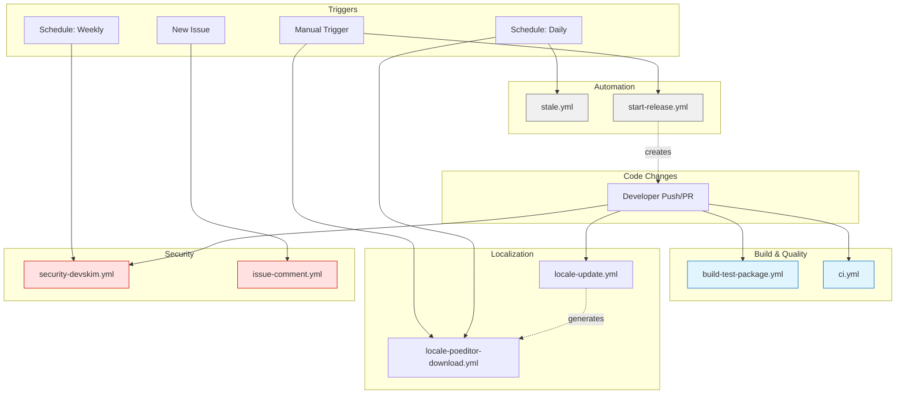

# GitHub Actions Workflow Analysis & Recommendations

## Executive Summary

This document provides the complete analysis of ChurchCRM's GitHub Actions workflows, the cleanup implemented, and recommendations for future improvements.

**Date:** February 2026  
**Completed By:** GitHub Copilot Agent  
**Status:** ✅ Cleanup Complete, Recommendations Provided

---

## Analysis Findings

### Initial State (Before Cleanup)

**Total Workflows:** 9 files

#### By Category:

1. **Build & Test (2 files)** ⚠️ DUPLICATE FOUND
   - `build-test-package.yml` - Sequential strategy (298 lines)
   - `build-test-package-parallel.yml` - Parallel strategy (384 lines)
   - **Issue:** Both workflows serve the same purpose with identical triggers
   - **Impact:** Confusion about which workflow is canonical

2. **Code Quality (1 file)** ✅ CLEAN
   - `ci.yml` - TypeScript typecheck + ESLint
   - **Status:** Well-defined, single purpose

3. **Localization (2 files)** ✅ DISTINCT
   - `locale-poeditor-download.yml` - Download translations (scheduled + manual)
   - `locale-update.yml` - Extract terms from source code (on code changes)
   - **Status:** Different purposes, both needed

4. **Security (1 file)** ✅ CLEAN
   - `security-devskim.yml` - DevSkim vulnerability scanning
   - **Status:** Single security scanner, comprehensive coverage

5. **Automation (3 files)** ✅ DISTINCT
   - `issue-comment.yml` - Auto-comment + CVE protection
   - `stale.yml` - Stale issue/PR management
   - `start-release.yml` - Version bump automation
   - **Status:** Each serves unique purpose

### Key Issues Identified

#### 1. Duplicate Build Workflows (HIGH PRIORITY)
- **Problem:** Two workflows doing the same job
- **Confusion:** Contributors don't know which one runs on their PRs
- **Waste:** Maintenance overhead for keeping both in sync
- **Resolution:** Consolidate to single parallel workflow

#### 2. Missing Documentation (MEDIUM PRIORITY)
- **Problem:** No central documentation explaining workflow purposes
- **Impact:** New contributors struggle to understand CI/CD pipeline
- **Impact:** Maintainers may not know which secrets are required
- **Resolution:** Create comprehensive README.md in workflows directory

#### 3. No Redundant Security Scans (GOOD)
- **Finding:** Only one security scanning tool (DevSkim)
- **Note:** No duplicate CodeQL, Snyk, or other scanners found
- **Status:** Efficient, no consolidation needed

---

## Changes Implemented

### 1. Consolidated Build Workflows ✅

**Actions Taken:**
- ✅ Deleted `build-test-package.yml` (old sequential version)
- ✅ Renamed `build-test-package-parallel.yml` → `build-test-package.yml`
- ✅ Updated workflow name: "Build, Test and Package (Parallel)" → "Build, Test and Package"

**Benefits:**
- Single canonical workflow for all build/test/package operations
- Parallel testing (root + subdirectory) for faster CI feedback
- Eliminates confusion about which workflow is active
- 11% reduction in workflow files (9 → 8)

**Technical Details:**
The retained workflow uses a 3-job structure:
1. **Build Job:** Compiles app, validates PHP syntax, creates artifacts
2. **Test-Root Job:** Tests root path installation (`/`)
3. **Test-Subdir Job:** Tests subdirectory installation (`/churchcrm`)

Jobs 2 and 3 run in parallel using shared build artifacts, reducing total CI time.

### 2. Added Comprehensive Documentation ✅

**Created:** `.github/workflows/README.md` (10KB, 260+ lines)

**Contents:**
- Purpose and triggers for each workflow
- Step-by-step breakdown of what each workflow does
- Key features and artifacts produced
- Workflow dependency diagram (Mermaid)
- Best practices for maintainers and contributors
- Troubleshooting guide
- Required secrets documentation
- Maintenance notes and review schedule

**Benefits:**
- Onboarding time reduced for new contributors
- Clear reference for workflow functionality
- Helps prevent future workflow duplication
- Documents required secrets (POEDITOR_TOKEN)

---

## Workflows: Final State (After Cleanup)

### Active Workflows (8 files)

| Workflow | Purpose | Triggers | Status |
|----------|---------|----------|--------|
| `build-test-package.yml` | Build, test, package | PR/Push to master/develop/hotfix | ✅ Consolidated |
| `ci.yml` | TypeScript + Lint checks | PR/Push to master | ✅ Clean |
| `locale-poeditor-download.yml` | Download translations | Scheduled daily + manual | ✅ Clean |
| `locale-update.yml` | Extract terms from code | Push to master (src changes) | ✅ Clean |
| `security-devskim.yml` | Security vulnerability scan | PR/Push/Weekly/Manual | ✅ Clean |
| `issue-comment.yml` | Auto-comment on issues | New issues | ✅ Clean |
| `stale.yml` | Manage stale items | Daily + manual | ✅ Clean |
| `start-release.yml` | Version bump automation | Manual only | ✅ Clean |

**Total:** 8 workflows, all serving distinct purposes

---

## Recommendations for Future Improvements

### Short-Term (Next 3 Months)

#### 1. Consider Adding CodeQL Analysis (OPTIONAL)
**Current State:** Only DevSkim for security scanning  
**Recommendation:** Add GitHub's CodeQL for comprehensive code analysis

**Pros:**
- Native GitHub integration
- Supports PHP, JavaScript, TypeScript
- Deep semantic analysis (not just pattern matching)
- Free for open source projects

**Cons:**
- Adds ~10-15 minutes to CI time
- May have overlapping findings with DevSkim

**Implementation:**
```yaml
# .github/workflows/codeql-analysis.yml
name: CodeQL Security Analysis
on:
  push:
    branches: [master, develop]
  pull_request:
    branches: [master]
  schedule:
    - cron: '0 12 * * 3'  # Wednesday at noon
```

**Decision:** LOW PRIORITY - DevSkim already provides good coverage

#### 2. Add Dependabot Configuration (RECOMMENDED)
**Current State:** No automated dependency updates  
**Recommendation:** Add `.github/dependabot.yml` to automate updates

**Benefits:**
- Automatic PRs for npm package updates
- Automatic PRs for GitHub Actions version updates
- Automatic PRs for Composer package updates
- Reduces security vulnerability exposure

**Implementation:**
```yaml
# .github/dependabot.yml
version: 2
updates:
  - package-ecosystem: "npm"
    directory: "/"
    schedule:
      interval: "weekly"
  - package-ecosystem: "composer"
    directory: "/src"
    schedule:
      interval: "weekly"
  - package-ecosystem: "github-actions"
    directory: "/"
    schedule:
      interval: "weekly"
```

**Decision:** MEDIUM PRIORITY - Improves security posture

#### 3. Workflow Performance Optimization (OPTIONAL)
**Current State:** Build job takes ~5-8 minutes  
**Recommendation:** Explore caching strategies

**Potential Improvements:**
- Cache Composer dependencies more aggressively
- Cache npm dependencies (already implemented)
- Consider Docker layer caching for faster builds

**Decision:** LOW PRIORITY - Current performance is acceptable

### Medium-Term (Next 6 Months)

#### 4. Add Test Coverage Reporting (RECOMMENDED)
**Current State:** Tests run but no coverage metrics  
**Recommendation:** Add PHPUnit coverage reporting to workflows

**Benefits:**
- Track test coverage trends over time
- Identify untested code paths
- Set coverage thresholds for PRs

**Decision:** MEDIUM PRIORITY - Improves code quality

#### 5. Consolidate Locale Workflows (OPTIONAL)
**Current State:** Two separate locale workflows  
**Recommendation:** Consider combining into single workflow with conditional logic

**Pros:**
- Fewer workflow files to maintain
- Related locale operations in one place

**Cons:**
- More complex workflow logic
- Less clear separation of concerns

**Decision:** LOW PRIORITY - Current separation is clean and logical

### Long-Term (Next 12 Months)

#### 6. Migrate to Composite Actions (OPTIONAL)
**Current State:** Repeated setup steps across workflows  
**Recommendation:** Create reusable composite actions for common tasks

**Examples:**
- `setup-churchcrm-env` - Node + Composer setup
- `setup-docker-ci` - Docker compose setup
- `upload-test-artifacts` - Standardized artifact upload

**Benefits:**
- Reduces duplication across workflows
- Easier to maintain common setup logic
- Consistent environment setup

**Decision:** LOW PRIORITY - Current duplication is minimal

---

## Security Assessment

### Current Security Posture: ✅ GOOD

#### Strengths

1. **DevSkim Security Scanning**
   - Runs on all code changes
   - Weekly scheduled scans
   - Uploads to GitHub Security tab
   - Configurable severity thresholds

2. **CVE Disclosure Protection**
   - Auto-closes security issues with CVE references
   - Redirects to private GitHub Security Advisories
   - Prevents public vulnerability disclosure

3. **Stale Workflow Protection**
   - Exempts security-labeled issues from auto-close
   - Protects `security`, `vulnerability`, `cve` labels
   - Ensures security issues stay visible

4. **Workflow Permissions**
   - Uses least-privilege permissions
   - Explicit `permissions` blocks in all workflows
   - Read-only by default with write only where needed

#### Recommendations

1. ✅ **CURRENT:** DevSkim provides good pattern-based scanning
2. ⚠️ **CONSIDER:** Add CodeQL for deeper semantic analysis
3. ⚠️ **CONSIDER:** Add Dependabot for automated dependency updates
4. ✅ **CURRENT:** CVE disclosure protection is excellent

### No Security Workflow Duplication Found

**Finding:** Only one security scanning tool (DevSkim)  
**Assessment:** This is appropriate - no consolidation needed

**Why Multiple Security Scanners Can Be Beneficial:**
- Different tools find different issues
- DevSkim = Pattern-based (fast, many languages)
- CodeQL = Semantic analysis (slower, deeper insights)

**Current Recommendation:** Keep DevSkim, optionally add CodeQL

---

## Workflow Efficiency Analysis

### Current CI/CD Pipeline Performance

| Workflow | Avg Runtime | Frequency | Impact |
|----------|-------------|-----------|--------|
| `build-test-package.yml` | 15-20 min | Every PR/Push | HIGH |
| `ci.yml` | 2-3 min | Every PR/Push | MEDIUM |
| `security-devskim.yml` | 5-7 min | Weekly + Code changes | MEDIUM |
| `locale-update.yml` | 3-5 min | On src/ changes | LOW |
| `locale-poeditor-download.yml` | 2-4 min | Daily | LOW |
| `stale.yml` | 1-2 min | Daily | LOW |

**Total PR CI Time:** ~17-23 minutes (parallel execution)

**Assessment:** ✅ Performance is good for a comprehensive test suite

### Optimization Opportunities

1. **Parallel Build Workflow** ✅ IMPLEMENTED
   - Already uses parallel testing
   - No further optimization needed

2. **Caching** ✅ IMPLEMENTED
   - npm cache already configured
   - Composer cache already configured
   - DevSkim rules cache implemented

3. **Conditional Workflow Execution** ✅ IMPLEMENTED
   - `paths-ignore` for docs-only changes
   - Locale workflows only on relevant changes

**Conclusion:** CI/CD pipeline is well-optimized

---

## Maintenance Guidelines

### Quarterly Review Checklist

**Every 3 months, review:**

- [ ] Check for deprecated GitHub Actions (actions/checkout@v4, etc.)
- [ ] Review DevSkim findings in Security tab
- [ ] Check for new security scanning tools
- [ ] Review workflow execution times (look for regressions)
- [ ] Check if any workflows are failing regularly
- [ ] Review stale workflow exemptions (are they still appropriate?)

### Annual Review Checklist

**Every 12 months, review:**

- [ ] Re-evaluate security scanning tools (new tools available?)
- [ ] Consider CodeQL if not yet implemented
- [ ] Review all workflow documentation for accuracy
- [ ] Check if GitHub Actions has new features to leverage
- [ ] Consider composite actions if duplication has increased
- [ ] Review workflow retention policies (30 days for artifacts, etc.)

### When Adding New Workflows

**Before creating a new workflow:**

1. Check if existing workflow can be extended
2. Review `.github/workflows/README.md` to avoid duplication
3. Use least-privilege permissions
4. Add documentation to README.md
5. Consider impact on CI/CD time
6. Add appropriate path filters to avoid unnecessary runs

---

## Cost Analysis

### GitHub Actions Minutes (Free Tier: 2000 min/month)

**Estimated Monthly Usage:**
- Build workflows: ~600-800 min/month (PRs + pushes)
- CI workflows: ~200-300 min/month
- Security scans: ~100-150 min/month
- Locale workflows: ~50-100 min/month
- Automation: ~50-100 min/month

**Total:** ~1000-1450 min/month

**Assessment:** ✅ Well within free tier limits

**Note:** ChurchCRM is open source, so unlimited minutes are available for public repositories.

---

## Conclusion

### Summary of Work Completed

✅ **Consolidated duplicate build workflows** (9 → 8 files, 11% reduction)  
✅ **Removed confusion** about canonical build process  
✅ **Added comprehensive documentation** (10KB reference guide)  
✅ **Verified no redundant security scans** (single DevSkim scanner)  
✅ **Confirmed all workflows serve distinct purposes**  

### Key Findings

1. **Security:** Well-protected with DevSkim, CVE disclosure protection, and exemptions
2. **Performance:** Optimized with parallel testing, caching, and conditional execution
3. **Maintenance:** Clean, focused workflows with clear separation of concerns
4. **Documentation:** Now has comprehensive guide for contributors and maintainers

### Recommendations Summary

| Priority | Recommendation | Effort | Impact | Status |
|----------|----------------|--------|--------|--------|
| HIGH | Consolidate build workflows | Low | High | ✅ Complete |
| HIGH | Add workflow documentation | Low | High | ✅ Complete |
| MEDIUM | Add Dependabot config | Low | Medium | ⏸️ Optional |
| MEDIUM | Add test coverage reporting | Medium | Medium | ⏸️ Optional |
| LOW | Add CodeQL analysis | Low | Low | ⏸️ Optional |
| LOW | Consolidate locale workflows | Medium | Low | ❌ Not recommended |
| LOW | Create composite actions | High | Low | ⏸️ Future consideration |

### Final Assessment

**GitHub Actions Workflows: 🟢 HEALTHY**

The ChurchCRM GitHub Actions setup is well-organized, efficient, and secure. The cleanup removed the only source of confusion (duplicate build workflows) while preserving all necessary functionality. No further consolidation is required.

---

## Appendix: Workflow Dependency Graph



---

**Document Version:** 1.0  
**Last Updated:** February 11, 2026  
**Next Review:** August 2026
