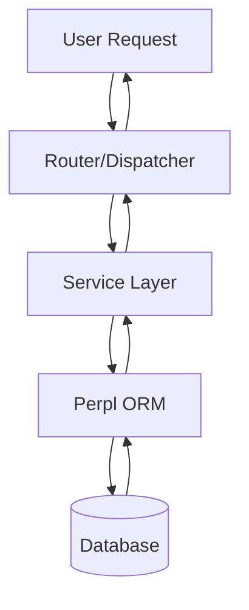

# Skill: Creating Wiki Documentation

## Context
ChurchCRM uses GitHub Wiki for complex documentation, admin guides, and developer reference materials. This skill covers when to create wiki articles and how to structure them for GitHub's wiki system.

---

## When to Create Wiki Documentation

Create a wiki article when the topic is:

### Complex & Reference-Heavy
- Multi-step workflows with edge cases
- Configuration guides with many options
- Architecture decisions and trade-offs
- Troubleshooting procedures

### For Multiple Audiences
- Administrators (setup, backup, permissions)
- Developers (architecture, extending plugins)
- End users (features, how-tos)
- Integrators (API reference, webhooks)

### Documentation That Evolves
- Feature documentation as features change
- Best practices that improve over time
- Known issues and their workarounds
- Installation guides for different environments

### Too Large for In-Code Comments
- Content > 500 lines
- Requires diagrams or external links
- Needs versioning history
- Referenced from multiple places

---

## When NOT to Use Wiki

**Use the appropriate skill file instead for:**
- API patterns → [API Development](./api-development.md) skill
- Code standards → [Code Standards](./code-standards.md) skill
- Job workflows → Inline in `copilot-instructions.md`
- Quick reference → Comments in the code itself

**Use README or guide files for:**
- Installation steps → Project README.md
- Contributing guidelines → CONTRIBUTING.md
- API documentation → API comments + OpenAPI spec
- Architecture → ADR (Architectural Decision Records)

---

## Wiki Article Structure

Each wiki article should follow this structure:

### Title + Metadata
```markdown
# Topic Title (Clear, searchable)

**Audience:** Admin | Developer | User | Integrator  
**Last Updated:** YYYY-MM-DD  
**Related:** [Other Wiki Article](link), [Skill File](link)  

## Overview
1-2 sentence summary of what this covers and who should read it.
```

### Table of Contents (if > 5 sections)
```markdown
## Table of Contents
- [Section 1](#section-1)
- [Section 2](#section-2)
- [Troubleshooting](#troubleshooting)
- [FAQ](#faq)
```

### Main Content Structure
```markdown
## Prerequisites
What knowledge or setup is needed before reading?

## Step-by-Step Process
Numbered steps with examples.

## Configuration Options
Table of settings with descriptions.

## Examples
Real-world usage examples.

## Troubleshooting
Common problems and solutions.

## Related
Links to related wiki articles or documentation.
```

---

## Wiki Documentation Examples

### Example 1: Admin Guide

```markdown
# Setting Up Automated Backups

**Audience:** Administrator  
**Last Updated:** 2026-02-15  
**Difficulty:** Intermediate  

## Overview
This guide covers setting up automatic daily backups to cloud storage (NextCloud, ownCloud, or Dropbox).

## Prerequisites
- Admin access to ChurchCRM
- WebDAV URL for your cloud storage
- Cloud storage account with available space

## Configuration Steps

### 1. Install External Backup Plugin
Navigate to **Admin System → Plugins** and enable the **External Backup** plugin.

### 2. Add Cloud Storage Credentials
Go to **Admin System → Backup Settings** and enter:
- **WebDAV URL**: `https://your-nextcloud.com/remote.php/dav/files/your-username/backups/`
- **Username**: Your cloud storage username
- **Password**: Your cloud storage password

### 3. Schedule Automatic Backups
In **Admin System → Scheduled Tasks**, create a new task:
- **Name**: Daily Database Backup
- **Frequency**: Daily at 2:00 AM
- **Action**: Execute backup.php

### 4. Test the Backup
Manually trigger a backup to verify it works:
1. Go to **Admin System → Database**
2. Click "Create Backup Now"
3. Check cloud storage to verify file appeared

## Backup Verification

To verify backups are working:
1. Check the **Backup Log** at **Admin System → Database → Backup History**
2. Verify files appear in your cloud storage
3. Monthly: Download and test restore a backup

## Troubleshooting

### Connection Failed
**Error:** "Failed to connect to WebDAV server"

**Solution:**
- Verify WebDAV URL is correct (check cloud storage documentation)
- Ensure SSL certificate is valid (self-signed certs need special configuration)
- Verify firewall allows outbound HTTPS

### Backup Takes Too Long
**Problem:** Nightly backups are timing out

**Solution:**
- Schedule backup during off-peak hours (try 3-4 AM)
- Consider weekly instead of daily
- Check server resource usage with `top` command

### Disk Space Full
**Problem:** "Out of disk space after backup"

**Solution:**
- Configure automatic cleanup: keep only last 7 backups
- Compress backups before upload: enable gzip compression
- Delete old backups in **Admin System → Database → Cleanup**

## Best Practices

### Backup Frequency
- **Small churches** (< 500 families): Weekly backup sufficient
- **Medium churches** (500-2000 families): Daily backup recommended
- **Large churches** (> 2000 families): Daily + weekly off-site archive

### Retention Policy
- Keep **last 30 days** of daily backups
- Archive **monthly** backups for 1 year
- Test restoration **quarterly**

### Disaster Recovery
Store at least one backup off-site:
- Local storage (external drive at pastor's home)
- Cloud storage (NextCloud, ownCloud, Dropbox)
- Both (best practice)

## FAQ

**Q: Can I backup manually without scheduling?**  
A: Yes. Go to **Admin System → Database** and click "Create Backup Now".

**Q: How large are typical backups?**  
A: 5-50 MB depending on photos and number of families. Most compress to 1-5 MB.

**Q: Can I restore from backup?**  
A: Yes, but it requires database administration. Contact ChurchCRM support or a system administrator.

## Related
- [Admin System Overview](./admin-overview)
- [Database Management](./database-management)
- [Plugin: External Backup](./plugins/external-backup)
```

### Example 2: Developer Architecture Guide

```markdown
# Plugin Architecture

**Audience:** Developer  
**Last Updated:** 2026-02-15  
**Difficulty:** Advanced  

## Overview
This guide explains ChurchCRM's plugin system, how plugins are discovered and loaded, and how to extend ChurchCRM with custom functionality.

## Architecture

### Plugin Directory Structure
```
src/plugins/
├── core/
│   ├── mailchimp/
│   │   ├── plugin.json
│   │   └── src/MailChimpPlugin.php
│   └── gravatar/
└── community/
    ├── my-custom-plugin/
```

### Plugin Lifecycle

```
Plugin Discovery → JSON Parse → Plugin Load → Hook Registration → Route Loading
```

1. **Discovery**: PluginManager scans `src/plugins/core/` and `src/plugins/community/`
2. **Parsing**: `plugin.json` manifest is validated
3. **Loading**: Plugin class is instantiated
4. **Hooks**: Plugin registers event listeners
5. **Routes**: Plugin routes are registered with Slim app

### Configuration Isolation

Each plugin's configuration is sandboxed:
- Settings are stored with `plugin.{id}.{key}` prefix
- Accessed via `$plugin->getConfigValue('key')`
- Cannot access other plugins' configuration

## Hook System

Plugins can hook into application events:

```php
// In plugin's boot() method
use ChurchCRM\Plugin\Hook\HookManager;
use ChurchCRM\Plugin\Hooks;

HookManager::addAction(Hooks::PERSON_UPDATED, [$this, 'onPersonUpdated']);

// In plugin's action method
public function onPersonUpdated(Person $person, array $oldData): void
{
    // React to person being updated
    $this->syncToMailChimp($person);
}
```

### Available Hooks
- **People**: PERSON_CREATED, PERSON_UPDATED, PERSON_DELETED
- **Families**: FAMILY_CREATED, FAMILY_UPDATED, FAMILY_DELETED
- **Groups**: GROUP_MEMBER_ADDED, GROUP_MEMBER_REMOVED
- **Financial**: DONATION_RECEIVED, DEPOSIT_CLOSED
- **System**: SYSTEM_INIT, SYSTEM_UPGRADED, CRON_RUN

## Extending ChurchCRM

### Creating a Plugin

1. Create directory: `src/plugins/core/my-plugin/`
2. Create `plugin.json` manifest
3. Create plugin class extending `AbstractPlugin`
4. Register hooks or routes

### Plugin Manifest (plugin.json)

```json
{
    "id": "my-plugin",
    "name": "My Custom Plugin",
    "description": "Adds custom functionality",
    "version": "1.0.0",
    "type": "core",
    "mainClass": "ChurchCRM\\Plugins\\MyPlugin\\MyPluginPlugin",
    "settings": [
        {
            "key": "apiKey",
            "label": "API Key",
            "type": "password",
            "required": true
        }
    ]
}
```

### Plugin Class Example

```php
<?php
namespace ChurchCRM\Plugins\MyPlugin;

use ChurchCRM\Plugin\AbstractPlugin;
use ChurchCRM\Plugin\Hook\HookManager;
use ChurchCRM\Plugin\Hooks;

class MyPluginPlugin extends AbstractPlugin
{
    public function getId(): string { return 'my-plugin'; }
    public function getName(): string { return 'My Plugin'; }
    public function getDescription(): string { return 'Custom functionality'; }

    public function boot(): void
    {
        HookManager::addAction(Hooks::PERSON_CREATED, [$this, 'onPersonCreated']);
    }

    public function onPersonCreated(Person $person): void
    {
        // React to person creation
    }
}
```

## Best Practices

### Security in Plugins
- Always validate and sanitize input
- Use prepared statements for database queries
- Check user permissions before acting
- Log security-relevant events

### Performance Considerations
- Avoid blocking operations in hooks
- Queue long-running tasks using CRON_RUN hook
- Cache external API responses
- Use selective field loading: `->select(['field1', 'field2'])`

### Configuration
- Provide sensible defaults
- Make API keys/secrets password fields
- Document all configuration options
- Validate configuration on boot

## Troubleshooting

### Plugin Not Loading
1. Check `plugin.json` is valid JSON
2. Verify `mainClass` path exists
3. Check PHP syntax errors: `php -l src/plugins/core/my-plugin/src/MyPluginPlugin.php`

### Plugin Routes Not Registered
1. Ensure `routesFile` path is correct in `plugin.json`
2. Routes file must call `global $app;` to access Slim app
3. Check plugin is enabled in UI

### Hook Not Firing
1. Verify hook name exists in `Hooks.php`
2. Check plugin is active/booted
3. Add logging to verify hook is being called

## Related
- [Skill: Plugin Development](../skills/plugin-development.md)
- [Skill: API Development](../skills/api-development.md)
- [Plugin Repository](https://github.com/ChurchCRM/plugins)
```

---

## Using Diagrams & Mermaid

Include diagrams for complex concepts:

```markdown
## Architecture Diagram


```

---

## Writing Style & Tone

### Best Practices

- **Clear & Direct**: "Navigate to Admin System" not "You should go to where the admin system is"
- **Active Voice**: "Click the Save button" not "The Save button should be clicked"
- **Audience Appropriate**: Admins ≠ Developers. Adjust terminology
- **Short Paragraphs**: No paragraph > 4 sentences
- **Numbered Steps**: Use for procedures, not prose
- **Code Examples**: Show both correct and incorrect approaches
- **Links**: Link to related wiki articles and skill files

### Formatting Tips

```markdown
**Bold**: For emphasis and UI elements
_Italic_: For technical terms on first mention
`code`: For file names, commands, config keys
> Blockquote: For important notes or warnings

## Heading 2: Major sections
### Heading 3: Subsections (avoid Heading 1 - that's the title)
```

---

## Wiki Navigation

### Organize by Audience

**Administrator Pages:**
- Backup & Recovery
- User Management
- Database Maintenance
- System Configuration

**Developer Pages:**
- Plugin Architecture
- API Reference
- Contributing
- Architecture Decisions

**User Pages:**
- Getting Started
- How-to Guides
- Feature Overview
- FAQ

### Create a Home Page Index

Create a `Home.md` in the wiki with:
- Brief description of ChurchCRM
- Links organized by audience
- Quick links to popular articles
- Getting started section

---

## Maintenance

### Keep Wiki Current

- **After** features are added/changed → Update wiki
- **Review** quarterly for broken links
- **Archive** outdated versions using version history
- **Note** when articles were last verified

### Version Control

GitHub Wiki articles can be cloned separately:

```bash
git clone https://github.com/ChurchCRM/CRM.wiki.git
cd CRM.wiki
# Edit markdown files
git add -A
git commit -m "Update documentation for feature X"
git push
```

### Common Updates

- Add troubleshooting sections when issues arise
- Note breaking changes with **version added/changed**
- Reference plugin versions when documenting plugins
- Include links to related GitHub issues for context

---

## Examples of Wiki Articles

Good wiki candidates:
- Multi-step admin procedures (Backup, User Setup, Plugin Configuration)
- Troubleshooting guides (Database Issues, Performance Tuning)
- Architecture decisions (Why we use Perpl ORM, Plugin system design)
- Integration guides (Setting up OpenLP, Integrating with accounting software)
- Frequently asked questions (FAQ by role: Admin, Developer, End User)

Poor wiki candidates:
- Single method documentation (use code comments instead)
- Simple how-to guides (< 3 steps - use README)
- API method reference (use OpenAPI spec or inline documentation)
- Quick fixes (use GitHub issues/discussions instead)

---

## Related Resources

- [GitHub Wiki Markdown Guide](https://docs.github.com/en/communities/documenting-your-project-with-wikis/adding-or-editing-wiki-pages)
- [ChurchCRM Wiki](https://github.com/ChurchCRM/CRM/wiki)
- Create an issue with documentation questions: [ChurchCRM Issues](https://github.com/ChurchCRM/CRM/issues)
