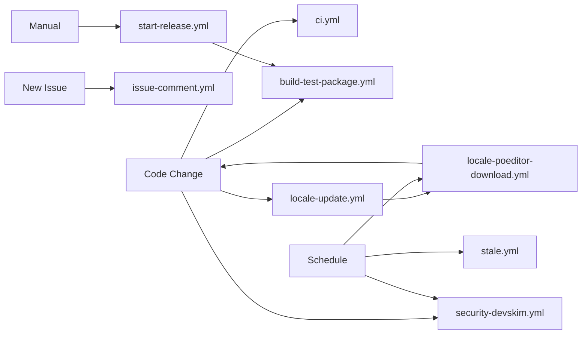

Starting review of closed issues without PRs
Dry run mode: false

Fetching closed issues from repository...
  Page 1: Found 100 closed issues
  Page 2: Found 75 closed issues

Total closed issues found: 175

Issues with "stale" label: 23

Checking for associated PRs...

  Issue #1234: No linked PRs found - needs review
  Issue #1256: Has 1 linked PR(s) - skipping
  Issue #1278: No linked PRs found - needs review

Issues needing manual review: 2

Tagging issues for manual review...

  ✓ Added "needs-manual-review" label to issue #1234
  ✓ Added "needs-manual-review" label to issue #1278

Review complete!

📊 Summary:
  Total closed issues: 175
  Issues with "stale" label: 23
  Issues without PRs: 2
  Issues tagged for review: 2

🔍 Issues tagged for manual review:
  - Issue #1234: Feature request that was auto-closed
    URL: https://github.com/ChurchCRM/CRM/issues/1234
  - Issue #1278: Bug report without resolution
    URL: https://github.com/ChurchCRM/CRM/issues/1278
```

### Maintainer Actions
When you see issues with the "needs-manual-review" label:

1. **Review the issue** to determine if it's still valid
2. **Take appropriate action:**
   - If resolved: Remove the label and close as completed
   - If invalid: Remove the label and mark as "not planned"
   - If still valid: Remove "stale" label, reopen, and address
3. **Remove the "needs-manual-review" label** once handled

### Permissions Required
- `contents: read` - To access repository data
- `issues: write` - To add labels to issues

### Rate Limiting
The workflow processes up to 50 pages of issues (5,000 issues max) to prevent API rate limiting. This should be sufficient for most repositories.

### Related Workflows
- **`stale.yml`** - Automatically marks inactive issues as stale and closes them
- **`issue-comment.yml`** - Posts helpful comments on new issues

---

## Contributing
To modify or add new workflows, please ensure:
1. YAML syntax is valid (`yamllint` passes)
2. Appropriate permissions are set
3. Documentation is updated
4. The workflow is tested in a fork first
# GitHub Actions Workflows

This directory contains all automated workflows for the ChurchCRM project. This document provides an overview of each workflow, its purpose, and when it runs.

## Build & Test Workflows

### build-test-package.yml
**Purpose:** Main CI/CD pipeline for building, testing, and packaging ChurchCRM

**Triggers:**
- Pull requests to `master`, `develop`, or `hotfix/**` branches
- Pushes to `master`, `develop`, or `hotfix/**` branches
- Ignores changes to documentation, markdown files, and LICENSE

**What it does:**
1. **Build Job:** Compiles the application, validates PHP syntax, and creates build artifacts
2. **Test Jobs (Parallel):**
   - `test-root`: Tests installation at root path (`/`)
   - `test-subdir`: Tests installation in subdirectory (`/churchcrm`)
3. **Package Job:** Creates release artifacts with version-based naming

**Key Features:**
- Runs tests in parallel for faster CI feedback
- Tests both root and subdirectory installation scenarios
- Uploads build artifacts for releases
- Comprehensive logging and Docker container logs on failure

**Artifacts:**
- `ChurchCRM-{version}.zip` for master branch
- `ChurchCRM-{version}-PR{number}.zip` for pull requests
- `cypress-artifacts-*` on test failures (logs, screenshots, videos)

---

## Code Quality Workflows

### ci.yml
**Purpose:** Quick code quality checks for TypeScript and linting

**Triggers:**
- Pushes to `master` branch
- Pull requests to `master` branch

**What it does:**
1. Runs TypeScript type checking (`tsc --noEmit`)
2. Runs ESLint on React components

**Key Features:**
- Fast feedback on code quality issues
- Runs independently from main build/test pipeline
- Uses Node.js 22.x

---

## Localization Workflows

### locale-poeditor-download.yml
**Purpose:** Download and sync translations from POEditor translation platform

**Triggers:**
- **Scheduled:** Daily at midnight UTC
- **Manual:** Via workflow_dispatch with options:
  - `operation_mode`: Choose between `download-and-audit` or `audit-only`
  - `skip_audit`: Skip audit step for faster execution

**What it does:**
1. Downloads latest translations from POEditor (requires `POEDITOR_TOKEN` secret)
2. Validates download integrity (checks for empty files, regressions)
3. Generates base term updates for locale variants (e.g., Portuguese variants)
4. Generates missing terms reports for incomplete locales
5. Runs locale audit to check translation completeness
6. Creates a PR with all changes to `locale/{version}` branch

**Key Features:**
- Comprehensive validation prevents translation data loss
- Detects and fails on locale regressions
- Generates reports to help translators identify missing terms
- Automatic PR creation with detailed changelog

**Artifacts:**
- Translation JSON files in `src/locale/i18n/`
- Base term updates in `locale/base-term-updates/`
- Missing terms reports in `locale/missing-terms/poeditor-*.json`

### locale-update.yml
**Purpose:** Generate translation terms from application source code

**Triggers:**
- Pushes to `master` branch that modify files in `src/**`
- Manual trigger via workflow_dispatch

**What it does:**
1. Starts Docker containers for locale extraction
2. Runs `npm run locale:build` to extract gettext strings from PHP/JS code
3. Updates `locale/terms/messages.po` with new translatable strings
4. Creates a PR if meaningful changes are detected (ignores header-only changes)

**Key Features:**
- Automatically detects new strings that need translation
- Skips PR creation for trivial changes (header updates only)
- Runs inside Docker to match production environment
- Integrated with POEditor workflow for complete translation pipeline

**Workflow Integration:**
1. Developer adds `gettext()` or `i18next.t()` calls in code
2. This workflow extracts new terms to `messages.po`
3. Terms are uploaded to POEditor for translation
4. `locale-poeditor-download.yml` brings translations back

---

## Security Workflows

### security-devskim.yml
**Purpose:** Automated security vulnerability scanning using Microsoft DevSkim

**Triggers:**
- **Pushes:** To `master` or `develop` branches (when code files change)
- **Pull Requests:** To `master` branch (when code files change)
- **Scheduled:** Weekly on Mondays at 6:00 AM UTC
- **Manual:** Via workflow_dispatch with options:
  - `scan_severity`: Minimum severity level (`low`, `medium`, `high`, `critical`)
  - `fail_on_error`: Whether to fail the workflow on security issues

**What it does:**
1. Installs Microsoft DevSkim CLI
2. Scans all code files for security vulnerabilities
3. Generates SARIF report with findings
4. Uploads results to GitHub Security tab
5. Creates step summary with issue counts and details

**Key Features:**
- Detects common security patterns (XSS, SQL injection, crypto issues, etc.)
- Configurable severity threshold
- Integrates with GitHub Security tab for issue tracking
- Can be configured to fail builds on security issues
- Archives SARIF results for 30 days

**Scanned File Types:**
- PHP, JavaScript, TypeScript
- JSON, YAML, SQL

### issue-comment.yml
**Purpose:** Automated issue triage and security CVE handling

**Triggers:**
- When new issues are opened

**What it does:**
1. Detects issue type based on content:
   - **Security CVE/GHSA disclosures** (highest priority)
   - **System info reports** (in-app bug reporter)
   - **Bug reports**
   - **Questions**
   - **Generic** (fallback)
2. Posts appropriate template comment from `.github/issue-comments/`
3. **For security issues:** Automatically closes, labels, and directs to private disclosure

**Key Features:**
- Prevents public disclosure of security vulnerabilities
- Automatically labels security issues with `security` and `security-delete-required`
- Provides helpful guidance based on issue type
- Thanks users who use the in-app bug reporter

**Security Protection:**
- Detects CVE-YYYY-NNNN and GHSA-xxxx-xxxx-xxxx patterns
- Closes security issues immediately to prevent exploitation
- Directs reporters to GitHub Security Advisories for private disclosure
- Flags issues for manual deletion by repository admins

---

## Automation Workflows

### stale.yml
**Purpose:** Automatically manage stale issues and pull requests

**Triggers:**
- **Scheduled:** Daily at 1:30 AM UTC
- **Manual:** Via workflow_dispatch with options:
  - `dry_run`: Preview actions without making changes
  - `debug_only`: Enable debug logging

**What it does:**
1. Marks issues stale after 30 days of inactivity
2. Marks PRs stale after 45 days of inactivity
3. Closes stale items after 15 additional days
4. Posts helpful messages explaining how to keep issues/PRs active

**Key Features:**
- Exempts security issues (labels: `security`, `vulnerability`, `cve`, `security-fix`)
- Exempts pinned and high-priority items
- Removes stale label when activity resumes
- Friendly, helpful messages for contributors
- Rate-limited to prevent API exhaustion (100 operations per run)

**Exempt Labels:**
- **Issues:** `pinned`, `security`, `vulnerability`, `cve`, `bug`, `enhancement`, `feature`, `good first issue`, `help wanted`, `priority:high`, `priority:critical`, `security-fix`
- **PRs:** `pinned`, `security`, `vulnerability`, `security-fix`, `work-in-progress`, `do-not-merge`, `priority:high`, `priority:critical`

### start-release.yml
**Purpose:** Initiate a new release by updating version numbers

**Triggers:**
- **Manual only:** Via workflow_dispatch
- **Required input:** `version` (e.g., "6.1.0")

**What it does:**
1. Runs `./scripts/startNewRelease.js` with the specified version
2. Updates version in:
   - `package.json` and `package-lock.json`
   - `src/composer.json` and `src/composer.lock`
   - `src/mysql/upgrade.json`
   - `demo/ChurchCRM-Database.sql`
3. Creates a new branch `build/{version}`
4. Commits all version changes
5. Creates a pull request to `master` branch

**Key Features:**
- Automated version bumping across all package files
- Consistent version numbering
- Creates clean release PRs
- Integrates with main build pipeline when merged

**Release Workflow:**
1. Maintainer triggers this workflow with new version number
2. Workflow creates PR with version updates
3. PR is reviewed and merged to `master`
4. `build-test-package.yml` creates release artifacts
5. Artifacts are used to create GitHub release

---

## Workflow Dependencies



---

## Best Practices

### For Maintainers

1. **Always review security-devskim.yml results** in the Security tab
2. **Don't skip locale workflows** - translations are important for users
3. **Use start-release.yml** instead of manually updating version numbers
4. **Monitor stale.yml** to ensure important issues aren't auto-closed

### For Contributors

1. **Expect build-test-package.yml to run** on all PRs (takes ~15-20 minutes)
2. **Fix ci.yml failures** before requesting review (TypeScript/lint errors)
3. **Add gettext() wrapping** for new UI strings so locale-update.yml can extract them
4. **Use GitHub Security Advisories** for security issues, not public issues

---

## Secrets Required

The following GitHub secrets must be configured for workflows to function:

- `GITHUB_TOKEN` - Automatically provided by GitHub Actions (no configuration needed)
- `POEDITOR_TOKEN` - API token for POEditor translation platform (required for locale-poeditor-download.yml)

---

## Troubleshooting

### Build Failures

1. Check `build-test-package.yml` logs for specific error
2. Download `cypress-artifacts-*` to see screenshots/videos of test failures
3. Review Docker container logs in the artifact
4. Check `src/logs/` in artifacts for PHP errors

### Security Scan False Positives

1. Review the finding in GitHub Security tab
2. Add exception to `.devskim.json` if it's a false positive
3. Document why it's a false positive in the configuration

### Locale Issues

1. Check POEditor for missing translations
2. Review `locale/missing-terms/` for reports on incomplete locales
3. Use `locale-poeditor-download.yml` manual trigger with `audit-only` mode

---

## Maintenance Notes

- **Last reviewed:** February 2026
- **Next review recommended:** August 2026 or when major GitHub Actions updates are released

### Recent Changes

- **February 2026:** Consolidated duplicate build workflows (removed old sequential version, kept parallel version)
- **February 2026:** Added comprehensive workflow documentation
