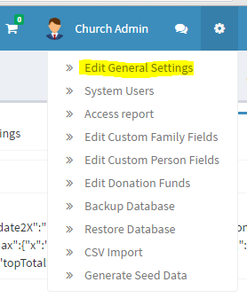

# Custom Fields

Custom Fields allow you to expand the functionality of ChurchCRM beyond the base information that can be stored as a default. Custom fields allow you to personalize the database to meet your specific needs. Custom fields can be added to [persons](person.md), [families](families.md), and [groups](Groups.md). For persons, you could, for example, have a custom field that shows an individual's mentor. For groups, you could have a start and stop date for a group of ushers.

## How do I assign Custom Fields?

#### For people and families:

1. Click the ⚙ (gear) icon dropdown menu (see [Administration](Administration.md))
  - For people click on _"Edit Custom Person Fields"_
  - For families click on _"Edit Custom Family Fields"_
2. To add a new field, select the type, a name and the side on which it should appear.
3. The name will appear in the shaded box on Person View and the side determines which column it shows up in when viewing the Person View.

#### For groups:

1. Click on the group you wish to add a custom field to
2. Click on _"Edit Group-Specific Properties Form"_.
If this link is not visible, this group may not have group-specific properties enabled.
3. Click on _"Edit this Group"_ and select the checkbox by _"Use group-specific properties?"_.
4. Too add a new field, select the type, name, description and click _"Add new field"_.

## What are the Types?

See the [Types](Types.md) help topic.

## How do I edit a Custom Field?

> **Note:** When changes are made to the categories in either form, you must click _"Save Changes"_ before anything else or all changes will be lost.

- **For people and families** you can change the name, special option, and Person-View side.  If the type needs to be changed, it can only be done by creating a new field and deleting the undesired field. If you wish to change the order in which the fields are displayed, use the up and down arrows to the left to move its location.  To delete a field, click the _"X"_ on the left side.

- **For groups**, you can change the name, description, and person view. Enabling the person view allows this property to be shown when viewing an individual in Person View. If the type needs to be changed, it can only be done by creating a new field and deleting the undesired field. If you wish to change the order in which the fields are displayed, use the up and down arrows to the left to move its location. To delete a field, click the _"X"_ on the left side.
