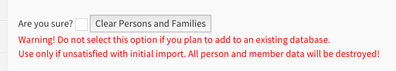
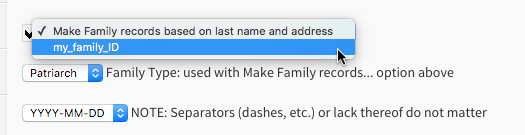

# Data Import

You can import data from a comma-separated value (.csv) file. Every line in this file must contain information about one [person](person.md).

The _"CSV Import"_ feature is in the Admin ⚙ menu Once a file is chosen and uploaded, there will be a page which allows you to tell ChurchCRM which field of your file corresponds to specific fields in ChurchCRM. The list of possible fields that ChurchCRM will import is shown below. You do not need to import data into every field.

- Title
- First Name
- Middle Name
- Last Name
- Suffix
- Gender
- Donation Envelope
- Address1
- Address2
- City
- State
- Zip
- Country
- Home Phone
- Work Phone
- Mobile Phone
- Email
- Work/Other Email
- Birth Date
- Membership Date
- Wedding Date
- [_Custom Person Field_](Custom Fields.md)
- [_Custom Family Field_](Custom Fields.md)

Dates can be formatted as `YYYY-MM-DD`, `MM-DD-YYYY`, or `DD-MM-YYYY`. The date separator (dash, slash, etc.) or lack thereof does not matter.

It is best to import the data first, before you invest time into tweaking the database. This way you can use the feature of the import screen which deletes all of the Person and Family records (see image below) so you can try importing again. It is usually easier to do most of the necessary clean-up in your data file rather than navigating the ChurchCRM interface to make corrections.

Once you are satisfied that the import has done what it can, you can make corrections using the ChurchCRM pages. You can move someone to a different family by editing the Person record. You can also specify family roles such as “child”, which helps ChurchCRM identify the adults for address labels.

## Generating family records

ChurchCRM can automatically generate [family](families.md) records for the imported person records. Two methods are offered to determine if two (or more) persons belong to the same family

- They share the same _Last Name_ and _Address1_ field values
- They share values of a selected _Custom Family Field_

The first option is a simple heuristic to detect traditional families. The second option allows the import of member directories with pre-assigned family identifiers and allows for families where not all members share the same last name.
Switch on family record generation by ticking the checkbox in front of the dropdown list shown in the figure above, then select either _"Make Family records based on last name and address"_ (default) or one of listed custom family fields below.

## Member classification

Another area which may require attention is the [classification](Classifications.md) field, which keeps track of which people are members. This information becomes important when ChurchCRM is used to generate the list of voting members. By creating separate import files by membership type (member, guest, regular attender, etc.), you can assign a classification during the import process that will apply to each person in that file. Example: Create an import file that contains only “Members” so the classification of “Member” can be assigned during the import process. This way each person in that file will be classified as a “Member” in ChurchCRM. Then, import another file that contains only “Guests” so the classification of “Guest” can be assigned during the import process…and so on.

> **Note:** If you are running the import on shared hosting then you may not have write access to the default area needed for import and the import script will show a file with 0 rows and not import anything. In this case, edit lines 139 and 316 of the CSVImport.php file so that they point to a writable location, e.g. `$system_temp = "../tmp";`
